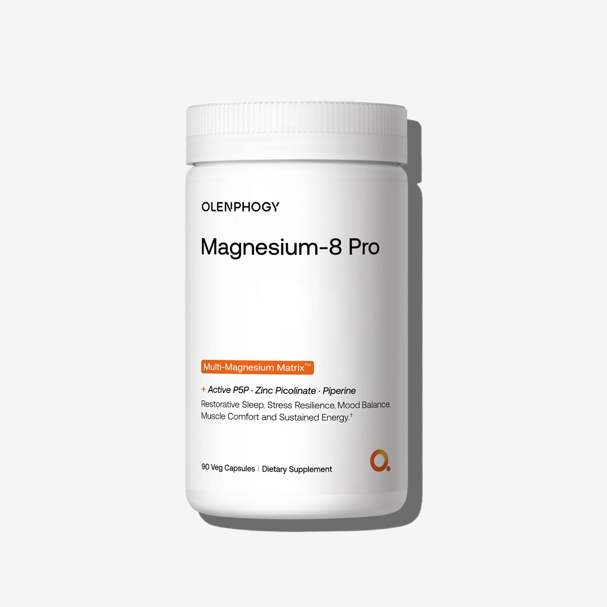
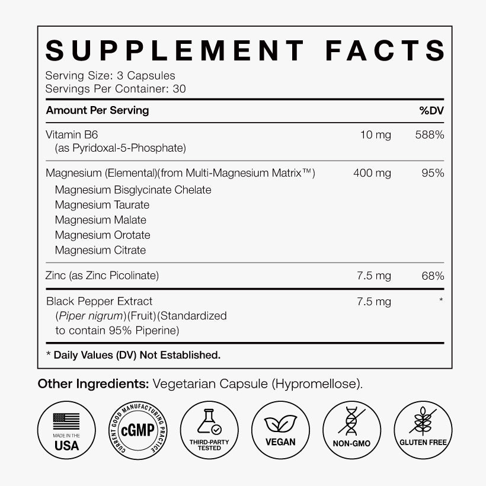
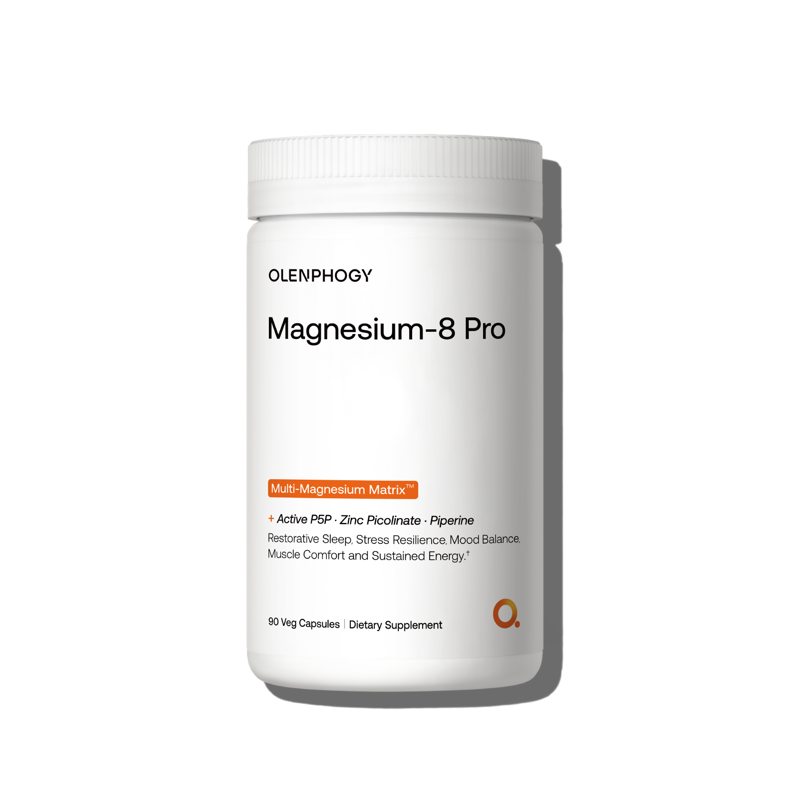

# Magnesium-8 Pro｜图库逐图分析

[返回总目录](../../README.md)

每条图库记录独立保留。相近瓶图不是变体；正文引用与其他页面复用位置在每张图下列出。

## IMG-001 · 白底瓶装身份图

- **观察｜文字与层级：** 包装依次读品牌、品名、配方条、用途、90粒。无额外广告标题。
- **观察｜构图：** 正面白瓶置中约七成画高，浅灰台面，阴影向右；橙色窄条把形态与利益区隔。
- **分析｜作用与复用：** 识别商品与规格；保持包装字号可放大，主图不承担全部机制解释。
- **资源：** 1640 × 1640；[原图](https://cdn.shopify.com/s/files/1/0958/9358/6230/files/7381fe63054f593be6eb051e1e67a48c.jpg)；[首个页面](https://olenphogy.com/products/magnesium-8-pro)。
- **出现位置：** products--magnesium-8-pro / gallery / 顺位1；products--magnesium-8-pro / body / shopify-section-template--25526732685622__main；collections--science-backed-supplements / body / shopify-section-template--25461923053878__product-grid。
- **核读：** 已目视检查；包装极小字不作为完整标签转录，关键剂量以标签专图为准。

## IMG-002 · 日夜双场景

- **观察｜文字与层级：** 先读昼夜利益，再从办公清醒过渡到夜间休息；不是两款产品。
- **观察｜构图：** 左侧办公女性，右下熟睡男性；右上浅底黑字，左下品牌，人物错位而不对称。
- **分析｜作用与复用：** 一图连接两个使用结果；分区色温代替长篇机制。
- **资源：** 1000 × 1000；[原图](https://cdn.shopify.com/s/files/1/0958/9358/6230/files/3_5599fabd-2850-43fd-8965-a2b77b531d5a.jpg)；[首个页面](https://olenphogy.com/products/magnesium-8-pro)。
- **出现位置：** products--magnesium-8-pro / gallery / 顺位2；products--magnesium-8-pro / body / shopify-section-template--25526732685622__main。
- **核读：** 已目视检查；包装极小字不作为完整标签转录，关键剂量以标签专图为准。

## IMG-003 · 镁营养标签

- **观察｜文字与层级：** 3粒/份、30份；元素镁400mg（95%DV），P5P 10mg、锌7.5mg、胡椒提取物7.5mg；HPMC胶囊壳。
- **观察｜构图：** 白底黑字标签占上部，粗横线分组，底部六个圆形品质图标。
- **分析｜作用与复用：** 把感性利益接到可核对规格；镁矩阵列五形态但未各列剂量。
- **资源：** 820 × 820；[原图](https://cdn.shopify.com/s/files/1/0958/9358/6230/files/4_bb3ea299-aa34-4182-a8a7-24564ee2b7bc.jpg)；[首个页面](https://olenphogy.com/products/magnesium-8-pro)。
- **出现位置：** products--magnesium-8-pro / gallery / 顺位3；products--magnesium-8-pro / body / shopify-section-template--25526732685622__main。
- **核读：** 已目视检查；包装极小字不作为完整标签转录，关键剂量以标签专图为准。

## IMG-004 · 镁瓶装补充角度

- **观察｜文字与层级：** 包装信息与001同类，没有新的利益文案。
- **观察｜构图：** 白瓶近正面，浅灰背景，较主图更多留白与不同阴影。
- **分析｜作用与复用：** 补充实物感；不是新增变体，也不应为此虚构新卖点。
- **资源：** 1700 × 1700；[原图](https://cdn.shopify.com/s/files/1/0958/9358/6230/files/5f86d72db70872edaea3301d5a22ae39.png)；[首个页面](https://olenphogy.com/products/magnesium-8-pro)。
- **出现位置：** products--magnesium-8-pro / gallery / 顺位4；home / body / shopify-section-template--25461923086646__1767850856b2c89653；products--magnesium-8-pro / body / shopify-section-template--25526732685622__main；products--magnesium-8-pro / body / shopify-section-template--25526732685622__blocks_xjtN89；products--myo-d-chiro-inositol-40-1 / body / shopify-section-template--25526755033398__blocks_7YbK8k；products--triphasic-berberine / body / shopify-section-template--25526755098934__blocks_XPjXLE。
- **核读：** 已目视检查；包装极小字不作为完整标签转录，关键剂量以标签专图为准。

## 正文之外的关联视觉

独立研究页、博客和品牌页的本品相关图，均在[共享图册](../../04-视觉表达规律/共享图片索引.md)按素材编号和全部出现位置记录。镁产品另有[亚马逊15图](../../06-亚马逊美国站/B0G933Z1JW/图片与A加构图.md)，未混入官网四图计数。

[返回本品页面地图](README.md)
