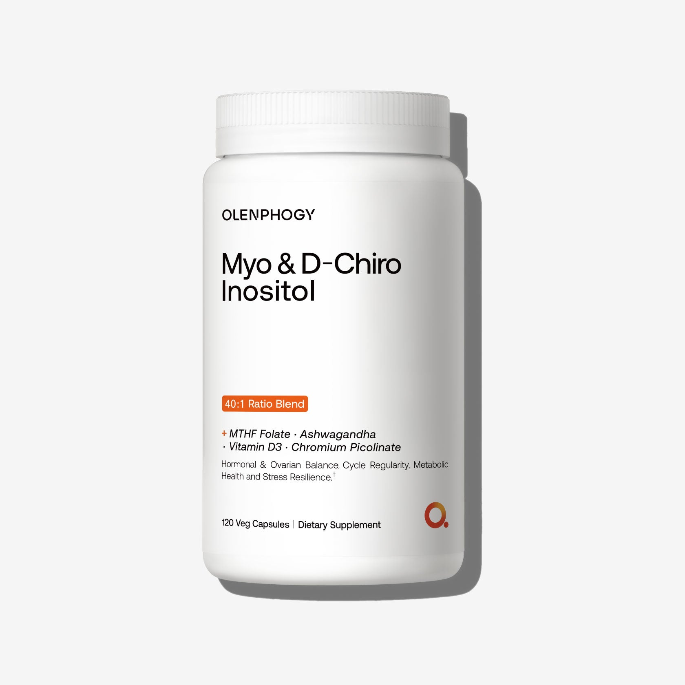
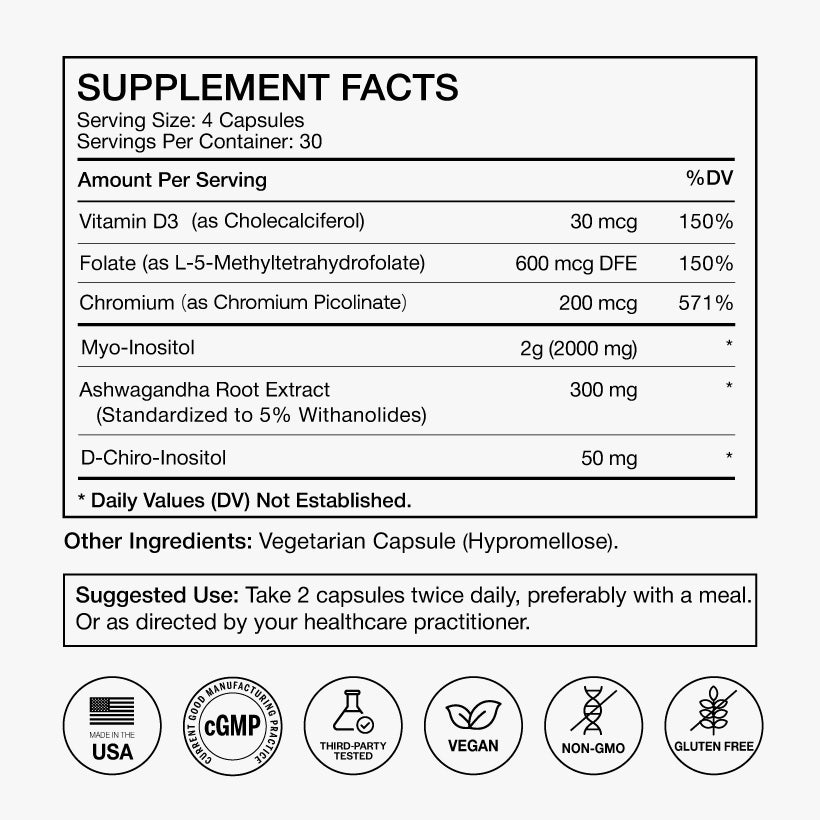
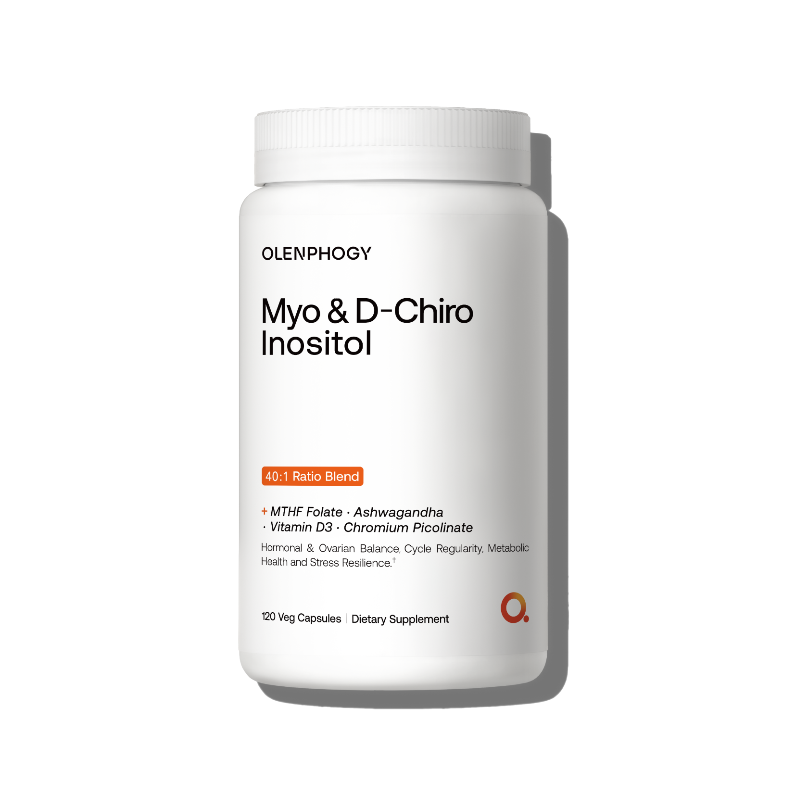

# Myo & D-Chiro Inositol｜图库逐图分析

[返回总目录](../../README.md)

每条图库记录独立保留。相近瓶图不是变体；正文引用与其他页面复用位置在每张图下列出。

## IMG-005 · 肌醇瓶装身份图

- **观察｜文字与层级：** 品牌→双肌醇名称→40:1→用途→120粒。
- **观察｜构图：** 白瓶正面置中，灰白台面与右侧阴影，黑色两行品名，橙色比例条。
- **分析｜作用与复用：** 以比例作为视觉记忆点；数字附着于明确的成分关系。
- **资源：** 1680 × 1680；[原图](https://cdn.shopify.com/s/files/1/0958/9358/6230/files/27895fff27dbc271147dd6bd6f8e5b0e.jpg)；[首个页面](https://olenphogy.com/products/myo-d-chiro-inositol-40-1)。
- **出现位置：** products--myo-d-chiro-inositol-40-1 / gallery / 顺位1；products--myo-d-chiro-inositol-40-1 / body / shopify-section-template--25526755033398__main；collections--science-backed-supplements / body / shopify-section-template--25461923053878__product-grid。
- **核读：** 已目视检查；包装极小字不作为完整标签转录，关键剂量以标签专图为准。

## IMG-006 · 肌醇结果时间线

- **观察｜文字与层级：** 把2–4周的能量/皮肤与9–12周以上的周期支持区分，底部有小号声明。
- **观察｜构图：** 米色针织女性在右侧，左侧蓝色浅底与黑标题，两个橙色周数标签垂直排列。
- **分析｜作用与复用：** 时间阶段降低即时见效期待；这些时间属于品牌主张，不是本库的效果承诺。
- **资源：** 820 × 820；[原图](https://cdn.shopify.com/s/files/1/0958/9358/6230/files/3_001aff14-c37f-4c8c-b65e-19cc6b4f38e4.jpg)；[首个页面](https://olenphogy.com/products/myo-d-chiro-inositol-40-1)。
- **出现位置：** products--myo-d-chiro-inositol-40-1 / gallery / 顺位2；products--myo-d-chiro-inositol-40-1 / body / shopify-section-template--25526755033398__main。
- **核读：** 已目视检查；包装极小字不作为完整标签转录，关键剂量以标签专图为准。

## IMG-007 · 肌醇营养标签

- **观察｜文字与层级：** 4粒/份、30份；Myo 2000mg、D-Chiro 50mg、南非醉茄300mg、D3 30mcg、叶酸600mcg DFE、铬200mcg。
- **观察｜构图：** 白底粗细黑线标签，剂量右对齐，下方使用说明与六个品质图标。
- **分析｜作用与复用：** 比例与绝对量同时出现；图示2粒每日两次随餐，阅读时不要混淆每粒和每份。
- **资源：** 820 × 820；[原图](https://cdn.shopify.com/s/files/1/0958/9358/6230/files/4_7cbb3d8d-55e5-453b-a311-eac6b6ea801e.jpg)；[首个页面](https://olenphogy.com/products/myo-d-chiro-inositol-40-1)。
- **出现位置：** products--myo-d-chiro-inositol-40-1 / gallery / 顺位3；products--myo-d-chiro-inositol-40-1 / body / shopify-section-template--25526755033398__main。
- **核读：** 已目视检查；包装极小字不作为完整标签转录，关键剂量以标签专图为准。

## IMG-008 · 肌醇瓶装补充角度

- **观察｜文字与层级：** 包装复述005，没有新增图外广告。
- **观察｜构图：** 浅灰底，白瓶居中，顶部和侧边留白，柔光与侧影。
- **分析｜作用与复用：** 为图库提供实物确认；重复身份图的边际信息量较低。
- **资源：** 1680 × 1680；[原图](https://cdn.shopify.com/s/files/1/0958/9358/6230/files/47985df40b04c59fbb5c8a3a938c2c72.png)；[首个页面](https://olenphogy.com/products/myo-d-chiro-inositol-40-1)。
- **出现位置：** products--myo-d-chiro-inositol-40-1 / gallery / 顺位4；home / body / shopify-section-template--25461923086646__1767850856b2c89653；products--magnesium-8-pro / body / shopify-section-template--25526732685622__blocks_xjtN89；products--myo-d-chiro-inositol-40-1 / body / shopify-section-template--25526755033398__main；products--myo-d-chiro-inositol-40-1 / body / shopify-section-template--25526755033398__blocks_7YbK8k；products--triphasic-berberine / body / shopify-section-template--25526755098934__blocks_XPjXLE。
- **核读：** 已目视检查；包装极小字不作为完整标签转录，关键剂量以标签专图为准。

## 正文之外的关联视觉

独立研究页、博客和品牌页的本品相关图，均在[共享图册](../../04-视觉表达规律/共享图片索引.md)按素材编号和全部出现位置记录。镁产品另有[亚马逊15图](../../06-亚马逊美国站/B0G933Z1JW/图片与A加构图.md)，未混入官网四图计数。

[返回本品页面地图](README.md)
