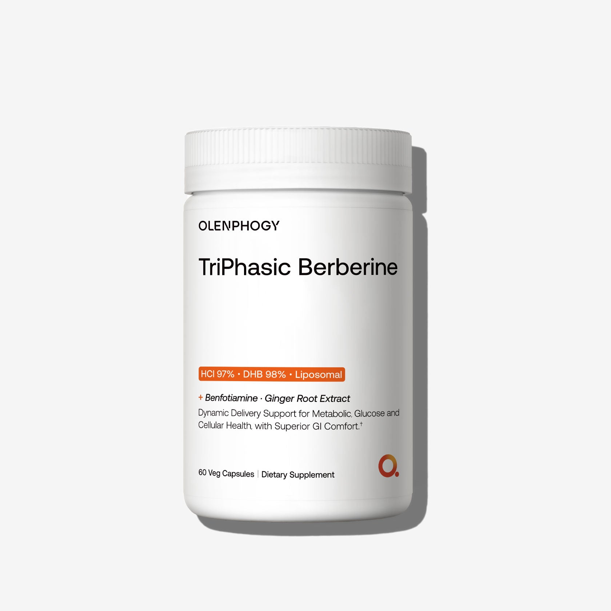
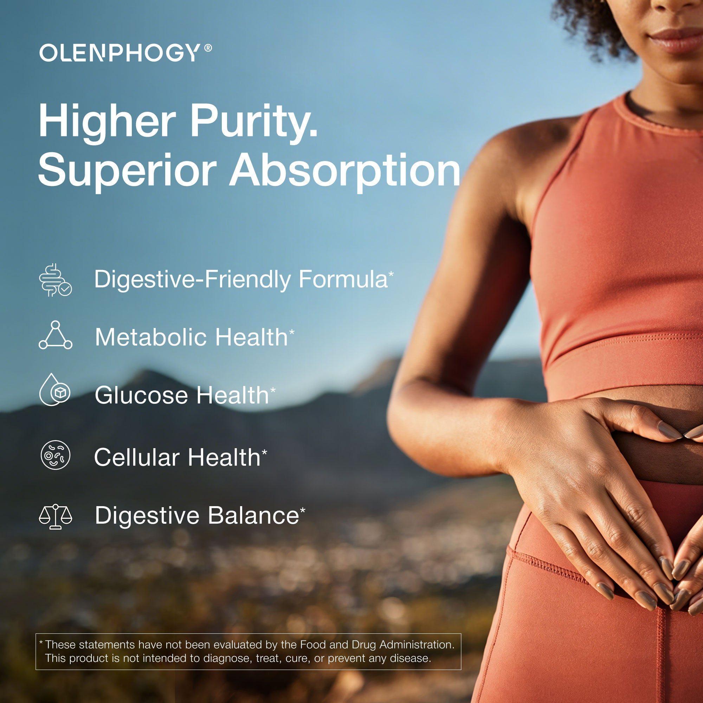
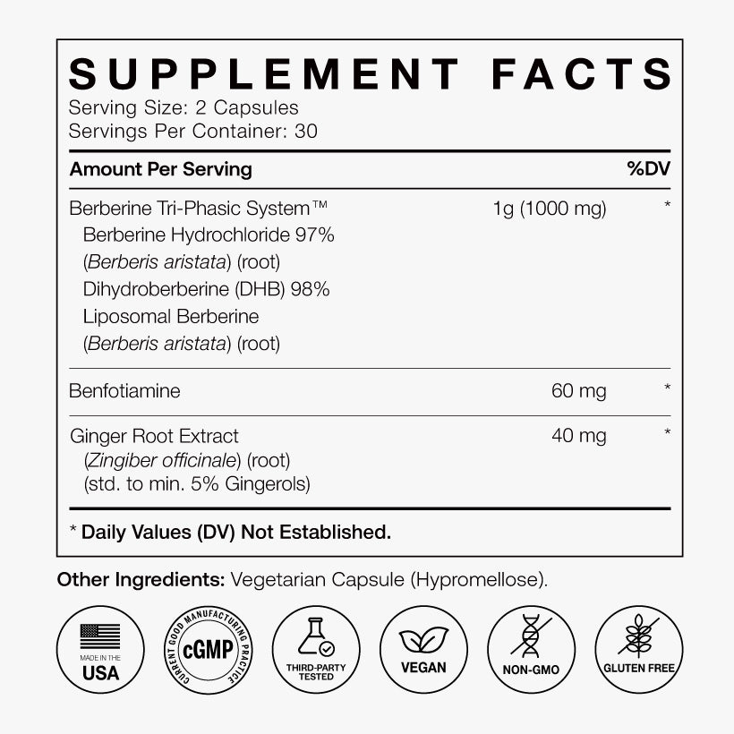
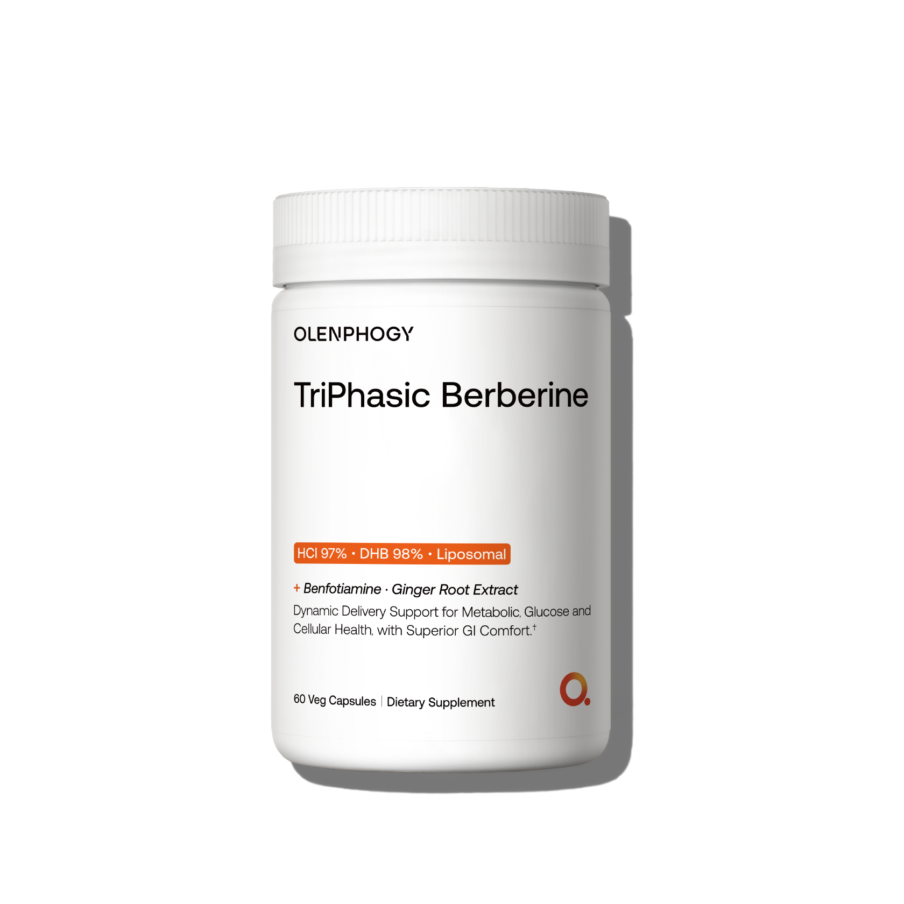

# TriPhasic Berberine｜图库逐图分析

[返回总目录](../../README.md)

每条图库记录独立保留。相近瓶图不是变体；正文引用与其他页面复用位置在每张图下列出。

## IMG-009 · 小檗碱瓶装身份图

- **观察｜文字与层级：** 品牌→三阶段命名→HCl 97%、DHB 98%、脂质体→60粒。
- **观察｜构图：** 白瓶置中，浅灰环境；黑字大品名，橙色高纯度/递送组合条。
- **分析｜作用与复用：** 命名先提出系统，再由纯度数字提供具体感；纯度不等同成品吸收率。
- **资源：** 1680 × 1680；[原图](https://cdn.shopify.com/s/files/1/0958/9358/6230/files/1_b797663e-a673-4993-ae81-2c47c74a16c9.jpg)；[首个页面](https://olenphogy.com/products/triphasic-berberine)。
- **出现位置：** products--triphasic-berberine / gallery / 顺位1；products--triphasic-berberine / body / shopify-section-template--25526755098934__main；collections--science-backed-supplements / body / shopify-section-template--25461923053878__product-grid。
- **核读：** 已目视检查；包装极小字不作为完整标签转录，关键剂量以标签专图为准。

## IMG-010 · 小檗碱腹部生活场景

- **观察｜文字与层级：** 强调纯度/吸收与代谢、葡萄糖、细胞及消化舒适等利益，底部小字声明。
- **观察｜构图：** 运动女性在右侧裁去部分头部，双手靠近腹部；左侧蓝色山景、白字标题与五行图标。
- **分析｜作用与复用：** 用腹部姿态暗示消化与代谢；不要把模特外观视为服用前后证据。
- **资源：** 2000 × 2000；[原图](https://cdn.shopify.com/s/files/1/0958/9358/6230/files/0508.jpg)；[首个页面](https://olenphogy.com/products/triphasic-berberine)。
- **出现位置：** products--triphasic-berberine / gallery / 顺位2；products--triphasic-berberine / body / shopify-section-template--25526755098934__main。
- **核读：** 已目视检查；包装极小字不作为完整标签转录，关键剂量以标签专图为准。

## IMG-011 · 小檗碱营养标签

- **观察｜文字与层级：** 2粒/份、30份；三形态矩阵1000mg、苯磷硫胺60mg、生姜40mg；矩阵未拆各形态重量。
- **观察｜构图：** 高密度白底黑字，粗线分隔，每份量和每日值列对齐，下部六图标。
- **分析｜作用与复用：** 让总量和协同项可对照；总矩阵量不能证明每个成分均达到研究剂量。
- **资源：** 820 × 820；[原图](https://cdn.shopify.com/s/files/1/0958/9358/6230/files/4.jpg)；[首个页面](https://olenphogy.com/products/triphasic-berberine)。
- **出现位置：** products--triphasic-berberine / gallery / 顺位3；products--triphasic-berberine / body / shopify-section-template--25526755098934__main。
- **核读：** 已目视检查；包装极小字不作为完整标签转录，关键剂量以标签专图为准。

## IMG-012 · 小檗碱瓶装补充角度

- **观察｜文字与层级：** 同包装信息，无新增标题。
- **观察｜构图：** 白瓶近正面，灰白底，阴影与009略异，周围留白。
- **分析｜作用与复用：** 身份确认和实物展示，不应计为新规格。
- **资源：** 1680 × 1680；[原图](https://cdn.shopify.com/s/files/1/0958/9358/6230/files/98c881e197cbefed910b10c625fbc2fa.png)；[首个页面](https://olenphogy.com/products/triphasic-berberine)。
- **出现位置：** products--triphasic-berberine / gallery / 顺位4；home / body / shopify-section-template--25461923086646__1767850856b2c89653；products--magnesium-8-pro / body / shopify-section-template--25526732685622__blocks_xjtN89；products--myo-d-chiro-inositol-40-1 / body / shopify-section-template--25526755033398__blocks_7YbK8k；products--triphasic-berberine / body / shopify-section-template--25526755098934__main；products--triphasic-berberine / body / shopify-section-template--25526755098934__blocks_XPjXLE。
- **核读：** 已目视检查；包装极小字不作为完整标签转录，关键剂量以标签专图为准。

## 正文之外的关联视觉

独立研究页、博客和品牌页的本品相关图，均在[共享图册](../../04-视觉表达规律/共享图片索引.md)按素材编号和全部出现位置记录。镁产品另有[亚马逊15图](../../06-亚马逊美国站/B0G933Z1JW/图片与A加构图.md)，未混入官网四图计数。

[返回本品页面地图](README.md)
