# 共享图册｜品牌与生活场景

[返回总目录](../README.md)

## IMG-028 · 首页移动首屏

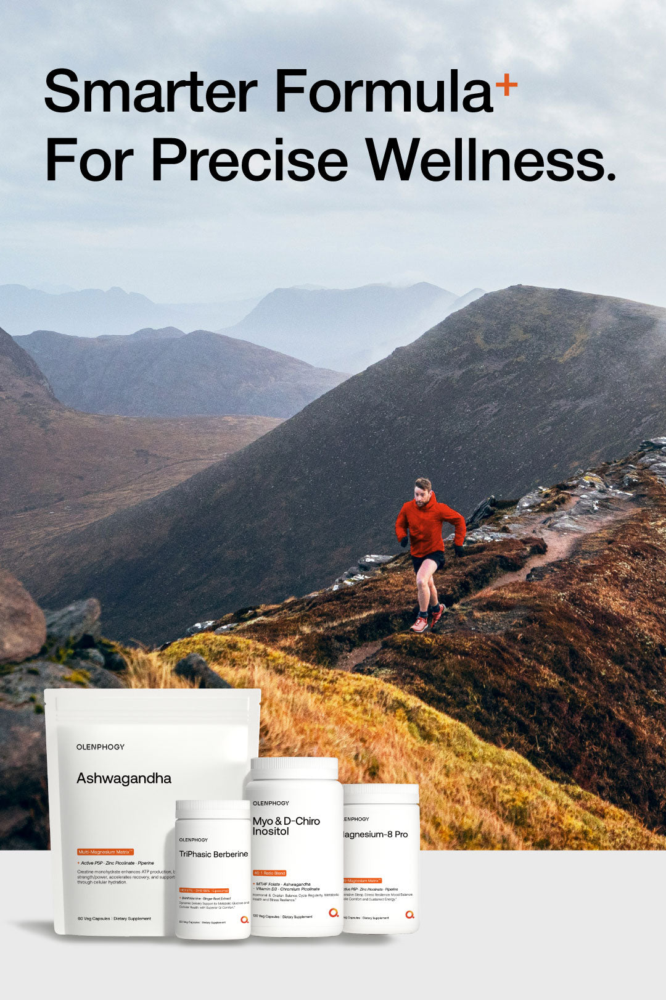

- **观察｜文字与层级：** 品牌理念在上，运动状态和产品在下，形成纵向三段。
- **观察｜构图：** 竖图顶部黑橙品牌承诺，中段越野跑者，下段产品群组与白色几何台阶。
- **分析｜作用与复用：** 这是专门的移动素材；画面有当前目录未列售的独立Ashwagandha包装，记录为展示残留/未列售线索。
- **资源：** 1080 × 1620；[原图](https://olenphogy.com/cdn/shop/files/0324-1.jpg)；[首个页面](https://olenphogy.com/)。
- **出现位置：** home / body / shopify-section-template--25461923086646__image_banner_UrgFzV。
- **核读：** 已目视检查；包装极小字不作为完整标签转录，关键剂量以标签专图为准。

## IMG-029 · 首页桌面首屏

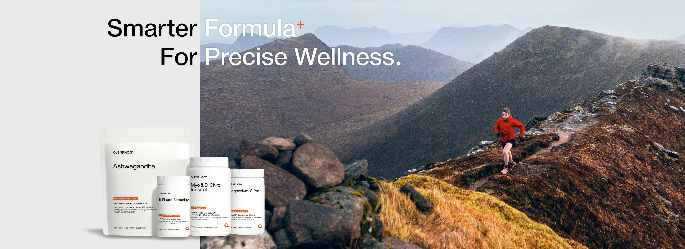

- **观察｜文字与层级：** 先读品牌方法，再看户外状态与产品群组。
- **观察｜构图：** 超宽左右拼接：左白底产品阶梯，右山地跑者；标题跨明暗区变色，橙色加号点缀。
- **分析｜作用与复用：** 理性产品与理想生活并置；宽图不适合直接中心裁成手机图。
- **资源：** 3840 × 1400；[原图](https://olenphogy.com/cdn/shop/files/0317._banner.jpg)；[首个页面](https://olenphogy.com/)。
- **出现位置：** home / body / shopify-section-template--25461923086646__image_banner_UrgFzV。
- **核读：** 已目视检查；包装极小字不作为完整标签转录，关键剂量以标签专图为准。

## IMG-030 · 科学支柱卡

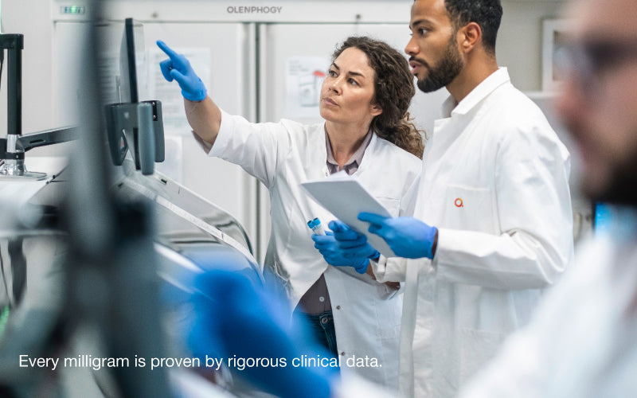

- **观察｜文字与层级：** 把每毫克与临床/科学严谨相连。
- **观察｜构图：** 两位白大褂与手套人物看实验屏幕，冷色实验室，底部白字。
- **分析｜作用与复用：** 实验场景提供语义氛围，不能据照片证明是品牌自有实验室。
- **资源：** 800 × 500；[原图](https://olenphogy.com/cdn/shop/files/800-500.jpg)；[首个页面](https://olenphogy.com/)。
- **出现位置：** home / body / shopify-section-template--25461923086646__1766109747b186c0f2。
- **核读：** 已目视检查；包装极小字不作为完整标签转录，关键剂量以标签专图为准。

## IMG-031 · 纯净支柱卡

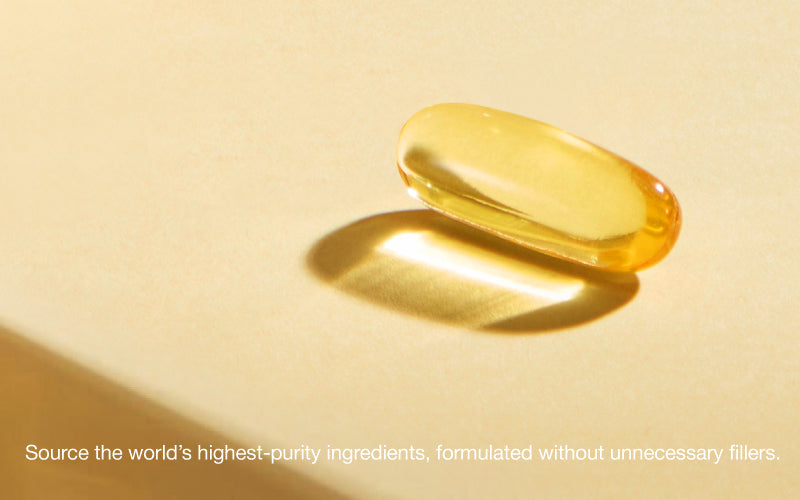

- **观察｜文字与层级：** 纯净与原料品质短句。
- **观察｜构图：** 金色软胶囊微距，暖黄背景与强阴影，底部白字。
- **分析｜作用与复用：** 材质质感承接纯净；当前三款是硬胶囊，不应把这张当商品实拍规格。
- **资源：** 800 × 500；[原图](https://olenphogy.com/cdn/shop/files/0224_4273a5b5-b5db-484b-87d5-99f3b3b72daf.jpg)；[首个页面](https://olenphogy.com/)。
- **出现位置：** home / body / shopify-section-template--25461923086646__1766109747b186c0f2。
- **核读：** 已目视检查；包装极小字不作为完整标签转录，关键剂量以标签专图为准。

## IMG-032 · 精准支柱卡

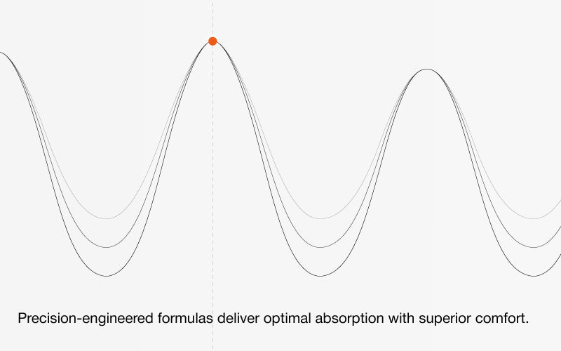

- **观察｜文字与层级：** 用抽象控制曲线表达精准吸收与舒适。
- **观察｜构图：** 白底灰色曲线堆叠，橙色峰点，下方黑字。
- **分析｜作用与复用：** 是概念图，缺坐标、单位和实验条件，不作为实验结果。
- **资源：** 800 × 500；[原图](https://olenphogy.com/cdn/shop/files/0224_80da77a7-f388-4f3b-a1b4-092661825b9f.jpg)；[首个页面](https://olenphogy.com/)。
- **出现位置：** home / body / shopify-section-template--25461923086646__1766109747b186c0f2。
- **核读：** 已目视检查；包装极小字不作为完整标签转录，关键剂量以标签专图为准。

## IMG-033 · 效能支柱卡

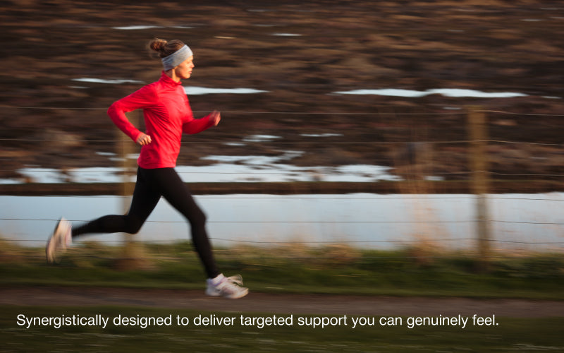

- **观察｜文字与层级：** 把科学结果转换为可感知的定向支持。
- **观察｜构图：** 红衣跑者侧向运动，背景拉出模糊条纹，底部白字。
- **分析｜作用与复用：** 运动模糊表现动力；不要暗示人物是使用者证言。
- **资源：** 800 × 500；[原图](https://olenphogy.com/cdn/shop/files/0224_441b89a9-02c1-4413-9b5e-0e1aa09c02bc.jpg)；[首个页面](https://olenphogy.com/)。
- **出现位置：** home / body / shopify-section-template--25461923086646__1766109747b186c0f2。
- **核读：** 已目视检查；包装极小字不作为完整标签转录，关键剂量以标签专图为准。

## IMG-034 · 晨跑女性

- **观察｜文字与层级：** 无独立图片文案。
- **观察｜构图：** 粉色运动上衣女性微笑，风吹发丝，建筑背景浅虚化，人物偏右。
- **分析｜作用与复用：** 用于日常状态/社交场景，标题由周围网页承担。
- **资源：** 582 × 552；[原图](https://olenphogy.com/cdn/shop/files/0224-9-291-276_18fde218-d48a-414c-a2be-1400ca13d2fd.jpg)；[首个页面](https://olenphogy.com/)。
- **出现位置：** home / body / shopify-section-template--25461923086646__blocks_cmfpD8。
- **核读：** 已目视检查；包装极小字不作为完整标签转录，关键剂量以标签专图为准。

## IMG-035 · 户外男性

- **观察｜文字与层级：** 无独立图片文案。
- **观察｜构图：** 背包男性在山野微笑，远山虚化，脸部为焦点。
- **分析｜作用与复用：** 把健康利益外化为自在的户外状态。
- **资源：** 582 × 552；[原图](https://olenphogy.com/cdn/shop/files/0224-10-291-276_b09c75cb-3eaf-4eb1-8615-db2ab051e701.jpg)；[首个页面](https://olenphogy.com/)。
- **出现位置：** home / body / shopify-section-template--25461923086646__blocks_cmfpD8。
- **核读：** 已目视检查；包装极小字不作为完整标签转录，关键剂量以标签专图为准。

## IMG-036 · 室内饮用场景

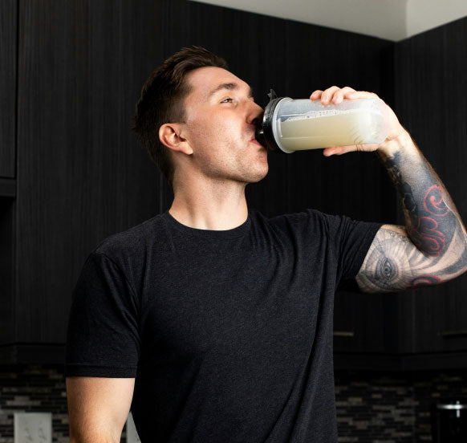

- **观察｜文字与层级：** 无独立图片文案。
- **观察｜构图：** 黑衣男性仰头饮用摇摇杯，室内深色背景，侧面光。
- **分析｜作用与复用：** 表达日常营养习惯；不能据此推断品牌有在售粉剂。
- **资源：** 582 × 552；[原图](https://olenphogy.com/cdn/shop/files/0224-11-291-276_fdfe0cbe-b401-4124-b7cb-82037731a664.jpg)；[首个页面](https://olenphogy.com/)。
- **出现位置：** home / body / shopify-section-template--25461923086646__blocks_cmfpD8。
- **核读：** 已目视检查；包装极小字不作为完整标签转录，关键剂量以标签专图为准。

## IMG-037 · 睡眠俯拍

- **观察｜文字与层级：** 无独立图片文案。
- **观察｜构图：** 浅绿床品，女性侧卧，俯视视角与大片织物留白。
- **分析｜作用与复用：** 安静色温对接休息利益，与户外图形成节奏变化。
- **资源：** 582 × 552；[原图](https://olenphogy.com/cdn/shop/files/0224-12-291-276_9472c8ac-0991-4631-9bba-5ba771a16e93.jpg)；[首个页面](https://olenphogy.com/)。
- **出现位置：** home / body / shopify-section-template--25461923086646__blocks_cmfpD8。
- **核读：** 已目视检查；包装极小字不作为完整标签转录，关键剂量以标签专图为准。

## IMG-038 · 品质移动图

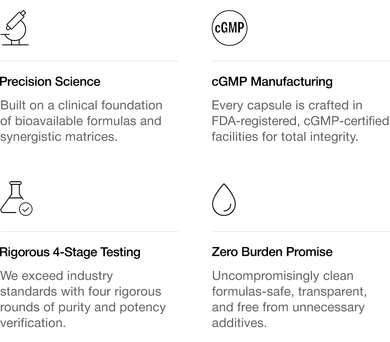

- **观察｜文字与层级：** 科学、制造、四阶段检测、低负担四个信任主题。
- **观察｜构图：** 2×2图标文本格，线性显微镜/制造/试管/水滴图案，白底黑字。
- **分析｜作用与复用：** 移动版把横向四列改为四宫格，适合短标题加一行解释。
- **资源：** 800 × 702；[原图](https://olenphogy.com/cdn/shop/files/0127.png)；[首个页面](https://olenphogy.com/)。
- **出现位置：** home / body / shopify-section-template--25461923086646__shoppable_image_ekdtif。
- **核读：** 已目视检查；包装极小字不作为完整标签转录，关键剂量以标签专图为准。

## IMG-039 · 品质桌面图

- **观察｜文字与层级：** 同038四主题，每列标题下接一段解释。
- **观察｜构图：** 透明底横向四列，细竖线分隔，小号黑字与线性图标。
- **分析｜作用与复用：** 浅色背景承载透明图；已专门合成灰底核读，不能把透明黑字误记为空白图。
- **资源：** 2560 × 310；[原图](https://olenphogy.com/cdn/shop/files/0324.png)；[首个页面](https://olenphogy.com/)。
- **出现位置：** home / body / shopify-section-template--25461923086646__shoppable_image_ekdtif。
- **核读：** 已目视检查；包装极小字不作为完整标签转录，关键剂量以标签专图为准。

## IMG-040 · 泡沫轴恢复

- **观察｜文字与层级：** 无独立图片文案。
- **观察｜构图：** 男性背向镜头使用泡沫轴，蓝绿色环境，身体形成斜线。
- **分析｜作用与复用：** 恢复场景补充运动利益，不是动作教学。
- **资源：** 648 × 614；[原图](https://olenphogy.com/cdn/shop/files/lQDPJyHDr31XT_nNAmbNAoiwoFLbigaKM0gJkVPmdx--Ag_648_614.jpg)；[首个页面](https://olenphogy.com/)。
- **出现位置：** home / body / shopify-section-template--25461923086646__1767679003dd82c0b1。
- **核读：** 已目视检查；包装极小字不作为完整标签转录，关键剂量以标签专图为准。

## IMG-041 · 红衣跑者方图

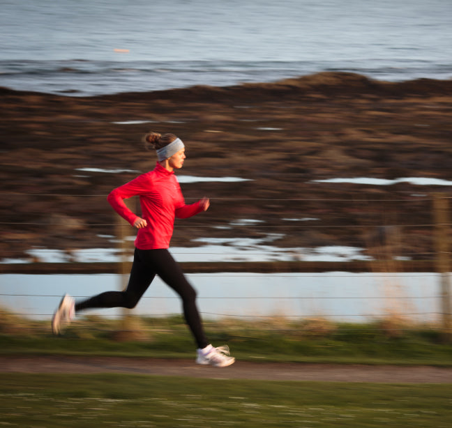

- **观察｜文字与层级：** 无独立图片文案。
- **观察｜构图：** 跑者在水边，横向模糊背景，红衣形成高对比焦点。
- **分析｜作用与复用：** 与效能支柱同视觉母题，方形裁切适合卡片。
- **资源：** 648 × 614；[原图](https://olenphogy.com/cdn/shop/files/lQDPJwYNoHgXz_nNAmbNAoiwFr9DJ512hfAJkVPmdx--AQ_648_614.jpg)；[首个页面](https://olenphogy.com/)。
- **出现位置：** home / body / shopify-section-template--25461923086646__1767679003dd82c0b1。
- **核读：** 已目视检查；包装极小字不作为完整标签转录，关键剂量以标签专图为准。

## IMG-042 · 星轨夜空

- **观察｜文字与层级：** 无独立图片文案。
- **观察｜构图：** 树木围出中央夜空，蓝色星轨旋转，冷色深底。
- **分析｜作用与复用：** 以夜晚隐喻休息节律，不能解释成成分作用机制。
- **资源：** 648 × 614；[原图](https://olenphogy.com/cdn/shop/files/lQDPKH6uEdVgf_nNAmbNAoiwRk5cmj3e_e4JkVPmdx--Aw_648_614.jpg)；[首个页面](https://olenphogy.com/)。
- **出现位置：** home / body / shopify-section-template--25461923086646__1767679003dd82c0b1。
- **核读：** 已目视检查；包装极小字不作为完整标签转录，关键剂量以标签专图为准。

## IMG-043 · 网球女性

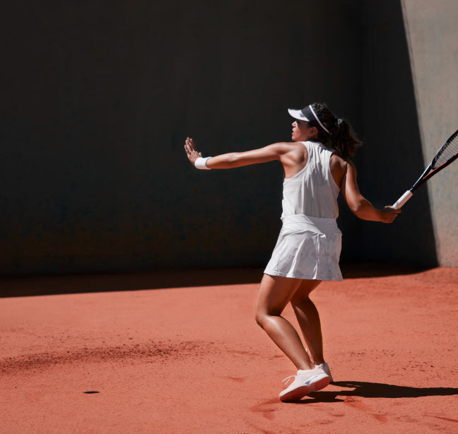

- **观察｜文字与层级：** 无独立图片文案。
- **观察｜构图：** 红土球场与深墙，白衣女性形成高明度主体，空白墙可叠字。
- **分析｜作用与复用：** 运动与精准生活的品牌氛围图。
- **资源：** 648 × 614；[原图](https://olenphogy.com/cdn/shop/files/lQDPKHL0vLWeP_nNAmbNAoiwsmYUBXBSOc8JkVPmdx--AA_648_614.jpg)；[首个页面](https://olenphogy.com/)。
- **出现位置：** home / body / shopify-section-template--25461923086646__1767679003dd82c0b1。
- **核读：** 已目视检查；包装极小字不作为完整标签转录，关键剂量以标签专图为准。

## IMG-044 · 跑道双人俯拍

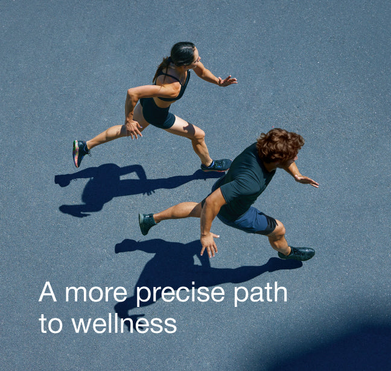

- **观察｜文字与层级：** 从空间路线引申到精准健康路径。
- **观察｜构图：** 蓝色场地与白线形成几何网格，两名跑者小比例分布，左下白字。
- **分析｜作用与复用：** 主体小、环境大，适合作为理念过场而非商品识别图。
- **资源：** 648 × 614；[原图](https://olenphogy.com/cdn/shop/files/1013-_-4_-1_7f01471b-5289-482f-a804-05573a23be77.jpg)；[首个页面](https://olenphogy.com/)。
- **出现位置：** home / body / shopify-section-template--25461923086646__blocks_ALnfeq。
- **核读：** 已目视检查；包装极小字不作为完整标签转录，关键剂量以标签专图为准。

## IMG-045 · 镁品牌引言卡

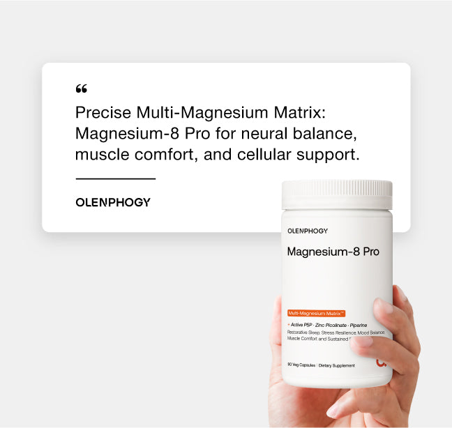

- **观察｜文字与层级：** 品牌口吻解释镁对神经、肌肉和细胞的支持。
- **观察｜构图：** 左上白灰阴影文字卡，右侧手持瓶与边缘重叠，浅暖色背景。
- **分析｜作用与复用：** 引言不是消费者评价；卡片与实物重叠让抽象文字有所指。
- **资源：** 648 × 614；[原图](https://olenphogy.com/cdn/shop/files/0324-2.jpg)；[首个页面](https://olenphogy.com/)。
- **出现位置：** home / body / shopify-section-template--25461923086646__blocks_ALnfeq。
- **核读：** 已目视检查；包装极小字不作为完整标签转录，关键剂量以标签专图为准。

## IMG-046 · 姜片疑问图

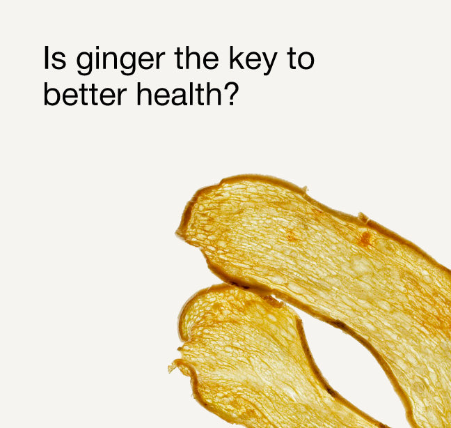

- **观察｜文字与层级：** 用“更好健康”式问题引导阅读。
- **观察｜构图：** 姜根/切面在下右放大，上左黑色疑问句，暖黄背景。
- **分析｜作用与复用：** 宏观食材与小字构成反差，适合教育入口。
- **资源：** 648 × 614；[原图](https://olenphogy.com/cdn/shop/files/1013-_-4_-3_0afe8c63-4d36-4764-9dcf-f48f1826dace.jpg)；[首个页面](https://olenphogy.com/)。
- **出现位置：** home / body / shopify-section-template--25461923086646__blocks_ALnfeq。
- **核读：** 已目视检查；包装极小字不作为完整标签转录，关键剂量以标签专图为准。

## IMG-047 · 海边伸展提问图

- **观察｜文字与层级：** 把伸展放松与神经系统重置的修辞相连。
- **观察｜构图：** 女性侧伸展，海岸与天空为背景，下方白字提问。
- **分析｜作用与复用：** 身体姿态辅助理解，不应照搬“重置”为已证实疗效。
- **资源：** 648 × 614；[原图](https://olenphogy.com/cdn/shop/files/1013-_-4_-4_ea41aac2-bb2c-46fb-b828-5c900d28804f.jpg)；[首个页面](https://olenphogy.com/)。
- **出现位置：** home / body / shopify-section-template--25461923086646__blocks_ALnfeq。
- **核读：** 已目视检查；包装极小字不作为完整标签转录，关键剂量以标签专图为准。

## IMG-048 · 镁推荐卡

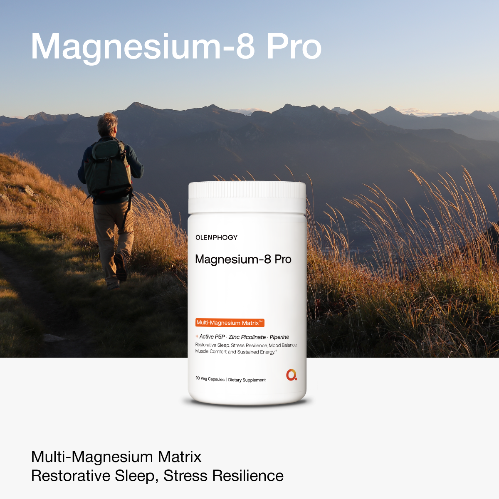

- **观察｜文字与层级：** 品名→利益短句→瓶装身份。
- **观察｜构图：** 上部山地徒步照片约占三分之二，白字品名；瓶子跨接下方白色说明区。
- **分析｜作用与复用：** 一张卡同时建立场景与商品，适合跨售。
- **资源：** 1200 × 1200；[原图](https://olenphogy.com/cdn/shop/files/lQLPKc_7UMVRChnNBLDNBLCwvPEfcf8jgg0JdVvvcSYnAQ_1200_1200.png)；[首个页面](https://olenphogy.com/)。
- **出现位置：** home / shared。
- **核读：** 已目视检查；包装极小字不作为完整标签转录，关键剂量以标签专图为准。

## IMG-049 · 肌醇推荐卡

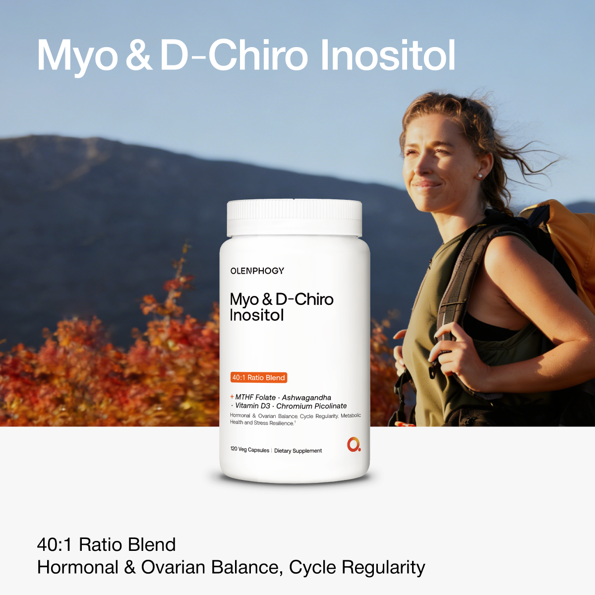

- **观察｜文字与层级：** 40:1及激素/周期利益摘要。
- **观察｜构图：** 女性徒步背景，前景瓶子压住照片与白底边界，标题在上。
- **分析｜作用与复用：** 户外角色扩大使用者想象，不能替代真实用户数据。
- **资源：** 1200 × 1200；[原图](https://olenphogy.com/cdn/shop/files/lQLPJxaBfyW46hnNBLDNBLCwJmc0JliUVNAJdVvvcOsEAA_1200_1200.png)；[首个页面](https://olenphogy.com/)。
- **出现位置：** home / shared。
- **核读：** 已目视检查；包装极小字不作为完整标签转录，关键剂量以标签专图为准。

## IMG-050 · 小檗碱推荐卡

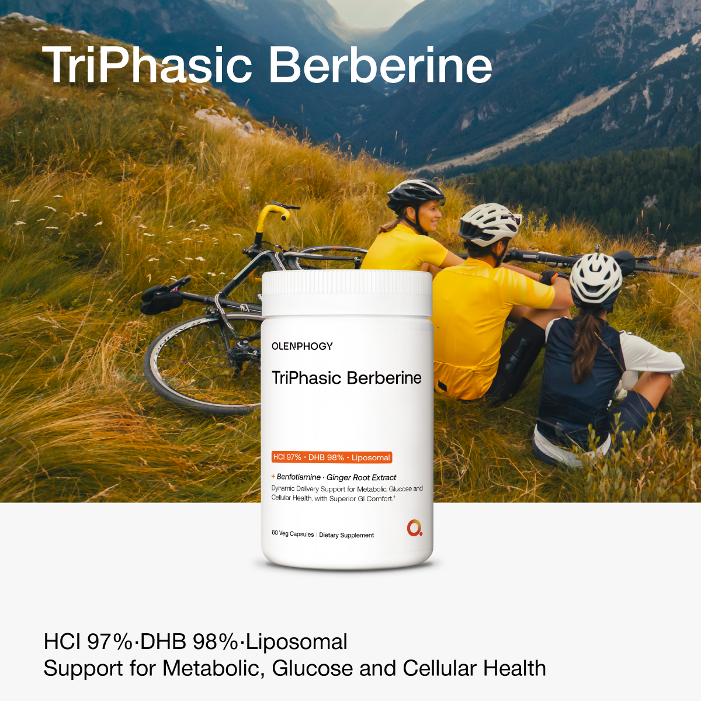

- **观察｜文字与层级：** 三形态与代谢利益摘要。
- **观察｜构图：** 山地骑行男女在上，瓶子居中压住白底下半区。
- **分析｜作用与复用：** 三款推荐卡保持同版式，用场景区分功能。
- **资源：** 1200 × 1200；[原图](https://olenphogy.com/cdn/shop/files/lQLPJwhntlKb2hnNBLDNBLCwrfSQfyi0nVMJdVvvcSYnAA_1200_1200.png)；[首个页面](https://olenphogy.com/)。
- **出现位置：** home / shared。
- **核读：** 已目视检查；包装极小字不作为完整标签转录，关键剂量以标签专图为准。

## IMG-051 · 金色软胶囊方图

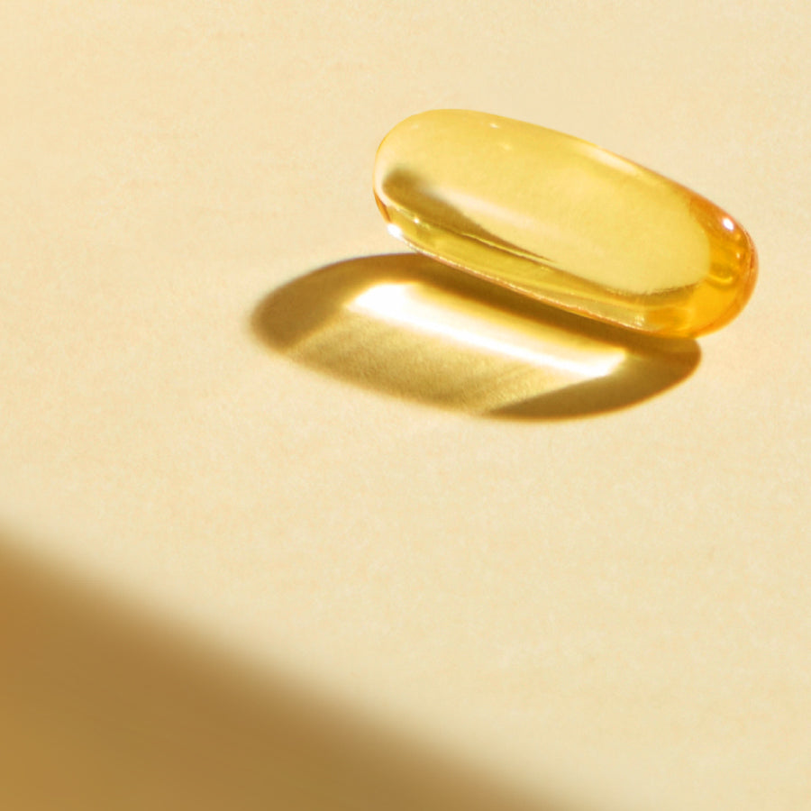

- **观察｜文字与层级：** 无独立图片文案。
- **观察｜构图：** 单粒金色胶囊与硬阴影，暖背景，近景裁切。
- **分析｜作用与复用：** 纯净主题复用；与当前硬胶囊商品形态分开理解。
- **资源：** 900 × 900；[原图](https://olenphogy.com/cdn/shop/files/1217_2_1.jpg)；[首个页面](https://olenphogy.com/)。
- **出现位置：** home / shared。
- **核读：** 已目视检查；包装极小字不作为完整标签转录，关键剂量以标签专图为准。

## IMG-052 · 培养皿粉末

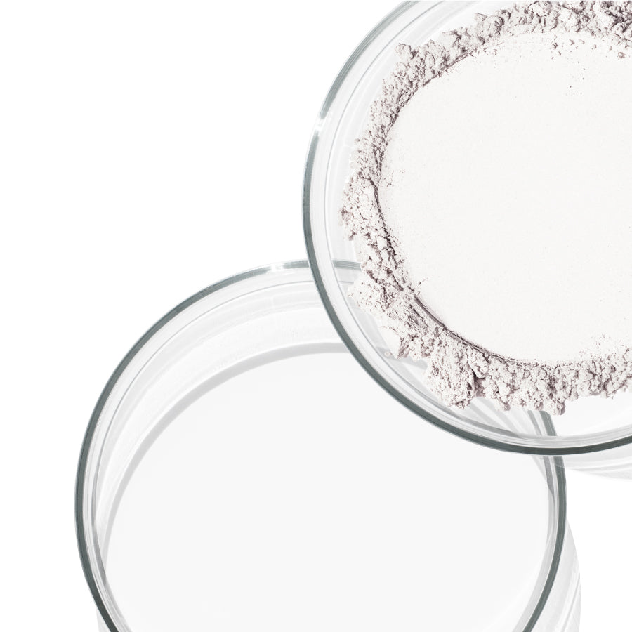

- **观察｜文字与层级：** 无独立图片文案。
- **观察｜构图：** 白色粉末与玻璃圆皿在相对角落，中央大留白。
- **分析｜作用与复用：** 暗示精确测量，适合叠加短标题。
- **资源：** 900 × 900；[原图](https://olenphogy.com/cdn/shop/files/lQDPJwoac3Hzs2vNA4TNA4SwO1wgvZ3LI6oJQC3AGZoXAA_900_900.jpg)；[首个页面](https://olenphogy.com/)。
- **出现位置：** home / shared。
- **核读：** 已目视检查；包装极小字不作为完整标签转录，关键剂量以标签专图为准。

## IMG-053 · 饮水女性

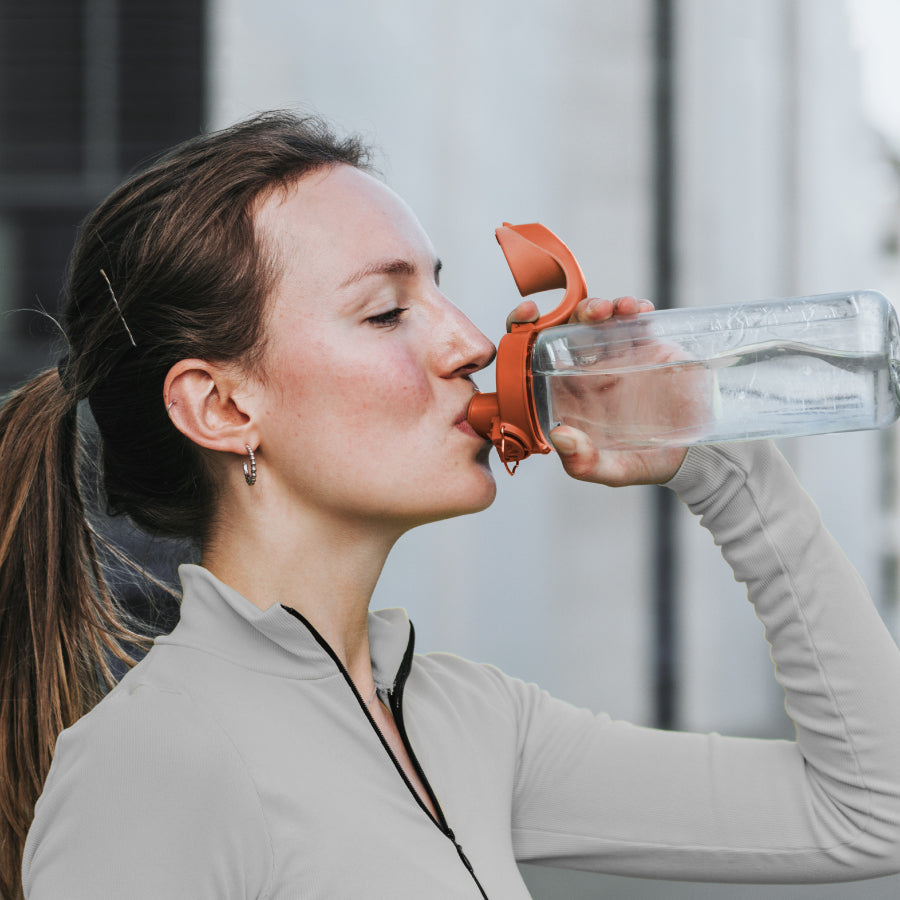

- **观察｜文字与层级：** 无独立图片文案。
- **观察｜构图：** 户外女性持水瓶靠近口部，侧面近景，自然光。
- **分析｜作用与复用：** 日常补充行为入口，不承担剂量说明。
- **资源：** 900 × 900；[原图](https://olenphogy.com/cdn/shop/files/1217_4.jpg)；[首个页面](https://olenphogy.com/)。
- **出现位置：** home / shared。
- **核读：** 已目视检查；包装极小字不作为完整标签转录，关键剂量以标签专图为准。

## IMG-054 · 网球女性方裁切

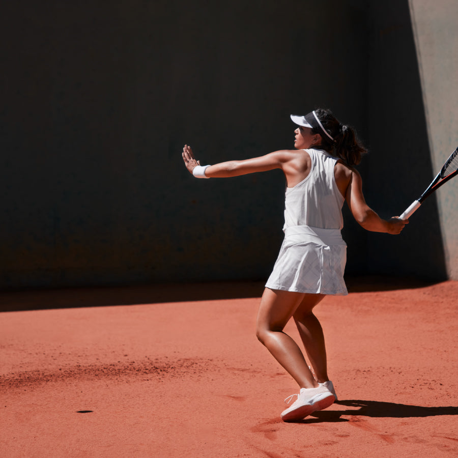

- **观察｜文字与层级：** 无独立图片文案。
- **观察｜构图：** 白衣人物对深墙/红场，方形裁切缩短环境。
- **分析｜作用与复用：** 与043同母图，尺寸版本单独追踪。
- **资源：** 900 × 900；[原图](https://olenphogy.com/cdn/shop/files/1217_3.jpg)；[首个页面](https://olenphogy.com/)。
- **出现位置：** home / shared。
- **核读：** 已目视检查；包装极小字不作为完整标签转录，关键剂量以标签专图为准。

## IMG-055 · 品牌字标

- **观察｜文字与层级：** 仅品牌名。
- **观察｜构图：** 透明底黑色全大写无衬线字标，横向紧凑，笔画粗。
- **分析｜作用与复用：** 品牌识别素材；需要浅底展示，字体不据外观猜具体字库。
- **资源：** 350 × 100；[原图](https://olenphogy.com/cdn/shop/files/logo_ef7a49ba-1f98-4e81-be46-d7659778bf16.png)；[首个页面](https://olenphogy.com/)。
- **出现位置：** home / shared；home / shared。
- **核读：** 已目视检查；包装极小字不作为完整标签转录，关键剂量以标签专图为准。

## IMG-056 · 关于页移动首屏

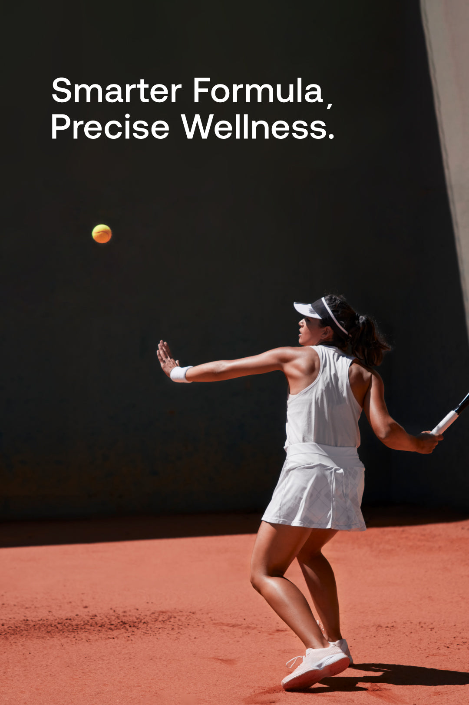

- **观察｜文字与层级：** 品牌生活理念大标题。
- **观察｜构图：** 竖向网球人物，深墙上方留标题，红土在下，人物偏右。
- **分析｜作用与复用：** 手机版保留标题与人物关系，避免桌面横图挤缩。
- **资源：** 1080 × 1620；[原图](https://olenphogy.com/cdn/shop/files/0324-3.jpg)；[首个页面](https://olenphogy.com/pages/about-olenphogy)。
- **出现位置：** pages--about-olenphogy / body / shopify-section-template--25478908969270__image_banner_TBLH3J。
- **核读：** 已目视检查；包装极小字不作为完整标签转录，关键剂量以标签专图为准。

## IMG-057 · 关于页桌面首屏

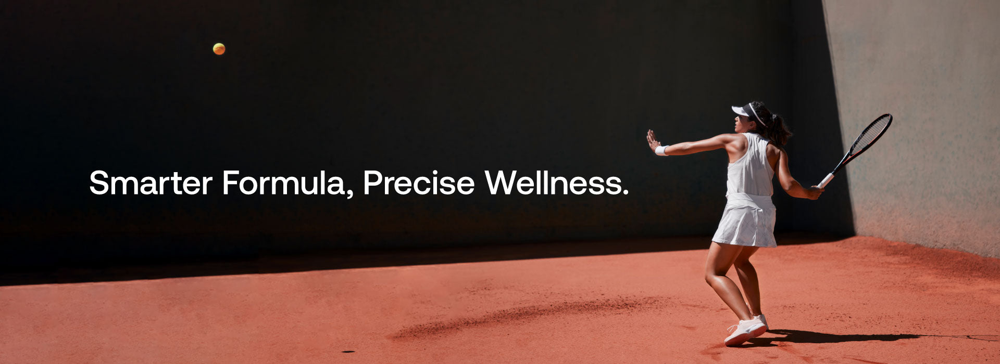

- **观察｜文字与层级：** 左侧理念标题，动作场景作为解释。
- **观察｜构图：** 超宽网球场，左侧深色空墙留白，右侧小比例白衣人物。
- **分析｜作用与复用：** 利用大负空间建立高端感而非增加小卖点。
- **资源：** 1920 × 700；[原图](https://olenphogy.com/cdn/shop/files/0324-2_54c16c7d-68b1-497c-84ae-77f00ca7a39d.jpg)；[首个页面](https://olenphogy.com/pages/about-olenphogy)。
- **出现位置：** pages--about-olenphogy / body / shopify-section-template--25478908969270__image_banner_TBLH3J。
- **核读：** 已目视检查；包装极小字不作为完整标签转录，关键剂量以标签专图为准。

## IMG-058 · 实验室无字版

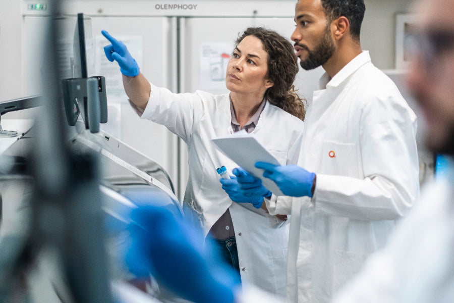

- **观察｜文字与层级：** 无独立图片文案。
- **观察｜构图：** 两位实验工作人员、屏幕和手套，冷白光，比030更宽。
- **分析｜作用与复用：** 适合网页叠字；场景真实性未独立核验。
- **资源：** 900 × 600；[原图](https://olenphogy.com/cdn/shop/files/900-600.jpg)；[首个页面](https://olenphogy.com/pages/about-olenphogy)。
- **出现位置：** pages--about-olenphogy / body / shopify-section-template--25478908969270__blocks_YrYKdg。
- **核读：** 已目视检查；包装极小字不作为完整标签转录，关键剂量以标签专图为准。

## IMG-059 · 软胶囊无字版

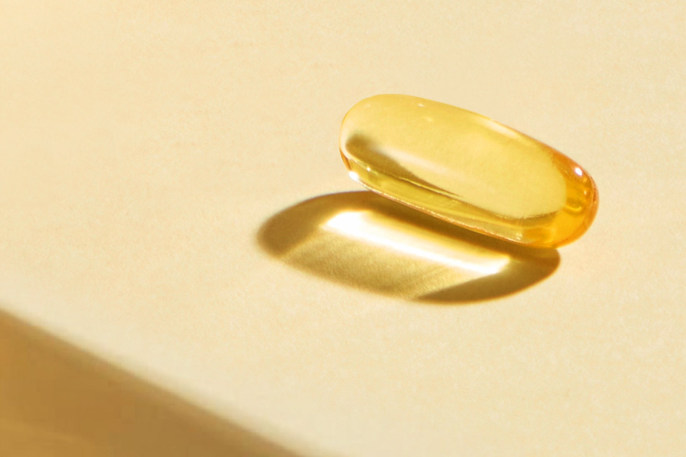

- **观察｜文字与层级：** 无独立图片文案。
- **观察｜构图：** 金色软胶囊暖底，阴影清晰，留白较大。
- **分析｜作用与复用：** 纯净母题，不对应当前在售胶囊外观。
- **资源：** 1800 × 1200；[原图](https://olenphogy.com/cdn/shop/files/0223-_-900-600.jpg)；[首个页面](https://olenphogy.com/pages/about-olenphogy)。
- **出现位置：** pages--about-olenphogy / body / shopify-section-template--25478908969270__blocks_YrYKdg。
- **核读：** 已目视检查；包装极小字不作为完整标签转录，关键剂量以标签专图为准。

## IMG-060 · 精准曲线无字版

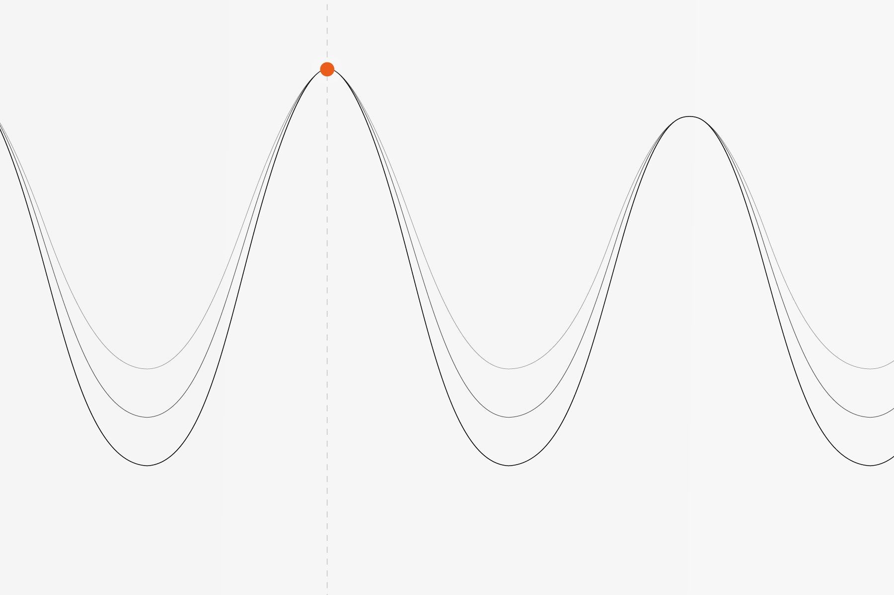

- **观察｜文字与层级：** 无独立图片文案。
- **观察｜构图：** 灰色波线与橙色峰点，白底简洁，无轴标签。
- **分析｜作用与复用：** 纯概念视觉，不得作为定量研究图复用。
- **资源：** 1800 × 1200；[原图](https://olenphogy.com/cdn/shop/files/0223-_-900-600-4.jpg)；[首个页面](https://olenphogy.com/pages/about-olenphogy)。
- **出现位置：** pages--about-olenphogy / body / shopify-section-template--25478908969270__blocks_YrYKdg。
- **核读：** 已目视检查；包装极小字不作为完整标签转录，关键剂量以标签专图为准。

## IMG-061 · 红衣跑者无字版

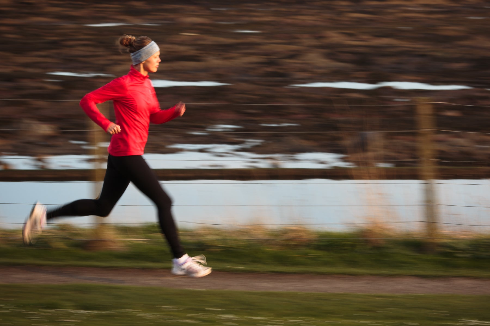

- **观察｜文字与层级：** 无独立图片文案。
- **观察｜构图：** 侧向奔跑，背景方向性模糊，红色主体突出。
- **分析｜作用与复用：** 效能母题，适合与科学/纯净卡平行排布。
- **资源：** 1800 × 1200；[原图](https://olenphogy.com/cdn/shop/files/0223-_-900-600-2.jpg)；[首个页面](https://olenphogy.com/pages/about-olenphogy)。
- **出现位置：** pages--about-olenphogy / body / shopify-section-template--25478908969270__blocks_YrYKdg。
- **核读：** 已目视检查；包装极小字不作为完整标签转录，关键剂量以标签专图为准。

## IMG-062 · 产品阶梯移动图

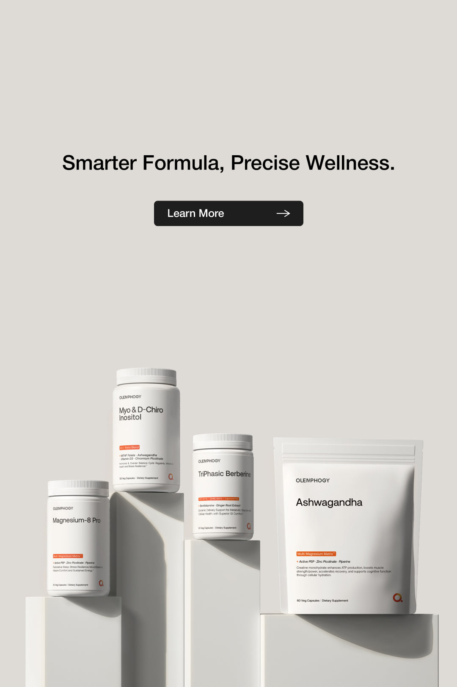

- **观察｜文字与层级：** 品牌理念→了解更多。
- **观察｜构图：** 三白瓶和独立南非醉茄袋置于阶梯底部，黑字标题居中，内嵌黑按钮。
- **分析｜作用与复用：** 竖版专用；袋装SKU未在当前目录找到。
- **资源：** 1080 × 1620；[原图](https://olenphogy.com/cdn/shop/files/6f2e4c368d0ebdfa5bbc86cb92410b7d.jpg)；[首个页面](https://olenphogy.com/pages/about-olenphogy)。
- **出现位置：** pages--about-olenphogy / body / shopify-section-template--25478908969270__image_banner_6rAcnY。
- **核读：** 已目视检查；包装极小字不作为完整标签转录，关键剂量以标签专图为准。

## IMG-063 · 产品阶梯桌面图

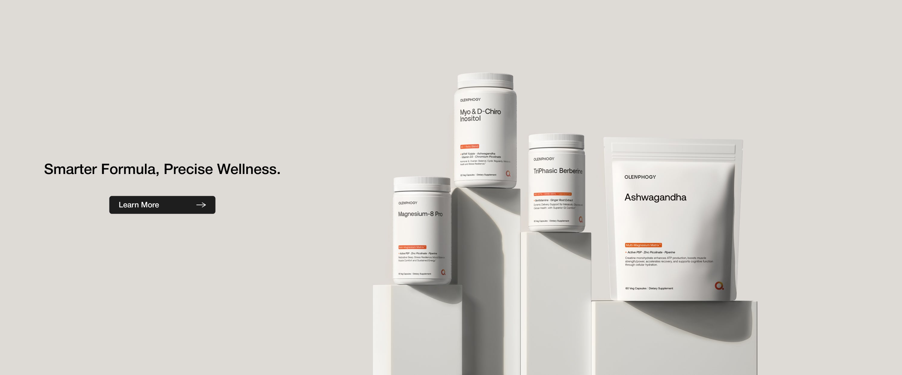

- **观察｜文字与层级：** 与062相同信息，横向阅读。
- **观察｜构图：** 右侧台阶与产品群，左侧黑标题和黑按钮，白底大留白。
- **分析｜作用与复用：** 不同端重排不是简单缩放；内嵌按钮仅是图像，交互另由网页链接承担。
- **资源：** 3000 × 1250；[原图](https://olenphogy.com/cdn/shop/files/2.jpg)；[首个页面](https://olenphogy.com/pages/about-olenphogy)。
- **出现位置：** pages--about-olenphogy / body / shopify-section-template--25478908969270__image_banner_6rAcnY。
- **核读：** 已目视检查；包装极小字不作为完整标签转录，关键剂量以标签专图为准。

## IMG-064 · 成分页移动首屏

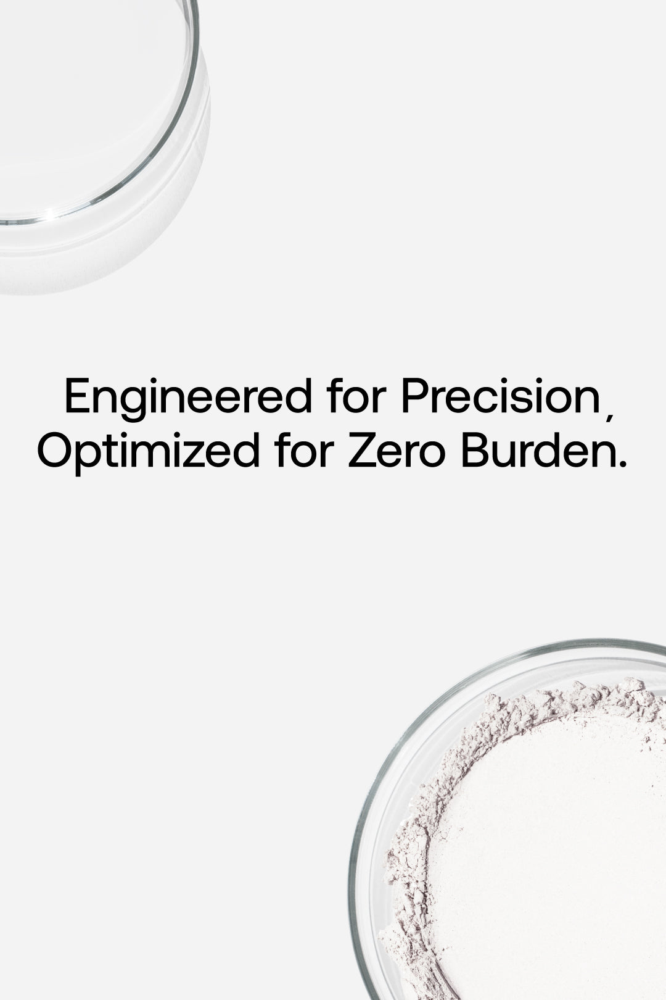

- **观察｜文字与层级：** 工程精准与低负担的理念。
- **观察｜构图：** 粉末培养皿位于上下角，中间黑色标题，白底竖图。
- **分析｜作用与复用：** 留白包围文字，建立字典页的专业而轻盈感觉。
- **资源：** 1080 × 1620；[原图](https://olenphogy.com/cdn/shop/files/lQDPJxOAEG2996XNBlTNBDiwDSiGCK_gSfYJd-o8BblnAA_1080_1620.jpg)；[首个页面](https://olenphogy.com/pages/ingredients)。
- **出现位置：** pages--ingredients / body / shopify-section-template--25477623873846__image_banner_qrpEqn。
- **核读：** 已目视检查；包装极小字不作为完整标签转录，关键剂量以标签专图为准。

## IMG-065 · 成分页桌面首屏

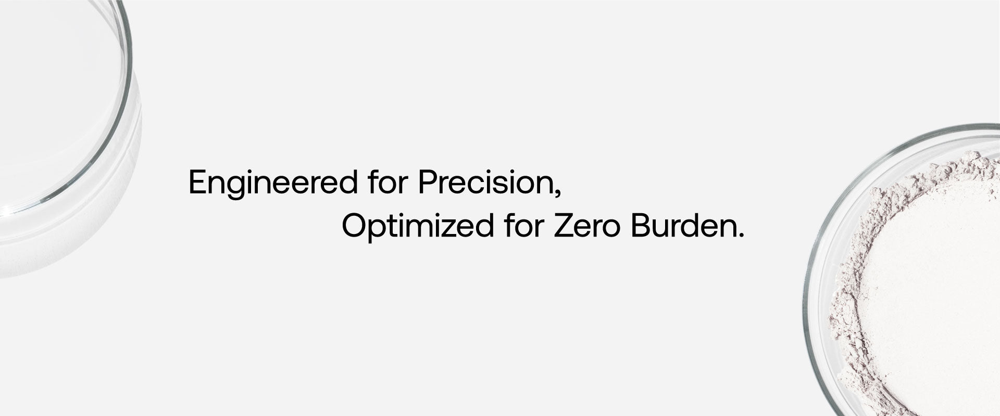

- **观察｜文字与层级：** 同064理念横排。
- **观察｜构图：** 两侧玻璃粉末皿，中央大标题，宽白底。
- **分析｜作用与复用：** 原料质感做边框，核心信息放安全区。
- **资源：** 1920 × 800；[原图](https://olenphogy.com/cdn/shop/files/banner02262.jpg)；[首个页面](https://olenphogy.com/pages/ingredients)。
- **出现位置：** pages--ingredients / body / shopify-section-template--25477623873846__image_banner_qrpEqn。
- **核读：** 已目视检查；包装极小字不作为完整标签转录，关键剂量以标签专图为准。

[返回共享索引](共享图片索引.md)
