# 共享图册｜成分字典

[返回总目录](../README.md)

## IMG-066 · 南非醉茄原料卡

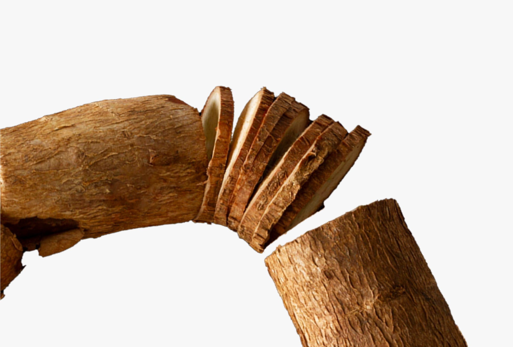

- **观察｜文字与层级：** 无独立图片文案；网页对应南非醉茄根提取物。
- **观察｜构图：** 棕色根段围住下方边缘，上部白底留白。
- **分析｜作用与复用：** 具象根部帮助认类，不证明活性含量。
- **资源：** 1950 × 1320；[原图](https://olenphogy.com/cdn/shop/files/420_c8f04f36-d771-4b08-9b52-c14f7490afb3.jpg)；[首个页面](https://olenphogy.com/pages/ingredients)。
- **出现位置：** pages--ingredients / body / shopify-section-template--25477623873846__blocks_dLMnWk。
- **核读：** 已目视检查；包装极小字不作为完整标签转录，关键剂量以标签专图为准。

## IMG-067 · 盐酸小檗碱原料卡

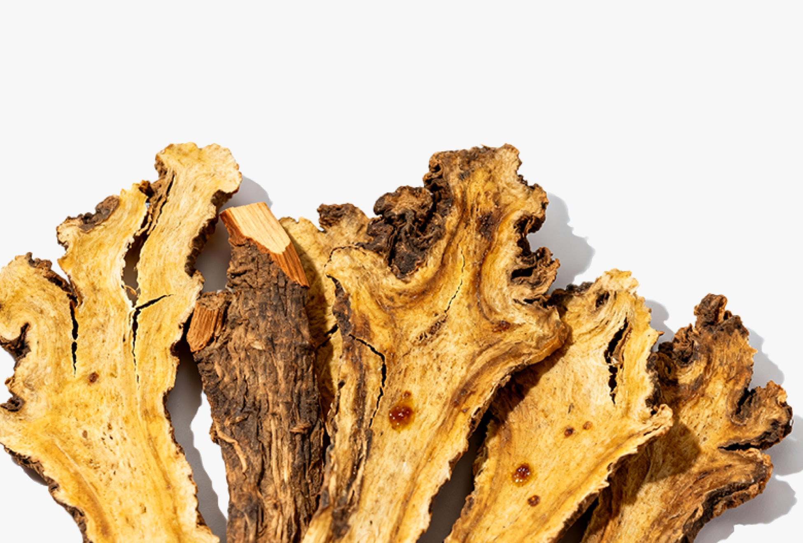

- **观察｜文字与层级：** 无独立图片文案；网页对应97% HCl。
- **观察｜构图：** 黄色木根呈扇状堆放在下部，白底。
- **分析｜作用与复用：** 植物根与纯度文字分工，纯度由文本声明。
- **资源：** 1950 × 1320；[原图](https://olenphogy.com/cdn/shop/files/420.jpg)；[首个页面](https://olenphogy.com/pages/ingredients)。
- **出现位置：** pages--ingredients / body / shopify-section-template--25477623873846__blocks_dLMnWk；pages--testing / body / shopify-section-template--25567485264182__blocks_jeM3t4。
- **核读：** 已目视检查；包装极小字不作为完整标签转录，关键剂量以标签专图为准。

## IMG-068 · 苯磷硫胺原料卡

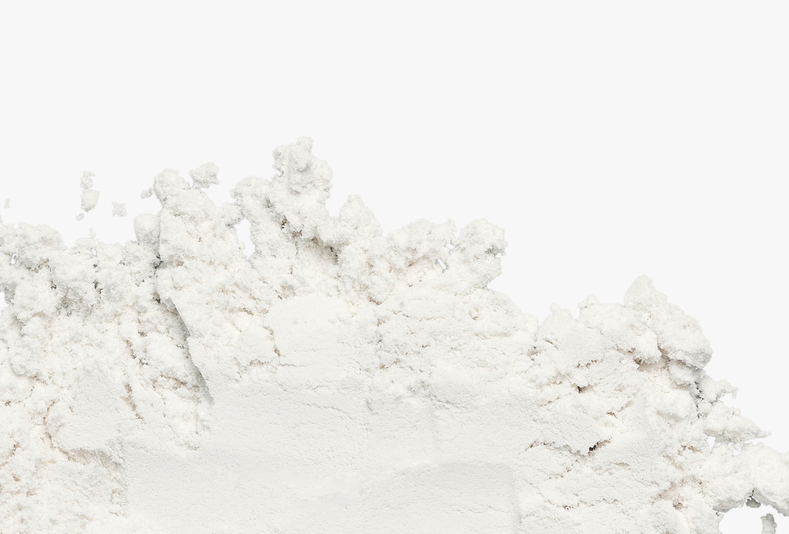

- **观察｜文字与层级：** 无独立图片文案；网页对应Benfotiamine。
- **观察｜构图：** 白色细粉堆在底边，白背景下以微阴影区分。
- **分析｜作用与复用：** 粉体极简强调纯净，需邻接名称避免无法识别。
- **资源：** 1950 × 1320；[原图](https://olenphogy.com/cdn/shop/files/420_76f71f4e-c840-41d1-92e6-305bfb67c4f0.jpg)；[首个页面](https://olenphogy.com/pages/ingredients)。
- **出现位置：** pages--ingredients / body / shopify-section-template--25477623873846__blocks_dLMnWk。
- **核读：** 已目视检查；包装极小字不作为完整标签转录，关键剂量以标签专图为准。

## IMG-069 · 胡椒提取物原料卡

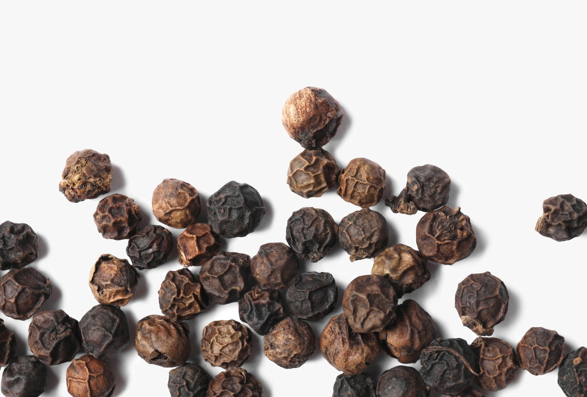

- **观察｜文字与层级：** 无独立图片文案；网页对应95%胡椒碱。
- **观察｜构图：** 黑胡椒粒密集占下半部，上方白底。
- **分析｜作用与复用：** 原料辨识明确，但全胡椒图不等于标准化提取物实拍。
- **资源：** 1950 × 1320；[原图](https://olenphogy.com/cdn/shop/files/420_6431ca93-e8c8-40c8-abab-7fc7308860d7.jpg)；[首个页面](https://olenphogy.com/pages/ingredients)。
- **出现位置：** pages--ingredients / body / shopify-section-template--25477623873846__blocks_dLMnWk；pages--testing / body / shopify-section-template--25567485264182__blocks_jeM3t4。
- **核读：** 已目视检查；包装极小字不作为完整标签转录，关键剂量以标签专图为准。

## IMG-070 · 铬原料卡

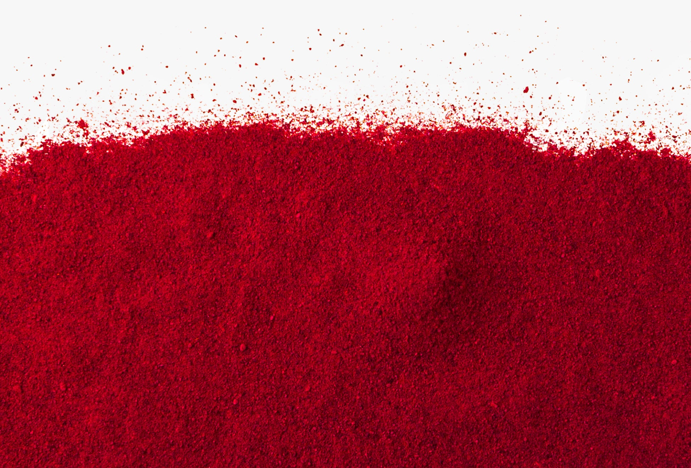

- **观察｜文字与层级：** 无独立图片文案；网页对应吡啶甲酸铬。
- **观察｜构图：** 红褐粉堆在下边，细颗粒与白底对比。
- **分析｜作用与复用：** 用颜色区分字典卡，不据颜色鉴定化学形态。
- **资源：** 1950 × 1320；[原图](https://olenphogy.com/cdn/shop/files/Chromium-_as-Chromium-Picolinate_-420.jpg)；[首个页面](https://olenphogy.com/pages/ingredients)。
- **出现位置：** pages--ingredients / body / shopify-section-template--25477623873846__blocks_dLMnWk；pages--testing / body / shopify-section-template--25567485264182__blocks_jeM3t4。
- **核读：** 已目视检查；包装极小字不作为完整标签转录，关键剂量以标签专图为准。

## IMG-071 · D-Chiro原料卡

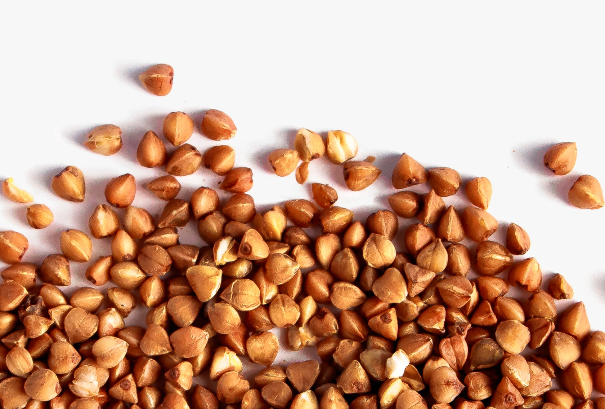

- **观察｜文字与层级：** 无独立图片文案；网页对应D-Chiro肌醇。
- **观察｜构图：** 米黄色种粒在左下，白底大留白。
- **分析｜作用与复用：** 是成分视觉指代，不能反推出供应来源。
- **资源：** 1950 × 1320；[原图](https://olenphogy.com/cdn/shop/files/D-Chiro-Inositol-420.jpg)；[首个页面](https://olenphogy.com/pages/ingredients)。
- **出现位置：** pages--ingredients / body / shopify-section-template--25477623873846__blocks_dLMnWk；pages--testing / body / shopify-section-template--25567485264182__blocks_jeM3t4。
- **核读：** 已目视检查；包装极小字不作为完整标签转录，关键剂量以标签专图为准。

## IMG-072 · DHB原料卡

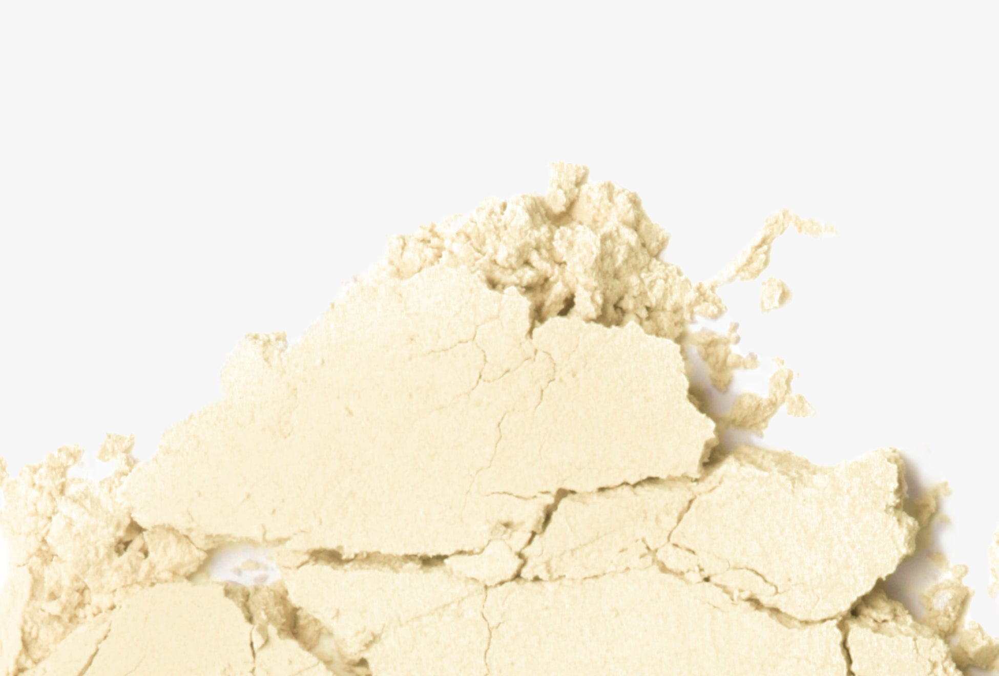

- **观察｜文字与层级：** 无独立图片文案；网页对应98% DHB。
- **观察｜构图：** 黄色粉末堆偏右下，低角度阴影，白底。
- **分析｜作用与复用：** 与白粉卡通过色相区分，规格依赖旁文。
- **资源：** 1950 × 1320；[原图](https://olenphogy.com/cdn/shop/files/DHB-420.jpg)；[首个页面](https://olenphogy.com/pages/ingredients)。
- **出现位置：** pages--ingredients / body / shopify-section-template--25477623873846__blocks_dLMnWk；pages--testing / body / shopify-section-template--25567485264182__blocks_jeM3t4。
- **核读：** 已目视检查；包装极小字不作为完整标签转录，关键剂量以标签专图为准。

## IMG-073 · 叶酸原料卡

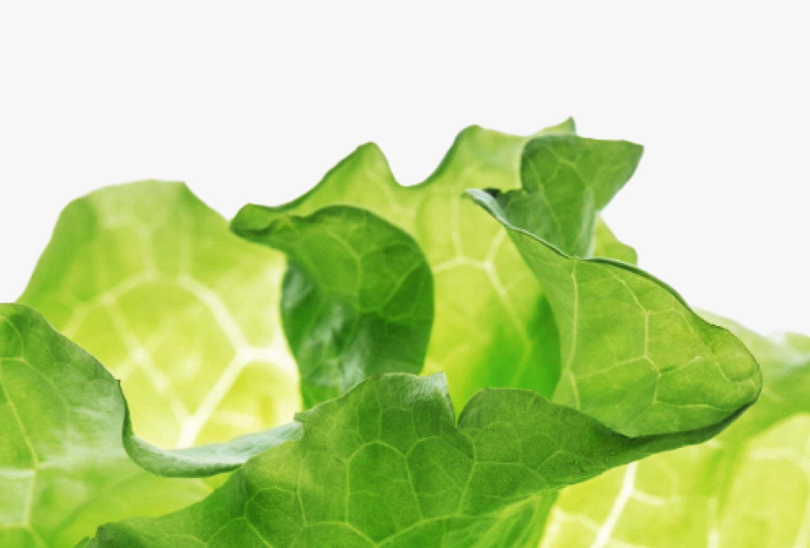

- **观察｜文字与层级：** 无独立图片文案；网页对应5-MTHF。
- **观察｜构图：** 绿色叶片簇在底部，白色背景。
- **分析｜作用与复用：** 将分子名转成熟悉植物语义，不等同该叶片提取来源。
- **资源：** 1950 × 1320；[原图](https://olenphogy.com/cdn/shop/files/Folate-_active-MTHF-form_-420.jpg)；[首个页面](https://olenphogy.com/pages/ingredients)。
- **出现位置：** pages--ingredients / body / shopify-section-template--25477623873846__blocks_dLMnWk。
- **核读：** 已目视检查；包装极小字不作为完整标签转录，关键剂量以标签专图为准。

## IMG-074 · 生姜原料卡

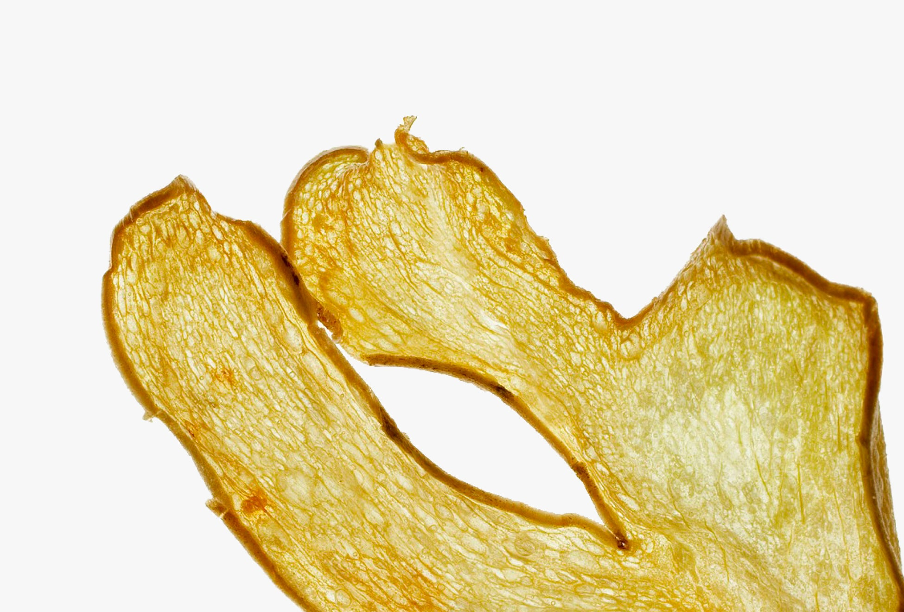

- **观察｜文字与层级：** 无独立图片文案；网页对应最低5%姜辣素。
- **观察｜构图：** 透光黄色姜片斜置，白底，上方留白。
- **分析｜作用与复用：** 切片质地表达天然原料，标准化含量由文本补足。
- **资源：** 1950 × 1320；[原图](https://olenphogy.com/cdn/shop/files/420_ab4f1ebe-dbd4-4101-a713-afbc5aec173d.jpg)；[首个页面](https://olenphogy.com/pages/ingredients)。
- **出现位置：** pages--ingredients / body / shopify-section-template--25477623873846__blocks_dLMnWk；pages--testing / body / shopify-section-template--25567485264182__blocks_jeM3t4。
- **核读：** 已目视检查；包装极小字不作为完整标签转录，关键剂量以标签专图为准。

## IMG-075 · 脂质体小檗碱原料卡

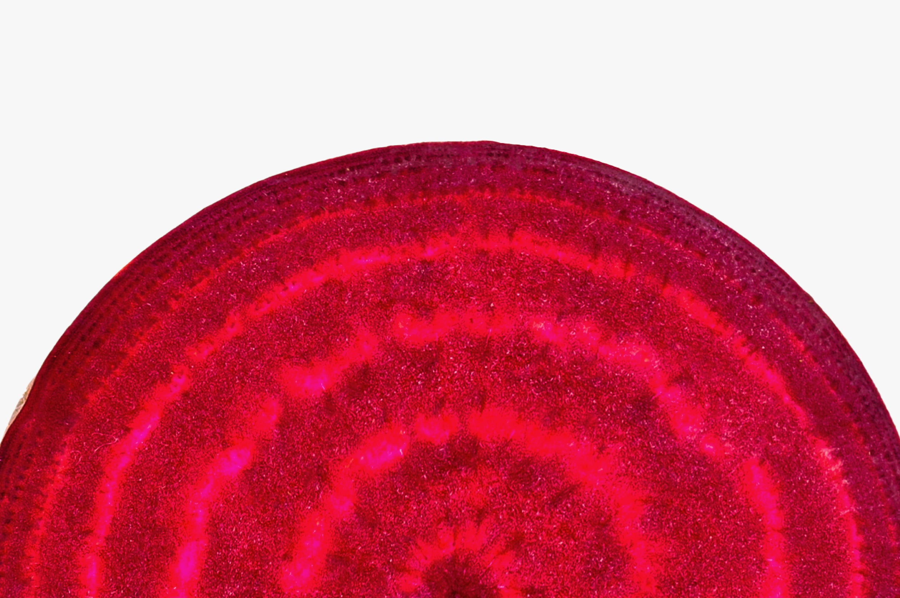

- **观察｜文字与层级：** 无独立图片文案；网页位置对应脂质体小檗碱。
- **观察｜构图：** 红色甜菜截面占下部，同心纹理明显，白底。
- **分析｜作用与复用：** 图片与专业成分关联不直观，不能按照片误标为甜菜产品。
- **资源：** 2520 × 1674；[原图](https://olenphogy.com/cdn/shop/files/lQDPKdThglQnj13NBorNCdiwenNu9qMttCUJeTxDpHwsAA_2520_1674.jpg)；[首个页面](https://olenphogy.com/pages/ingredients)。
- **出现位置：** pages--ingredients / body / shopify-section-template--25477623873846__blocks_dLMnWk。
- **核读：** 已目视检查；包装极小字不作为完整标签转录，关键剂量以标签专图为准。

## IMG-076 · 双甘氨酸镁原料卡

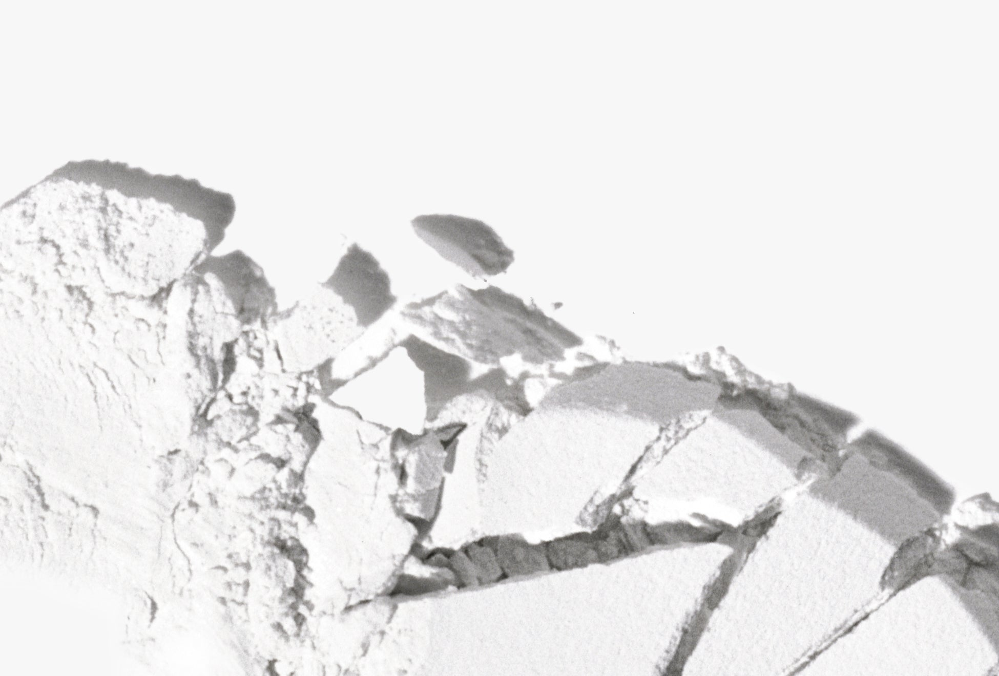

- **观察｜文字与层级：** 无独立图片文案；网页对应螯合双甘氨酸镁。
- **观察｜构图：** 白色结块粉末在下部，微阴影。
- **分析｜作用与复用：** 极简粉体需要完整标题解释，图片本身无法证实螯合。
- **资源：** 1950 × 1320；[原图](https://olenphogy.com/cdn/shop/files/420_a49c1875-57a7-411b-b24b-ceed0000c561.jpg)；[首个页面](https://olenphogy.com/pages/ingredients)。
- **出现位置：** pages--ingredients / body / shopify-section-template--25477623873846__blocks_dLMnWk。
- **核读：** 已目视检查；包装极小字不作为完整标签转录，关键剂量以标签专图为准。

## IMG-077 · 柠檬酸镁原料卡

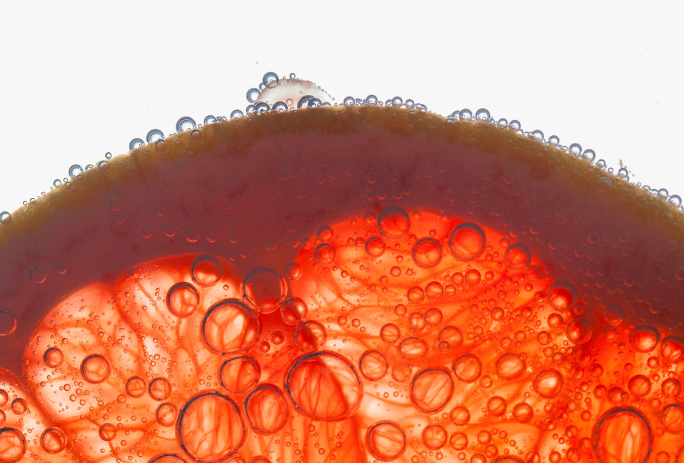

- **观察｜文字与层级：** 无独立图片文案；网页对应柠檬酸镁。
- **观察｜构图：** 橙色透明液滴与小气泡在下方，白底。
- **分析｜作用与复用：** 抽象材质提示成分，不作实际剂型或颜色承诺。
- **资源：** 1950 × 1320；[原图](https://olenphogy.com/cdn/shop/files/Magnesium-Citrate-420.jpg)；[首个页面](https://olenphogy.com/pages/ingredients)。
- **出现位置：** pages--ingredients / body / shopify-section-template--25477623873846__blocks_dLMnWk；pages--testing / body / shopify-section-template--25567485264182__blocks_jeM3t4。
- **核读：** 已目视检查；包装极小字不作为完整标签转录，关键剂量以标签专图为准。

## IMG-078 · 苹果酸镁原料卡

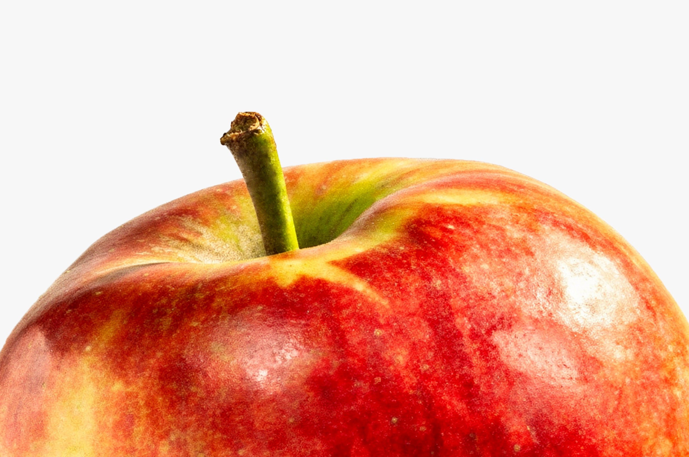

- **观察｜文字与层级：** 无独立图片文案；网页对应苹果酸镁。
- **观察｜构图：** 红苹果局部靠底边，白底，高光柔和。
- **分析｜作用与复用：** 用名称联想帮助记忆，不代表产品由苹果直接提取。
- **资源：** 2520 × 1674；[原图](https://olenphogy.com/cdn/shop/files/2_38cc1a2c-07c1-4a99-8166-8aa51558cbdc.jpg)；[首个页面](https://olenphogy.com/pages/ingredients)。
- **出现位置：** pages--ingredients / body / shopify-section-template--25477623873846__blocks_dLMnWk。
- **核读：** 已目视检查；包装极小字不作为完整标签转录，关键剂量以标签专图为准。

## IMG-079 · 乳清酸镁原料卡

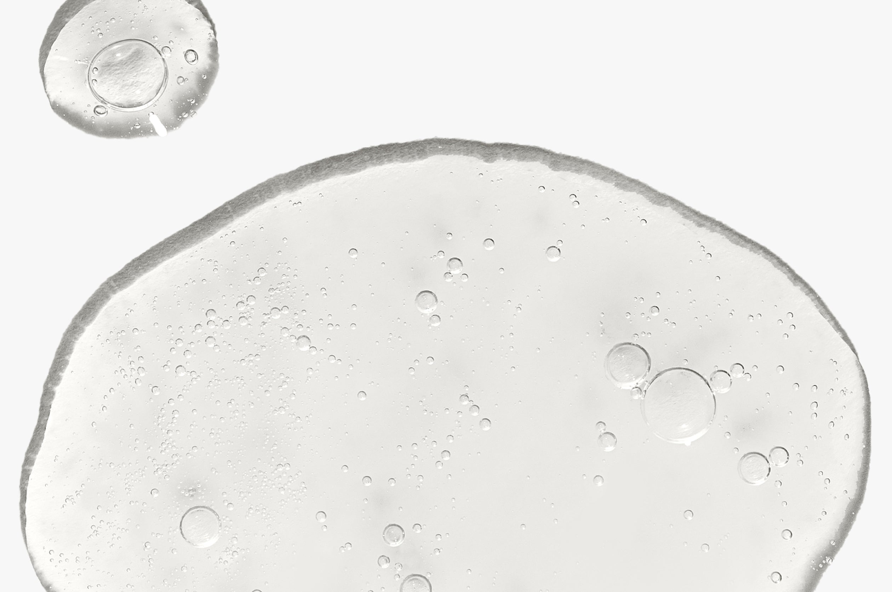

- **观察｜文字与层级：** 无独立图片文案；网页对应乳清酸镁。
- **观察｜构图：** 透明液滴特写占下部，白底边缘折光。
- **分析｜作用与复用：** 视觉纯净感强但识别弱，需要相邻文字。
- **资源：** 2520 × 1674；[原图](https://olenphogy.com/cdn/shop/files/lQDPJwzNqsKIj13NBorNCdiwvyb_5KrrPgUJeTxDpC6iAQ_2520_1674.jpg)；[首个页面](https://olenphogy.com/pages/ingredients)。
- **出现位置：** pages--ingredients / body / shopify-section-template--25477623873846__blocks_dLMnWk。
- **核读：** 已目视检查；包装极小字不作为完整标签转录，关键剂量以标签专图为准。

## IMG-080 · 牛磺酸镁原料卡

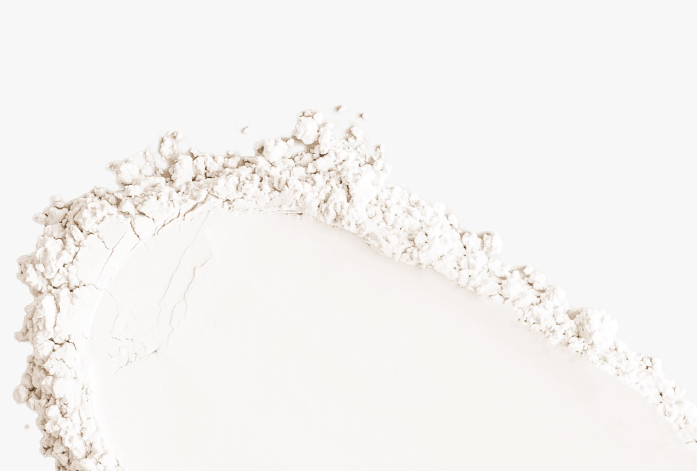

- **观察｜文字与层级：** 无独立图片文案；网页对应牛磺酸镁。
- **观察｜构图：** 白粉呈弧环堆积，中央凹陷，浅阴影。
- **分析｜作用与复用：** 用形状与其他白粉卡区分，不提供化学证据。
- **资源：** 1950 × 1320；[原图](https://olenphogy.com/cdn/shop/files/1120.jpg)；[首个页面](https://olenphogy.com/pages/ingredients)。
- **出现位置：** pages--ingredients / body / shopify-section-template--25477623873846__blocks_dLMnWk。
- **核读：** 已目视检查；包装极小字不作为完整标签转录，关键剂量以标签专图为准。

## IMG-081 · Myo原料卡

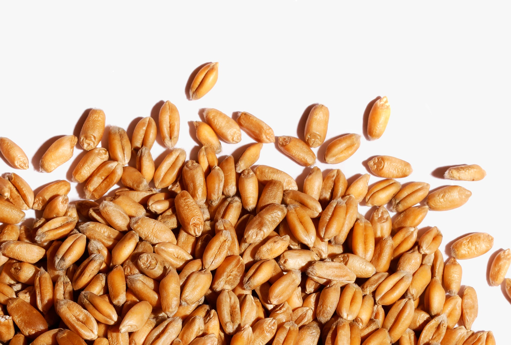

- **观察｜文字与层级：** 无独立图片文案；网页对应Myo肌醇。
- **观察｜构图：** 金黄色谷物颗粒在下部，白底。
- **分析｜作用与复用：** 食物来源联想应与明确供应事实分开。
- **资源：** 1950 × 1320；[原图](https://olenphogy.com/cdn/shop/files/Myo-lnositol-420.jpg)；[首个页面](https://olenphogy.com/pages/ingredients)。
- **出现位置：** pages--ingredients / body / shopify-section-template--25477623873846__blocks_dLMnWk；pages--testing / body / shopify-section-template--25567485264182__blocks_jeM3t4。
- **核读：** 已目视检查；包装极小字不作为完整标签转录，关键剂量以标签专图为准。

## IMG-082 · B6原料卡

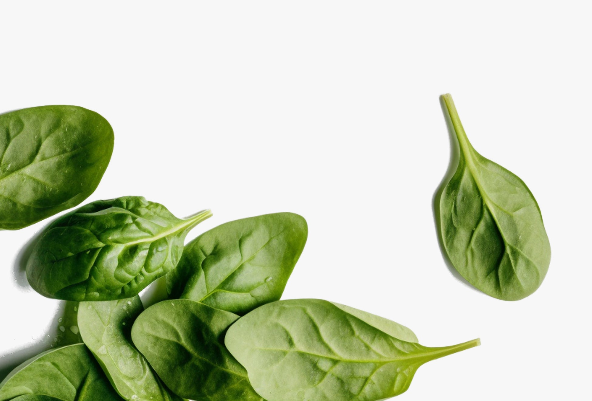

- **观察｜文字与层级：** 无独立图片文案；网页对应P5P活性B6。
- **观察｜构图：** 绿色菠菜叶丛下压，白底，上部留白。
- **分析｜作用与复用：** 日常食物给陌生成分一个识别入口，不等于配方含菠菜。
- **资源：** 1950 × 1320；[原图](https://olenphogy.com/cdn/shop/files/VitaminB6-420-2.jpg)；[首个页面](https://olenphogy.com/pages/ingredients)。
- **出现位置：** pages--ingredients / body / shopify-section-template--25477623873846__blocks_dLMnWk。
- **核读：** 已目视检查；包装极小字不作为完整标签转录，关键剂量以标签专图为准。

## IMG-083 · D3原料卡

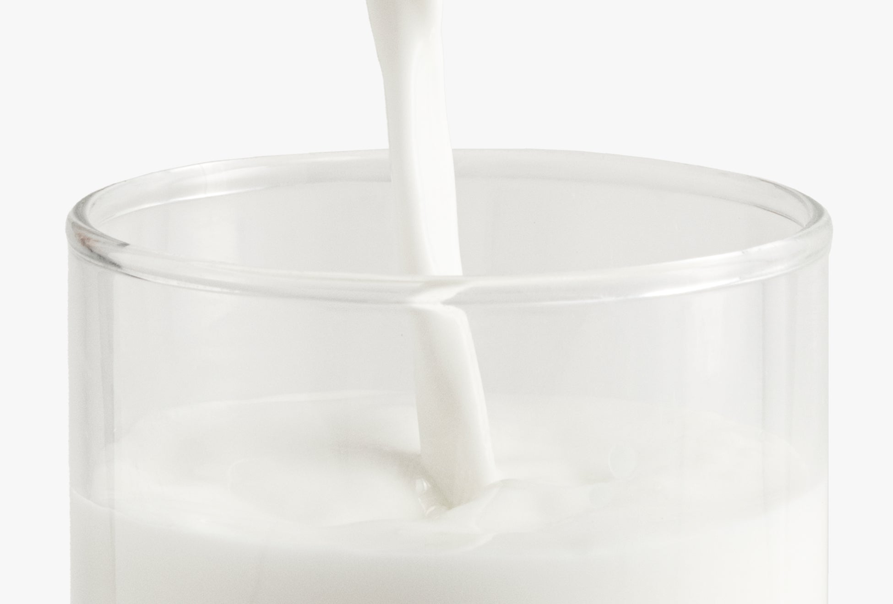

- **观察｜文字与层级：** 无独立图片文案；网页对应D3。
- **观察｜构图：** 牛奶倾入玻璃杯，杯身与液柱集中下半部。
- **分析｜作用与复用：** 乳品意象与品牌无乳/素食主张有理解距离，不能据此认定含奶。
- **资源：** 1950 × 1320；[原图](https://olenphogy.com/cdn/shop/files/Vitamin-D3-_as-Cholecalciferol_-420.jpg)；[首个页面](https://olenphogy.com/pages/ingredients)。
- **出现位置：** pages--ingredients / body / shopify-section-template--25477623873846__blocks_dLMnWk。
- **核读：** 已目视检查；包装极小字不作为完整标签转录，关键剂量以标签专图为准。

## IMG-084 · 锌原料卡

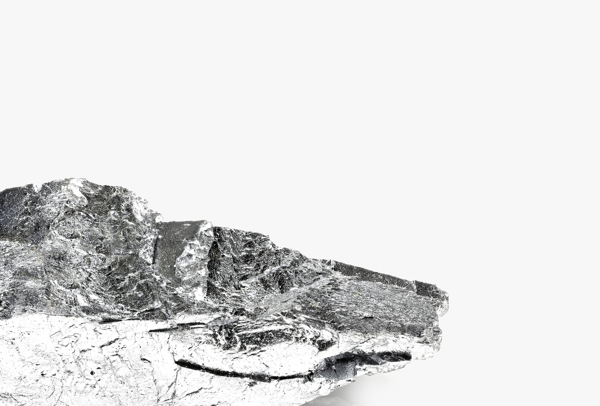

- **观察｜文字与层级：** 无独立图片文案；网页对应吡啶甲酸锌。
- **观察｜构图：** 银灰金属矿物碎片在底部，白底与冷高光。
- **分析｜作用与复用：** 矿物隐喻，不应读为胶囊内含此类金属块。
- **资源：** 1950 × 1320；[原图](https://olenphogy.com/cdn/shop/files/420_0622ab99-b4aa-4a58-a9aa-da0e3377197d.jpg)；[首个页面](https://olenphogy.com/pages/ingredients)。
- **出现位置：** pages--ingredients / body / shopify-section-template--25477623873846__blocks_dLMnWk；pages--testing / body / shopify-section-template--25567485264182__1768528048034db3e5。
- **核读：** 已目视检查；包装极小字不作为完整标签转录，关键剂量以标签专图为准。

[返回共享索引](共享图片索引.md)
