# 共享图册｜教育与研究

[返回总目录](../README.md)

## IMG-085 · 博客移动首屏

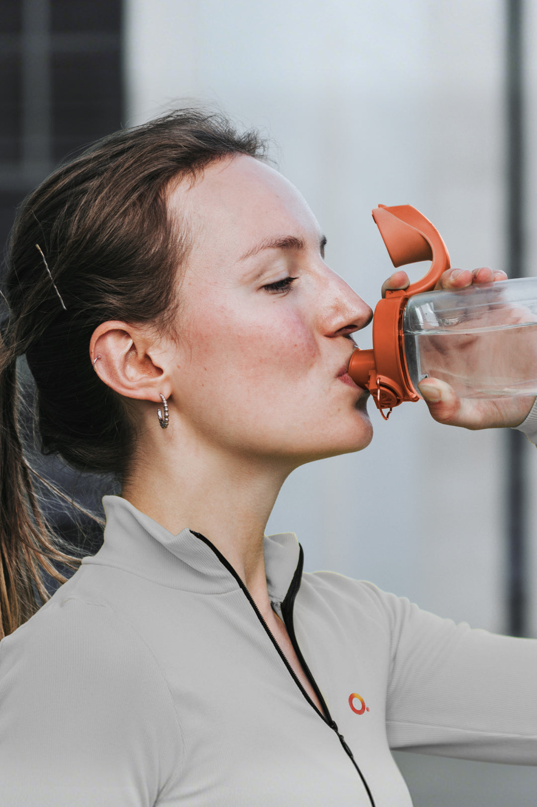

- **观察｜文字与层级：** 无独立图片文案。
- **观察｜构图：** 饮水女性竖幅近景，人物占主要面积，自然光。
- **分析｜作用与复用：** 把阅读入口放在普通生活中，文字由页面层叠加。
- **资源：** 1080 × 1620；[原图](https://olenphogy.com/cdn/shop/files/lQDPJwCf60lSg6PNBlTNBDiwhQrHRR81RroJQcs56tdzAA_1080_1620.jpg)；[首个页面](https://olenphogy.com/pages/blog-about-smarter-wellness)。
- **出现位置：** pages--blog-about-smarter-wellness / body / shopify-section-template--25478851264822__image_banner_TAAxar；pages--blog-about-smarter-wellness-page-2 / body / shopify-section-template--25594668548406__image_banner_GB4qfA；pages--blog-about-smarter-wellness-page-3 / body / shopify-section-template--25594698957110__image_banner_TAAxar；blogs--blog / body / shopify-section-template--25527544709430__image_banner_dqggBn。
- **核读：** 已目视检查；包装极小字不作为完整标签转录，关键剂量以标签专图为准。

## IMG-086 · 博客桌面首屏

- **观察｜文字与层级：** 无独立图片文案。
- **观察｜构图：** 与085同母图的横向宽裁切，环境留白更多。
- **分析｜作用与复用：** 端侧裁切服务标题安全区。
- **资源：** 1920 × 800；[原图](https://olenphogy.com/cdn/shop/files/lQDPKH7bi3ZglKHNAyDNB4Cwe08VShvy7c0JdAoqZYGeAA_1920_800.jpg)；[首个页面](https://olenphogy.com/pages/blog-about-smarter-wellness)。
- **出现位置：** pages--blog-about-smarter-wellness / body / shopify-section-template--25478851264822__image_banner_TAAxar；pages--blog-about-smarter-wellness-page-2 / body / shopify-section-template--25594668548406__image_banner_GB4qfA；pages--blog-about-smarter-wellness-page-3 / body / shopify-section-template--25594698957110__image_banner_TAAxar；blogs--blog / body / shopify-section-template--25527544709430__image_banner_dqggBn。
- **核读：** 已目视检查；包装极小字不作为完整标签转录，关键剂量以标签专图为准。

## IMG-087 · 网球博客图

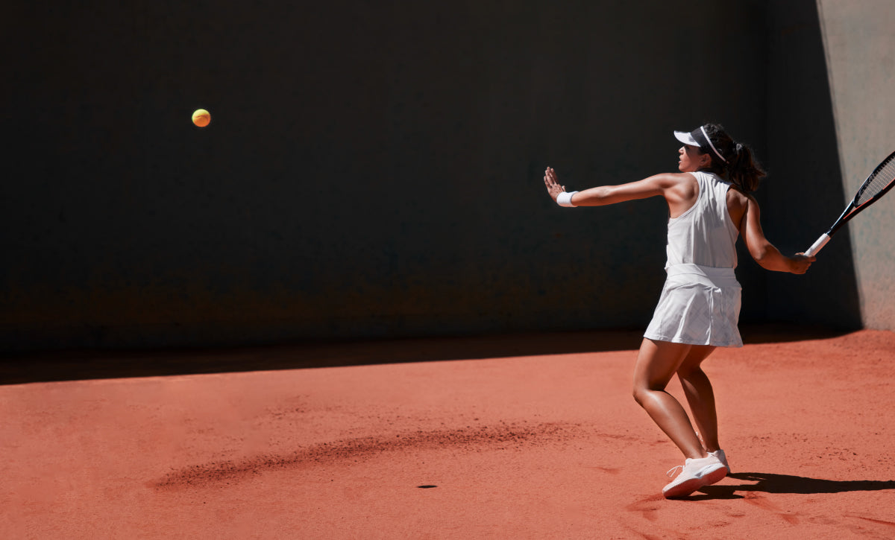

- **观察｜文字与层级：** 无独立图片文案。
- **观察｜构图：** 红场深墙宽景，白衣女性偏一侧，动作瞬间。
- **分析｜作用与复用：** 连接精准生活和教育文章，不是商品效果记录。
- **资源：** 1200 × 725；[原图](https://olenphogy.com/cdn/shop/articles/1013-_-5_ad018a67-979a-4b84-831d-cf8446162888.jpg)；[首个页面](https://olenphogy.com/pages/blog-about-smarter-wellness)。
- **出现位置：** pages--blog-about-smarter-wellness / body / shopify-section-template--25478851264822__1765439820af80aeb2；blogs--blog / body / shopify-section-template--25527544709430__blocks_trpqC7；blogs--blog--health-insights-supplement-science / body / shopify-section-template--25461922955574__main。
- **核读：** 已目视检查；包装极小字不作为完整标签转录，关键剂量以标签专图为准。

## IMG-088 · 小檗碱手持图

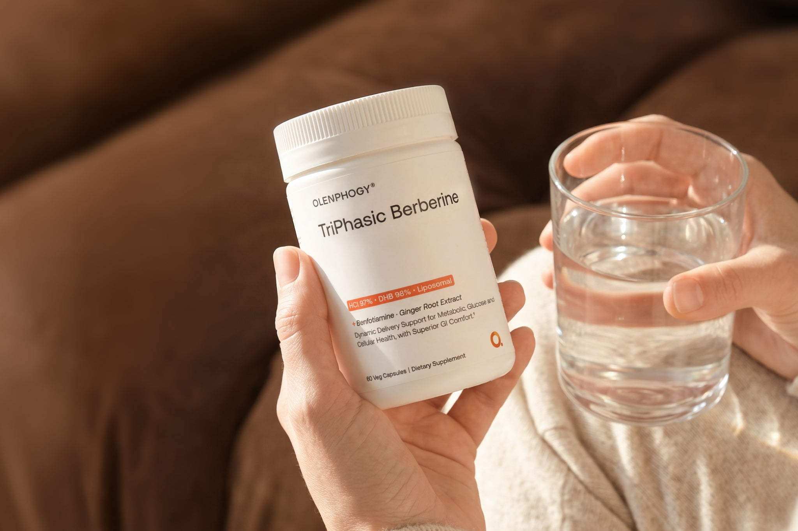

- **观察｜文字与层级：** 仅可读包装，无额外广告标题。
- **观察｜构图：** 手持瓶子与透明水杯，暖褐环境，近景。
- **分析｜作用与复用：** 让复杂配方落到可执行的服用动作。
- **资源：** 2048 × 1365；[原图](https://olenphogy.com/cdn/shop/articles/0521.jpg)；[首个页面](https://olenphogy.com/pages/blog-about-smarter-wellness)。
- **出现位置：** pages--blog-about-smarter-wellness / body / shopify-section-template--25478851264822__1765439820af80aeb2；blogs--blog / body / shopify-section-template--25527544709430__blocks_trpqC7；blogs--blog--health-insights-berberine-guide / body / shopify-section-template--25461922955574__main。
- **核读：** 已目视检查；包装极小字不作为完整标签转录，关键剂量以标签专图为准。

## IMG-089 · 镁静物图

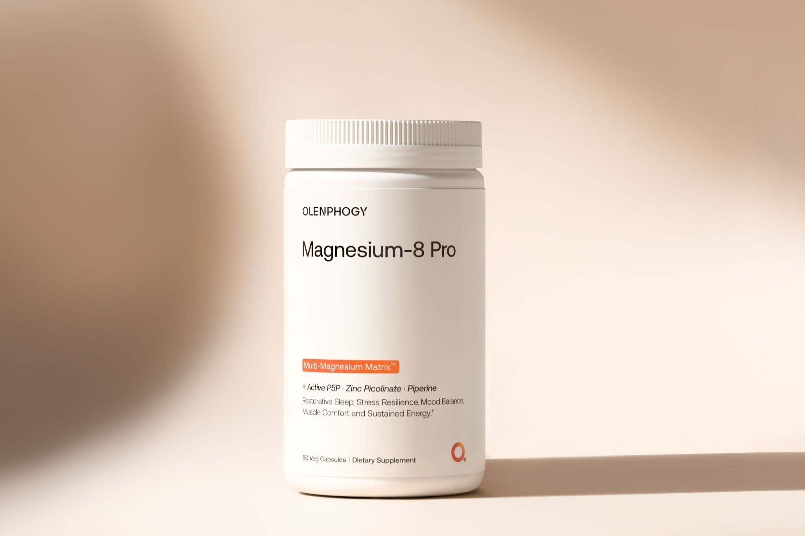

- **观察｜文字与层级：** 仅包装文字，无独立标题。
- **观察｜构图：** 米色背景瓶装，侧向硬阳光拉出长阴影。
- **分析｜作用与复用：** 通过光影和留白突出产品身份，适合文章封面。
- **资源：** 2048 × 1365；[原图](https://olenphogy.com/cdn/shop/articles/lQDPJxwef43fOZ3NBVXNCACwZij5WbjjWW8Jm5LrCQ6uAQ_2048_1365_6de5c48f-eca5-42be-aae3-fccc70039d46.jpg)；[首个页面](https://olenphogy.com/pages/blog-about-smarter-wellness)。
- **出现位置：** pages--blog-about-smarter-wellness / body / shopify-section-template--25478851264822__1765439820af80aeb2；blogs--blog / body / shopify-section-template--25527544709430__blocks_trpqC7；blogs--blog--health-insights-magnesium-guide / body / shopify-section-template--25461922955574__main。
- **核读：** 已目视检查；包装极小字不作为完整标签转录，关键剂量以标签专图为准。

## IMG-090 · 健身饮水女性

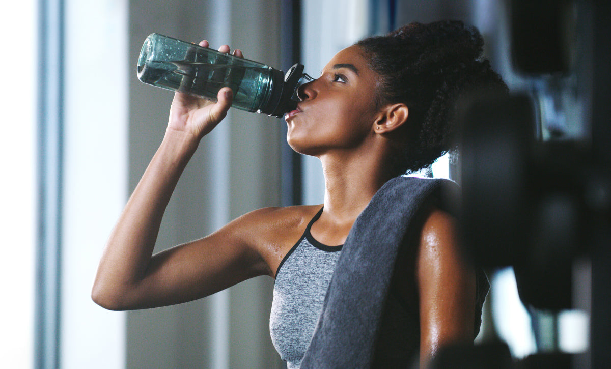

- **观察｜文字与层级：** 无独立图片文案。
- **观察｜构图：** 深色运动服女性与水瓶，健身场景，偏冷光。
- **分析｜作用与复用：** 生活方式入口，人物并非已确认代言人或使用者。
- **资源：** 1200 × 725；[原图](https://olenphogy.com/cdn/shop/articles/1013-_-6_260e3e3d-702b-464c-aa70-25a9a1da9145.jpg)；[首个页面](https://olenphogy.com/pages/blog-about-smarter-wellness)。
- **出现位置：** pages--blog-about-smarter-wellness / body / shopify-section-template--25478851264822__1765439820af80aeb2；blogs--blog / body / shopify-section-template--25527544709430__blocks_trpqC7；blogs--blog--health-insights-inositol-guide / body / shopify-section-template--25461922955574__main。
- **核读：** 已目视检查；包装极小字不作为完整标签转录，关键剂量以标签专图为准。

## IMG-091 · 杠铃训练男性

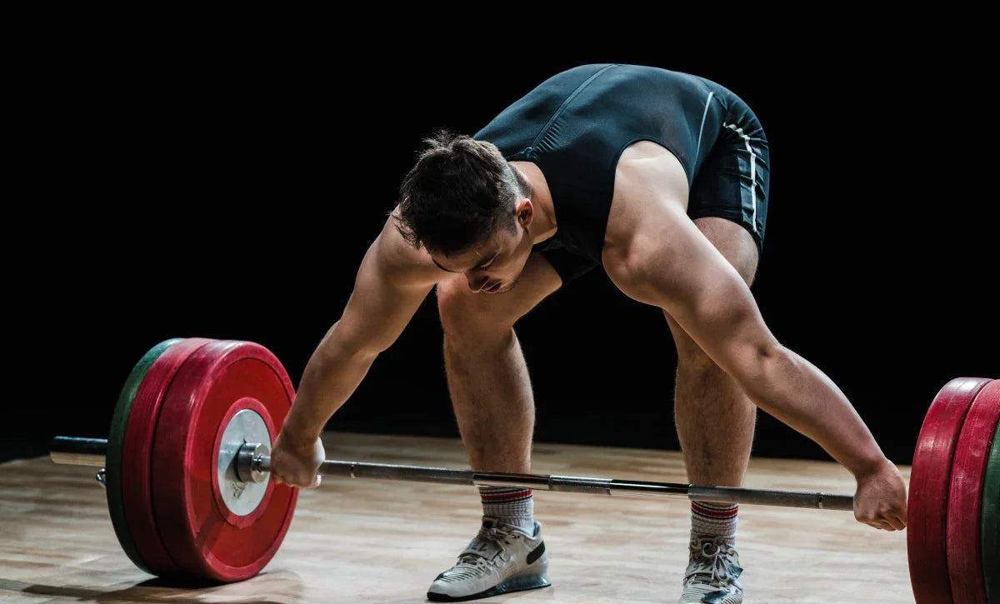

- **观察｜文字与层级：** 无独立图片文案。
- **观察｜构图：** 暗色健身房，男性与大块红色杠铃片，高反差。
- **分析｜作用与复用：** 表现身体压力和恢复场景。
- **资源：** 1200 × 725；[原图](https://olenphogy.com/cdn/shop/articles/1013-_-1_f4983b3f-b717-473c-8844-e3bbf60e2d88.jpg)；[首个页面](https://olenphogy.com/pages/blog-about-smarter-wellness)。
- **出现位置：** pages--blog-about-smarter-wellness / body / shopify-section-template--25478851264822__1765439820af80aeb2；blogs--blog / body / shopify-section-template--25527544709430__blocks_trpqC7；blogs--blog--berberine-berberine-benefits-absorption-guide / body / shopify-section-template--25461922955574__main。
- **核读：** 已目视检查；包装极小字不作为完整标签转录，关键剂量以标签专图为准。

## IMG-092 · 睡眠面部近景

- **观察｜文字与层级：** 无独立图片文案。
- **观察｜构图：** 女性枕在蓝色枕头上，面部近景，低饱和柔光。
- **分析｜作用与复用：** 休息主题直接识别，与机制文章形成情绪入口。
- **资源：** 1200 × 725；[原图](https://olenphogy.com/cdn/shop/articles/1013-Blog-4_-1_15f3762d-01f1-40b1-9bc4-f1da8ea8a80f.jpg)；[首个页面](https://olenphogy.com/pages/blog-about-smarter-wellness)。
- **出现位置：** pages--blog-about-smarter-wellness / body / shopify-section-template--25478851264822__1765439820af80aeb2；blogs--blog / body / shopify-section-template--25527544709430__blocks_trpqC7；blogs--blog--magnesium-glycinate-vs-chelated-magnesium / body / shopify-section-template--25461922955574__main。
- **核读：** 已目视检查；包装极小字不作为完整标签转录，关键剂量以标签专图为准。

## IMG-093 · 红跑者文章图

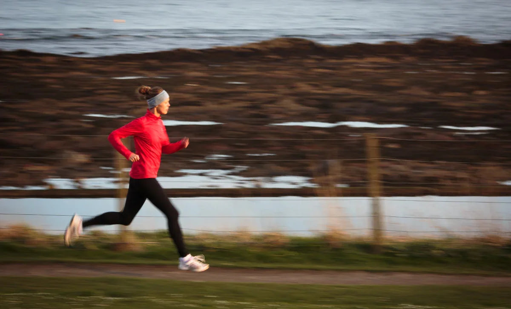

- **观察｜文字与层级：** 无独立图片文案。
- **观察｜构图：** 横幅红衣跑者与动态背景，主体位置偏中。
- **分析｜作用与复用：** 效能主题复用；尺寸不同不代表新场景。
- **资源：** 1200 × 725；[原图](https://olenphogy.com/cdn/shop/articles/1013-_-2_ef7ed11b-e55c-43fb-a2c3-f6cb28e634ae.jpg)；[首个页面](https://olenphogy.com/pages/blog-about-smarter-wellness)。
- **出现位置：** pages--blog-about-smarter-wellness / body / shopify-section-template--25478851264822__1765439820af80aeb2；blogs--blog / body / shopify-section-template--25527544709430__blocks_trpqC7；blogs--blog--news-chelated-magnesium-glycinate-benefits / body / shopify-section-template--25461922955574__main。
- **核读：** 已目视检查；包装极小字不作为完整标签转录，关键剂量以标签专图为准。

## IMG-094 · 显微镜实验室

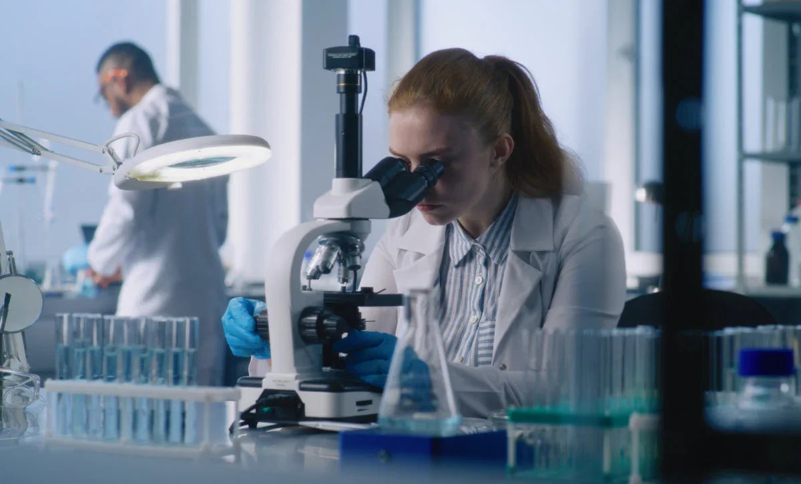

- **观察｜文字与层级：** 无独立图片文案。
- **观察｜构图：** 蓝手套女性用显微镜，前景清晰、其他人员虚化，冷色光。
- **分析｜作用与复用：** 科学氛围；没有据此认定图片中的人是品牌研究团队。
- **资源：** 1200 × 725；[原图](https://olenphogy.com/cdn/shop/articles/lQDPKGmTq9V5sbfNAtXNBLCw0b3XovxjncAI_oISk44oAA_1200_725_0c661e9b-347f-4cbd-a279-baf3d0498616.jpg)；[首个页面](https://olenphogy.com/pages/blog-about-smarter-wellness)。
- **出现位置：** pages--blog-about-smarter-wellness / body / shopify-section-template--25478851264822__1765439820af80aeb2；blogs--blog / body / shopify-section-template--25527544709430__blocks_trpqC7；blogs--blog--do-supplements-really-work / body / shopify-section-template--25461922955574__main。
- **核读：** 已目视检查；包装极小字不作为完整标签转录，关键剂量以标签专图为准。

## IMG-095 · 研究页移动首屏

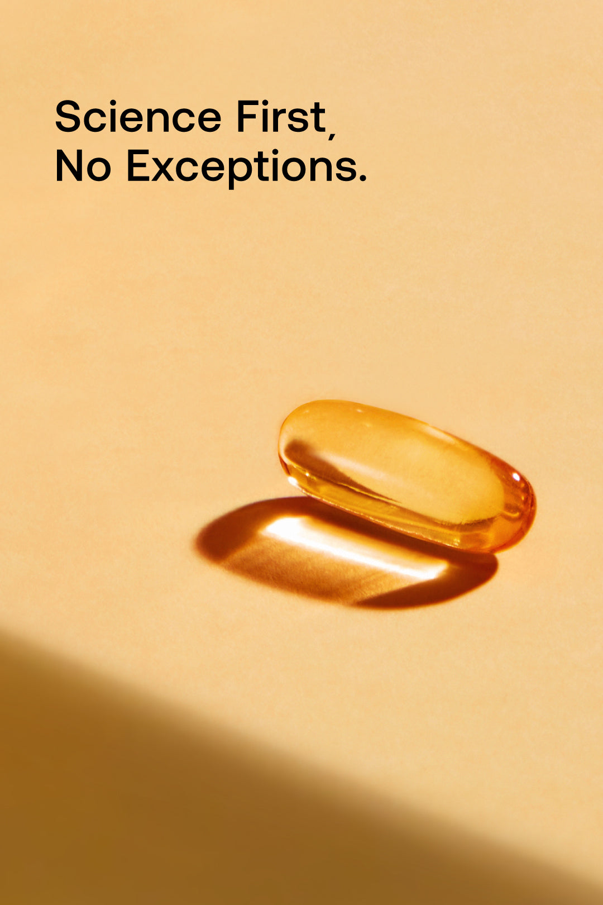

- **观察｜文字与层级：** 科学原则的绝对式宣言。
- **观察｜构图：** 金色软胶囊在竖图下部，上方黑色大标题。
- **分析｜作用与复用：** 图像强调品质感，研究证据应由正文提供。
- **资源：** 1080 × 1620；[原图](https://olenphogy.com/cdn/shop/files/lQDPJwBocLUWLWPNBlTNBDiwBPUXQfy-3KIJQZDWc0F5AQ_1080_1620.jpg)；[首个页面](https://olenphogy.com/pages/research)。
- **出现位置：** pages--research / body / shopify-section-template--25478332973366__image_banner_w6tVed。
- **核读：** 已目视检查；包装极小字不作为完整标签转录，关键剂量以标签专图为准。

## IMG-096 · 研究页桌面首屏

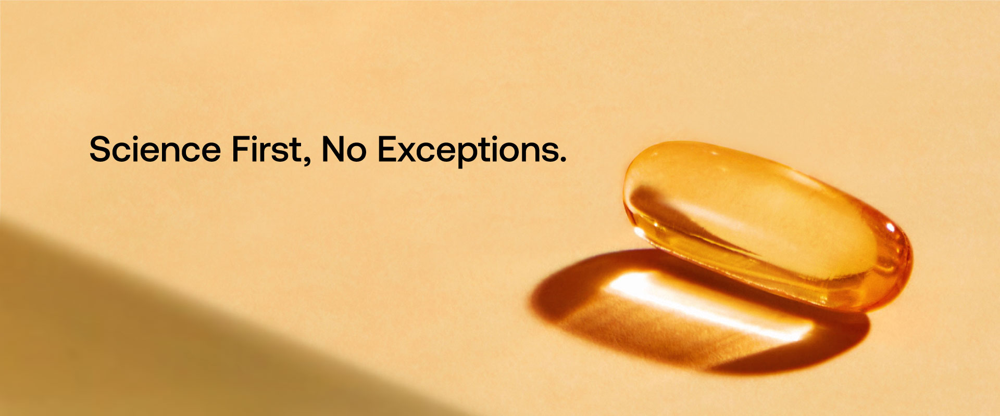

- **观察｜文字与层级：** 与095同主题，左右布局。
- **观察｜构图：** 金色胶囊在右，左侧标题，宽暖黄背景和硬阴影。
- **分析｜作用与复用：** 将抽象证据页做成易进入的品牌页面。
- **资源：** 1920 × 800；[原图](https://olenphogy.com/cdn/shop/files/lQDPJx-HnTKWB3HNAyDNB4CweHjvhBaY0GIJc-B8iwb_AA_1920_800.jpg)；[首个页面](https://olenphogy.com/pages/research)。
- **出现位置：** pages--research / body / shopify-section-template--25478332973366__image_banner_w6tVed。
- **核读：** 已目视检查；包装极小字不作为完整标签转录，关键剂量以标签专图为准。

## IMG-097 · 镁研究柱形图

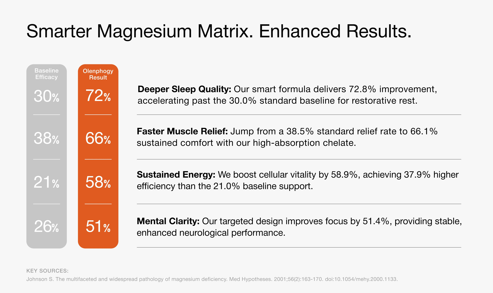

- **观察｜文字与层级：** 深休息72对30、肌肉66对38、能量58对21、清晰51对26；正文带更精确小数。
- **观察｜构图：** 左侧灰/橙两个纵向数字栏，每栏分四行，右侧分段利益说明，浅底小字脚注。
- **分析｜作用与复用：** 数字制造精度感；未见可把这些品牌对照数逐一对应到成品试验的记录，不能当已核验比较结果。
- **资源：** 3200 × 1905；[原图](https://olenphogy.com/cdn/shop/files/lQDPJwIT5w7ZlT3NB3HNDICwjb0As-4-Q3YJmo1cz9DgAQ_3200_1905.jpg)；[首个页面](https://olenphogy.com/pages/research)。
- **出现位置：** pages--research / body / shopify-section-template--25478332973366__blocks_GJFjHH。
- **核读：** 已目视检查；包装极小字不作为完整标签转录，关键剂量以标签专图为准。

## IMG-098 · 肌醇研究柱形图

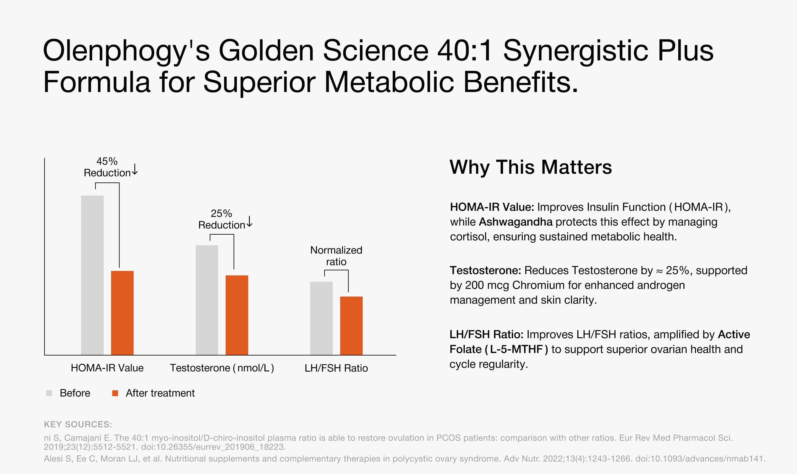

- **观察｜文字与层级：** 呈现HOMA-IR下降45%、睾酮下降25%及LH/FSH正常化等主张。
- **观察｜构图：** 三组灰/橙条与百分数，右侧激素/代谢说明，底部研究脚注。
- **分析｜作用与复用：** 临床指标比生活利益更具体；须区分成分研究与本品牌组合成品验证。
- **资源：** 3200 × 1905；[原图](https://olenphogy.com/cdn/shop/files/lQDPJxIHiKXkNT3NB3HNDICwPaKpjqE5ZRwJmo1cz9DgAg_3200_1905.jpg)；[首个页面](https://olenphogy.com/pages/research)。
- **出现位置：** pages--research / body / shopify-section-template--25478332973366__blocks_GJFjHH。
- **核读：** 已目视检查；包装极小字不作为完整标签转录，关键剂量以标签专图为准。

## IMG-099 · 小檗碱时间曲线

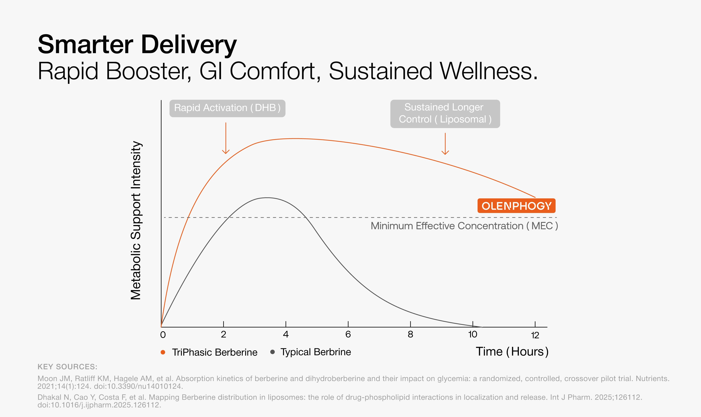

- **观察｜文字与层级：** 以曲线解释三阶段递送及长时间支持。
- **观察｜构图：** 0–12小时横轴，灰线快速峰降，橙线较高且缓慢下降；标注DHB起效、脂质体维持与阈值。
- **分析｜作用与复用：** 纵轴缺足够定量条件，记录为品牌机制示意，不能当成已核验的药代数据。
- **资源：** 3200 × 1905；[原图](https://olenphogy.com/cdn/shop/files/lQDPJxK9bsbYtT3NB3HNDICw79PdruXrw8gJmo1cz9DgAA_3200_1905.jpg)；[首个页面](https://olenphogy.com/pages/research)。
- **出现位置：** pages--research / body / shopify-section-template--25478332973366__blocks_GJFjHH。
- **核读：** 已目视检查；包装极小字不作为完整标签转录，关键剂量以标签专图为准。

## IMG-100 · 代谢文章横幅

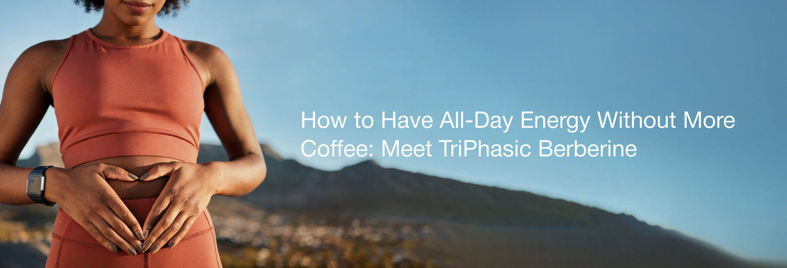

- **观察｜文字与层级：** 用不用更多咖啡也有全天能量的问题引流。
- **观察｜构图：** 女性腹部与运动装靠左，右侧蓝天空间放大问句。
- **分析｜作用与复用：** 具体生活痛点比“先进递送”更容易触发阅读。
- **资源：** 1920 × 656；[原图](https://olenphogy.com/cdn/shop/files/lQDPJxr8XqsaYF3NApDNB4CwxBJNcvferCoJmpkIdjh3AA_1920_656.jpg)；[首个页面](https://olenphogy.com/pages/research)。
- **出现位置：** pages--research / body / shopify-section-template--25478332973366__multicolumn_7Q6wbe。
- **核读：** 已目视检查；包装极小字不作为完整标签转录，关键剂量以标签专图为准。

## IMG-101 · 镁文章横幅

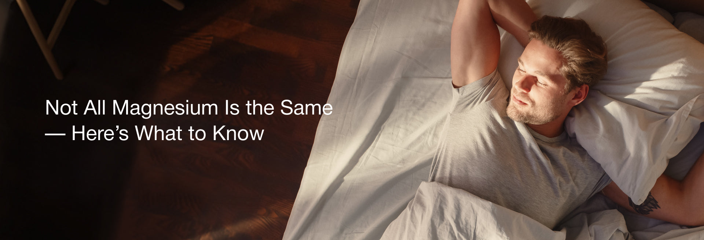

- **观察｜文字与层级：** 强调不同镁产品并不一样。
- **观察｜构图：** 男性休息在右，左侧深色空间放大提问。
- **分析｜作用与复用：** 先建立选择难题，再由文章解释形态。
- **资源：** 1920 × 656；[原图](https://olenphogy.com/cdn/shop/files/lQDPJwIUz9s6QF3NApDNB4CwWG5-yxFFOHYJmpkIdjh3AQ_1920_656.jpg)；[首个页面](https://olenphogy.com/pages/research)。
- **出现位置：** pages--research / body / shopify-section-template--25478332973366__multicolumn_7Q6wbe。
- **核读：** 已目视检查；包装极小字不作为完整标签转录，关键剂量以标签专图为准。

## IMG-102 · 骑行男性

- **观察｜文字与层级：** 无独立图片文案。
- **观察｜构图：** 森林里骑行男性微笑，头盔和绿色背景，近景。
- **分析｜作用与复用：** 运动表现/日常精力类内容入口。
- **资源：** 1050 × 1110；[原图](https://olenphogy.com/cdn/shop/files/0223testing_-350-370.jpg)；[首个页面](https://olenphogy.com/pages/testing)。
- **出现位置：** pages--testing / body / shopify-section-template--25567485264182__1768528048034db3e5。
- **核读：** 已目视检查；包装极小字不作为完整标签转录，关键剂量以标签专图为准。

## IMG-103 · 慢跑女性侧面

- **观察｜文字与层级：** 无独立图片文案。
- **观察｜构图：** 女性侧向跑过暖色墙，身体与墙面几何对照。
- **分析｜作用与复用：** 生活场景去医疗化，正文承担科学说明。
- **资源：** 1050 × 1110；[原图](https://olenphogy.com/cdn/shop/files/0223testing_-350-370-2.jpg)；[首个页面](https://olenphogy.com/pages/testing)。
- **出现位置：** pages--testing / body / shopify-section-template--25567485264182__1768528048034db3e5。
- **核读：** 已目视检查；包装极小字不作为完整标签转录，关键剂量以标签专图为准。

## IMG-104 · 向上伸展女性

- **观察｜文字与层级：** 无独立图片文案。
- **观察｜构图：** 女性双臂举高闭眼，深色背景，身体纵向延伸。
- **分析｜作用与复用：** 放松、恢复、可感知舒适的姿态语义。
- **资源：** 1050 × 1110；[原图](https://olenphogy.com/cdn/shop/files/0223testing_-350-370-3.jpg)；[首个页面](https://olenphogy.com/pages/testing)。
- **出现位置：** pages--testing / body / shopify-section-template--25567485264182__1768528048034db3e5。
- **核读：** 已目视检查；包装极小字不作为完整标签转录，关键剂量以标签专图为准。

## IMG-105 · 生产环境

- **观察｜文字与层级：** 无独立图片文案。
- **观察｜构图：** 两位白衣人员背向镜头，金属管线与设备，冷白工业光。
- **分析｜作用与复用：** 制造信任的环境照，不证明特定工厂资质。
- **资源：** 870 × 1050；[原图](https://olenphogy.com/cdn/shop/files/0206r_-290-350.jpg)；[首个页面](https://olenphogy.com/pages/testing)。
- **出现位置：** pages--testing / body / shopify-section-template--25567485264182__1768528048034db3e5。
- **核读：** 已目视检查；包装极小字不作为完整标签转录，关键剂量以标签专图为准。

## IMG-106 · 浅棕种粒

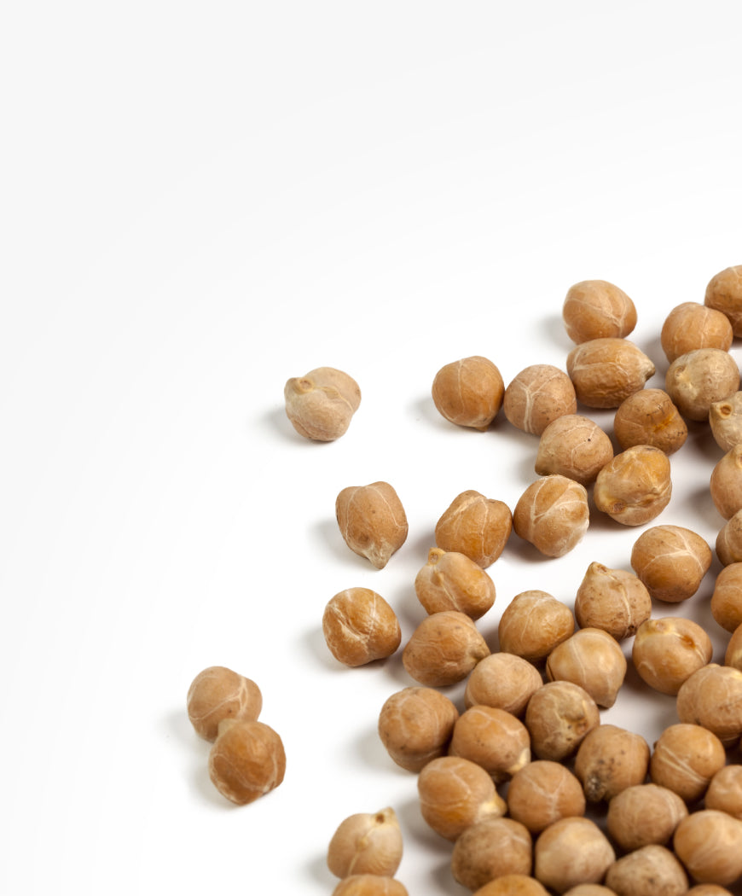

- **观察｜文字与层级：** 无独立图片文案。
- **观察｜构图：** 圆形浅棕豆/种粒堆于白底下右，质感近拍。
- **分析｜作用与复用：** 原料主题插图，未仅凭照片判定植物物种。
- **资源：** 870 × 1050；[原图](https://olenphogy.com/cdn/shop/files/11.jpg)；[首个页面](https://olenphogy.com/pages/testing)。
- **出现位置：** pages--testing / body / shopify-section-template--25567485264182__1768528048034db3e5。
- **核读：** 已目视检查；包装极小字不作为完整标签转录，关键剂量以标签专图为准。

## IMG-107 · 橙子截面

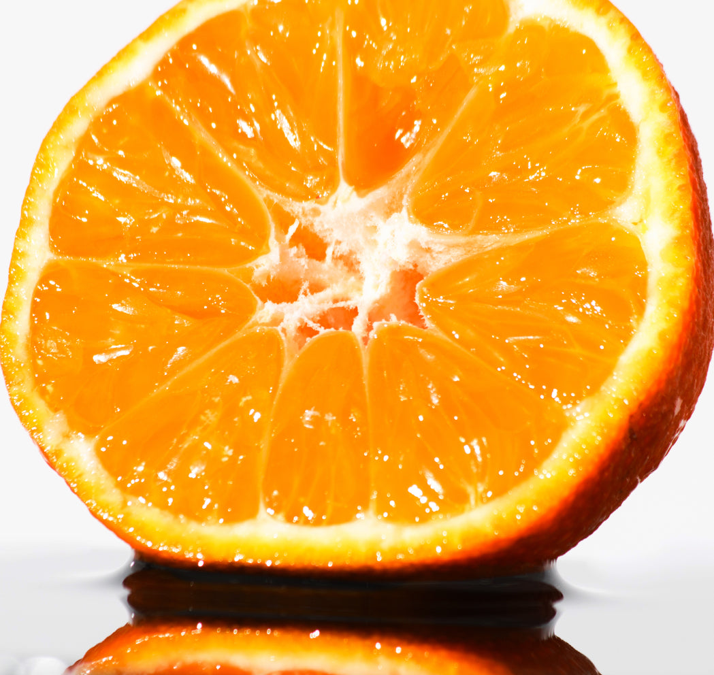

- **观察｜文字与层级：** 无独立图片文案。
- **观察｜构图：** 橙子半切微距与反射，橙色饱和，果肉纹理清楚。
- **分析｜作用与复用：** 营养与天然感视觉隐喻。
- **资源：** 1049 × 992；[原图](https://olenphogy.com/cdn/shop/files/lQDPJyCGRbsVaAHNA-DNBBmwpgj8LJDnWN0JdAXcJ86sAQ_1049_992.jpg)；[首个页面](https://olenphogy.com/pages/testing)。
- **出现位置：** pages--testing / body / shopify-section-template--25567485264182__1768528048034db3e5。
- **核读：** 已目视检查；包装极小字不作为完整标签转录，关键剂量以标签专图为准。

## IMG-108 · 带水滴绿叶

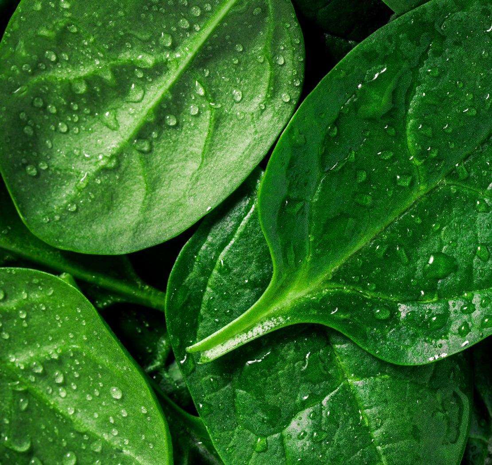

- **观察｜文字与层级：** 无独立图片文案。
- **观察｜构图：** 菠菜样叶片微距，叶脉和水滴为焦点，绿色背景。
- **分析｜作用与复用：** 鲜活、纯净语义，不构成原料溯源证据。
- **资源：** 1110 × 1050；[原图](https://olenphogy.com/cdn/shop/files/1_8f867cb9-0332-4d33-94a2-88b83b996004.jpg)；[首个页面](https://olenphogy.com/pages/testing)。
- **出现位置：** pages--testing / body / shopify-section-template--25567485264182__1768528048034db3e5。
- **核读：** 已目视检查；包装极小字不作为完整标签转录，关键剂量以标签专图为准。

## IMG-109 · 健身饮水变体

- **观察｜文字与层级：** 无独立图片文案。
- **观察｜构图：** 与090同场景女性水瓶，裁切范围与像素不同。
- **分析｜作用与复用：** 保留版本编号以追踪使用位置。
- **资源：** 1200 × 725；[原图](https://olenphogy.com/cdn/shop/articles/1013-_-6_8b88365a-e858-4ffa-8a72-5dc6624bb65c.jpg)；[首个页面](https://olenphogy.com/pages/blog-about-smarter-wellness-page-2)。
- **出现位置：** pages--blog-about-smarter-wellness-page-2 / body / shopify-section-template--25594668548406__blocks_XdnWGj；blogs--blog--science-40-1-myo-d-chiro-inositol-ratio / body / shopify-section-template--25461922955574__main。
- **核读：** 已目视检查；包装极小字不作为完整标签转录，关键剂量以标签专图为准。

## IMG-110 · 金色胶囊横图

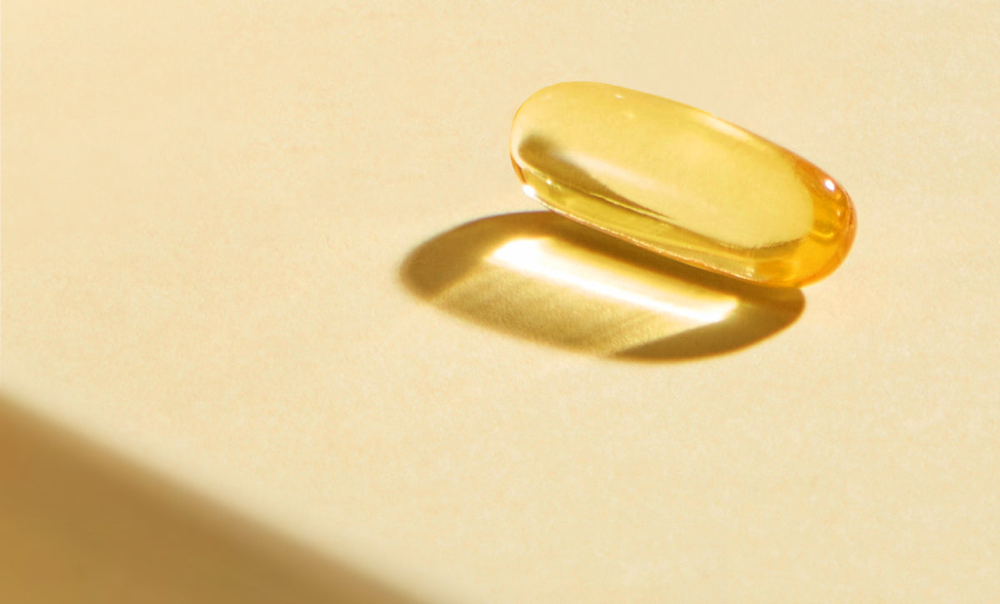

- **观察｜文字与层级：** 无独立图片文案。
- **观察｜构图：** 金色软胶囊宽幅版本，暖底与强阴影。
- **分析｜作用与复用：** 品质概念封面，非当前硬胶囊剂型照片。
- **资源：** 1200 × 725；[原图](https://olenphogy.com/cdn/shop/articles/1013-Blog-4_-3_4bb6cfa4-5301-4dc3-8903-05b680eb53a1.jpg)；[首个页面](https://olenphogy.com/pages/blog-about-smarter-wellness-page-2)。
- **出现位置：** pages--blog-about-smarter-wellness-page-2 / body / shopify-section-template--25594668548406__blocks_XdnWGj；blogs--blog--scientific-nutrition-sustained-release-liposomal-precision-health / body / shopify-section-template--25461922955574__main。
- **核读：** 已目视检查；包装极小字不作为完整标签转录，关键剂量以标签专图为准。

## IMG-111 · 星轨横图

- **观察｜文字与层级：** 无独立图片文案。
- **观察｜构图：** 蓝色星轨与树木边缘，横向宽幅夜景。
- **分析｜作用与复用：** 用于夜间与节律文章，不是科学图表。
- **资源：** 1200 × 725；[原图](https://olenphogy.com/cdn/shop/articles/1016-_1200-725_-1_ba91f7c0-90c5-4863-bf5f-d593155222bb.jpg)；[首个页面](https://olenphogy.com/pages/blog-about-smarter-wellness-page-2)。
- **出现位置：** pages--blog-about-smarter-wellness-page-2 / body / shopify-section-template--25594668548406__blocks_XdnWGj；blogs--blog--magnesium-glycinate-physical-mental-stress / body / shopify-section-template--25461922955574__main。
- **核读：** 已目视检查；包装极小字不作为完整标签转录，关键剂量以标签专图为准。

## IMG-112 · 小檗碱暖色静物

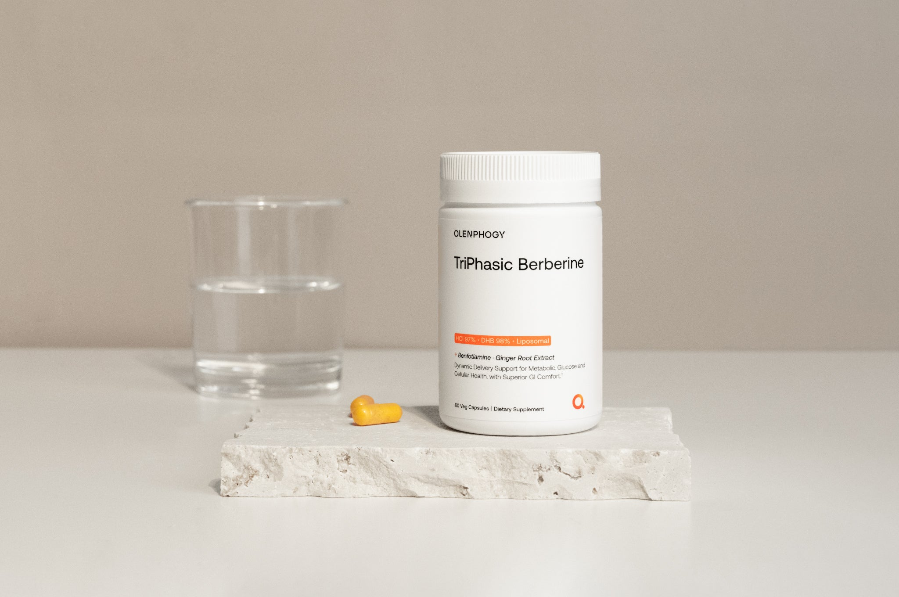

- **观察｜文字与层级：** 只有包装可读文字。
- **观察｜构图：** 瓶、水杯、两粒黄色胶囊置于石质台面，暖光。
- **分析｜作用与复用：** 把标签规格与服用场景并置；剂量仍以标签为准。
- **资源：** 2048 × 1360；[原图](https://olenphogy.com/cdn/shop/articles/A_-0325-1_2eb6f01f-3919-43f5-b60e-14512410d4a3.jpg)；[首个页面](https://olenphogy.com/pages/blog-about-smarter-wellness-page-2)。
- **出现位置：** pages--blog-about-smarter-wellness-page-2 / body / shopify-section-template--25594668548406__blocks_XdnWGj；blogs--blog--blood-sugar-weight-metabolism-berberine / body / shopify-section-template--25461922955574__main。
- **核读：** 已目视检查；包装极小字不作为完整标签转录，关键剂量以标签专图为准。

## IMG-113 · 单粒胶囊特写

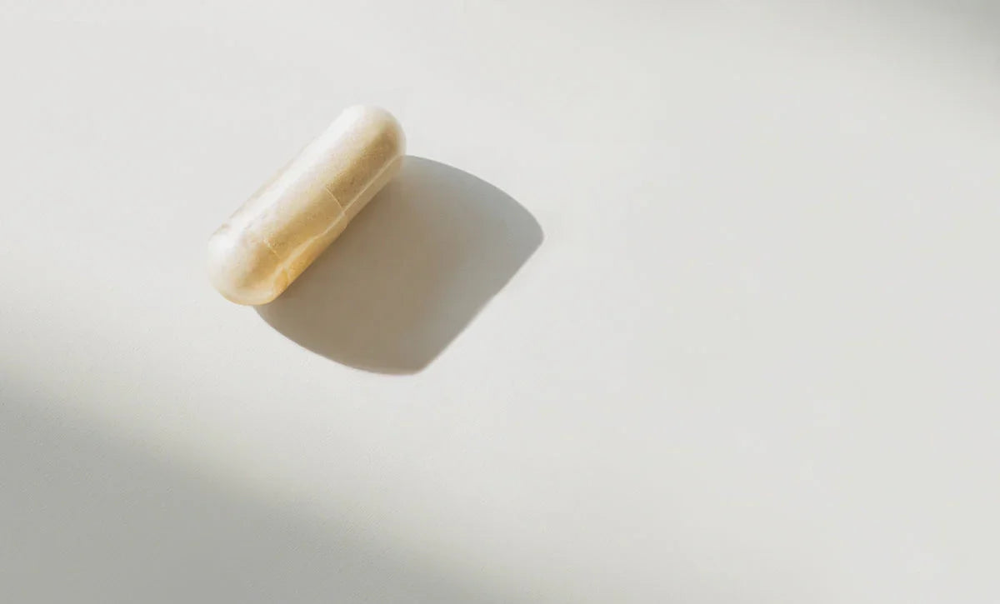

- **观察｜文字与层级：** 无独立图片文案。
- **观察｜构图：** 米黄色胶囊斜放白底，锐利投影，极简近拍。
- **分析｜作用与复用：** 帮助解释颜色/粉末/纯净话题，不能凭外观判断质量。
- **资源：** 1200 × 725；[原图](https://olenphogy.com/cdn/shop/articles/1016-_1200-725_-2_61685c76-ea39-4c82-b8b4-95a33c7e93c8.jpg)；[首个页面](https://olenphogy.com/pages/blog-about-smarter-wellness-page-2)。
- **出现位置：** pages--blog-about-smarter-wellness-page-2 / body / shopify-section-template--25594668548406__blocks_XdnWGj；blogs--blog--science-purity-precision-ef%EF%AC%81cacy-olenphogy-standards / body / shopify-section-template--25461922955574__main。
- **核读：** 已目视检查；包装极小字不作为完整标签转录，关键剂量以标签专图为准。

## IMG-114 · 泡沫轴横图

- **观察｜文字与层级：** 无独立图片文案。
- **观察｜构图：** 男性背面恢复场景的宽裁切，蓝绿色调。
- **分析｜作用与复用：** 与040同母题，横幅适合博客正文。
- **资源：** 1200 × 725；[原图](https://olenphogy.com/cdn/shop/articles/1016-_1200-765_-4_0c77696a-8de9-46d3-8cb7-67ac42a1d1c4.jpg)；[首个页面](https://olenphogy.com/pages/blog-about-smarter-wellness-page-2)。
- **出现位置：** pages--blog-about-smarter-wellness-page-2 / body / shopify-section-template--25594668548406__blocks_XdnWGj；blogs--blog--when-to-take-magnesium-vs-berberine / body / shopify-section-template--25461922955574__main。
- **核读：** 已目视检查；包装极小字不作为完整标签转录，关键剂量以标签专图为准。

## IMG-115 · 小檗碱明亮静物

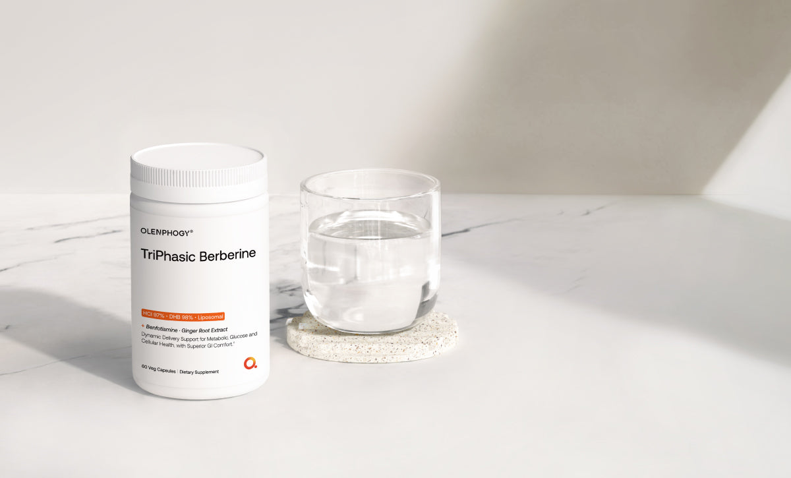

- **观察｜文字与层级：** 仅包装文字。
- **观察｜构图：** 瓶和水杯在白色大理石面，明亮日光，浅阴影。
- **分析｜作用与复用：** 日常习惯场景比研究图更亲近，承担品牌回收。
- **资源：** 1200 × 725；[原图](https://olenphogy.com/cdn/shop/articles/1023_6c543442-9a18-4b3b-bdc0-bdcbc9453289.jpg)；[首个页面](https://olenphogy.com/pages/blog-about-smarter-wellness-page-3)。
- **出现位置：** pages--blog-about-smarter-wellness-page-3 / body / shopify-section-template--25594698957110__1765439820af80aeb2；blogs--blog--tri-phasic-berberine-absorption / body / shopify-section-template--25461922955574__main。
- **核读：** 已目视检查；包装极小字不作为完整标签转录，关键剂量以标签专图为准。

## IMG-116 · 黑白运动女性

- **观察｜文字与层级：** 无独立图片文案。
- **观察｜构图：** 女性侧面，单色高反差，左边大留白。
- **分析｜作用与复用：** 严谨与专注的情绪，不承担功效证明。
- **资源：** 1200 × 725；[原图](https://olenphogy.com/cdn/shop/articles/1013-Blog-4_-2_c0bb8533-4649-4143-97f9-edc487af5e1c.jpg)；[首个页面](https://olenphogy.com/pages/blog-about-smarter-wellness-page-3)。
- **出现位置：** pages--blog-about-smarter-wellness-page-3 / body / shopify-section-template--25594698957110__1765439820af80aeb2；blogs--blog--the-mthfr-genetic-blueprint-why-60-of-women-can-t-process-standard-folic-acid-and-how-it-stalls-inositol-s-results / body / shopify-section-template--25461922955574__main。
- **核读：** 已目视检查；包装极小字不作为完整标签转录，关键剂量以标签专图为准。

## IMG-117 · 镁引言横版

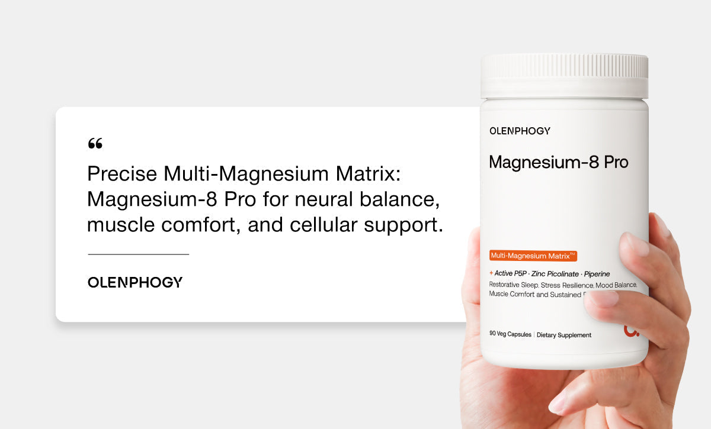

- **观察｜文字与层级：** 与045同类品牌自述利益文字。
- **观察｜构图：** 白色文字卡在左、手持瓶在右，宽幅留白。
- **分析｜作用与复用：** 明确署为品牌说明，不写成消费者证言。
- **资源：** 1200 × 725；[原图](https://olenphogy.com/cdn/shop/articles/0325_0637e5a4-3458-4e38-ac63-fef03a59bb42.jpg)；[首个页面](https://olenphogy.com/pages/blog-about-smarter-wellness-page-3)。
- **出现位置：** pages--blog-about-smarter-wellness-page-3 / body / shopify-section-template--25594698957110__1765439820af80aeb2；blogs--blog--wellness-magnesium-upset-stomach-absorption-guide / body / shopify-section-template--25461922955574__main。
- **核读：** 已目视检查；包装极小字不作为完整标签转录，关键剂量以标签专图为准。

## IMG-118 · 网球俯拍

- **观察｜文字与层级：** 无独立图片文案。
- **观察｜构图：** 红土橙色地面，女性球拍与黄色球，自上而下视角。
- **分析｜作用与复用：** 几何与动作共同表达精准生活。
- **资源：** 1200 × 725；[原图](https://olenphogy.com/cdn/shop/articles/1118_adf2aaf6-b783-4c1d-8297-c860a243cbfb.jpg)；[首个页面](https://olenphogy.com/pages/blog-about-smarter-wellness-page-3)。
- **出现位置：** pages--blog-about-smarter-wellness-page-3 / body / shopify-section-template--25594698957110__1765439820af80aeb2；blogs--blog--dhb-berberine-absorption-science / body / shopify-section-template--25461922955574__main。
- **核读：** 已目视检查；包装极小字不作为完整标签转录，关键剂量以标签专图为准。

## IMG-119 · 首页首屏另一尺寸

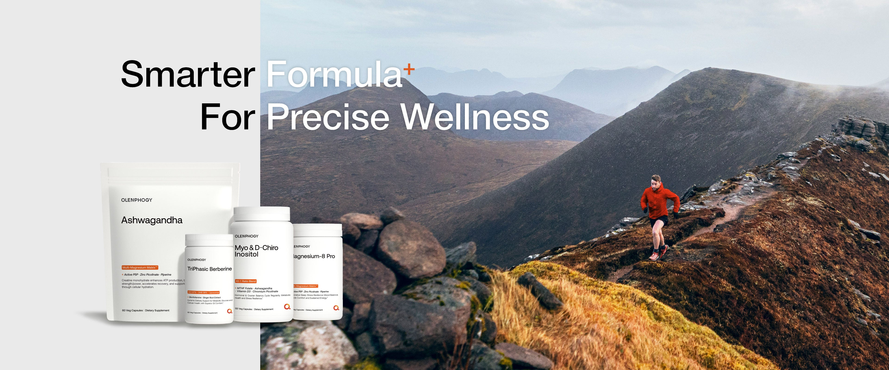

- **观察｜文字与层级：** 与029同主题但尺寸/裁切不同，含未列售袋装产品。
- **观察｜构图：** 超宽产品阶梯加山地跑者，左白右景，标题跨区。
- **分析｜作用与复用：** 保留实际资源而不是按画面近似删除版本。
- **资源：** 3840 × 1600；[原图](https://olenphogy.com/cdn/shop/files/lQDPJwbez5k8y3XNBkDNDwCw0lJLeqLGCKQJgyQXfehMAA_3840_1600.jpg)；[首个页面](https://olenphogy.com/pages/reward)。
- **出现位置：** pages--reward / body / shopify-section-template--26135020503350__image_banner_GRU3Qf。
- **核读：** 已目视检查；包装极小字不作为完整标签转录，关键剂量以标签专图为准。

## IMG-120 · 抽象补充剂静物

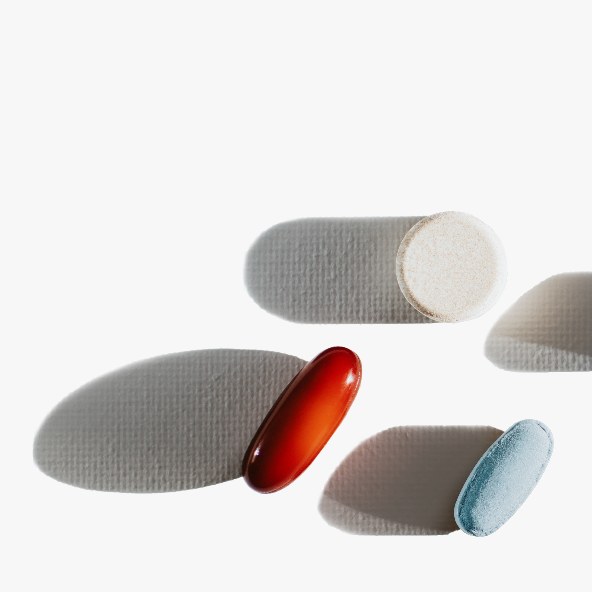

- **观察｜文字与层级：** 无独立图片文案。
- **观察｜构图：** 白片、红软胶囊、蓝片等沿对角散布，白底强影，左上留白。
- **分析｜作用与复用：** 营养品类别示意，不代表目录包含这些剂型。
- **资源：** 3000 × 3000；[原图](https://olenphogy.com/cdn/shop/files/0408truemade-1-3000-3000.png)；[首个页面](https://olenphogy.com/pages/pay-with-hsa-fsa)。
- **出现位置：** pages--pay-with-hsa-fsa / body / shopify-section-template--26308502389046__blocks_PewJRi。
- **核读：** 已目视检查；包装极小字不作为完整标签转录，关键剂量以标签专图为准。

[返回共享索引](共享图片索引.md)
