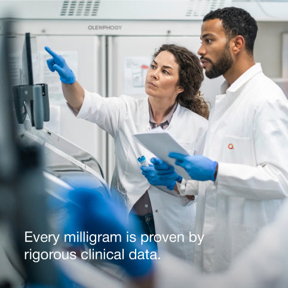
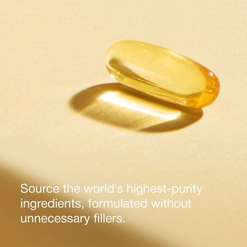
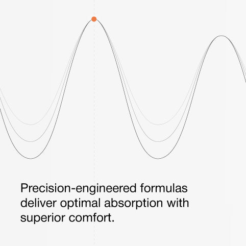
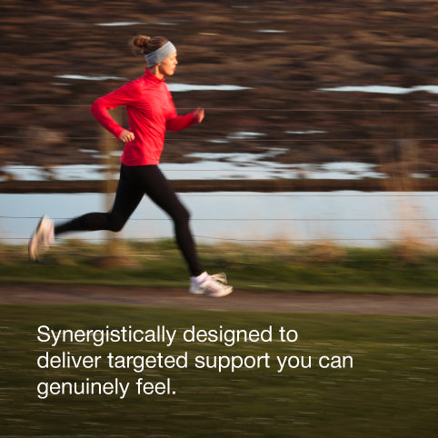
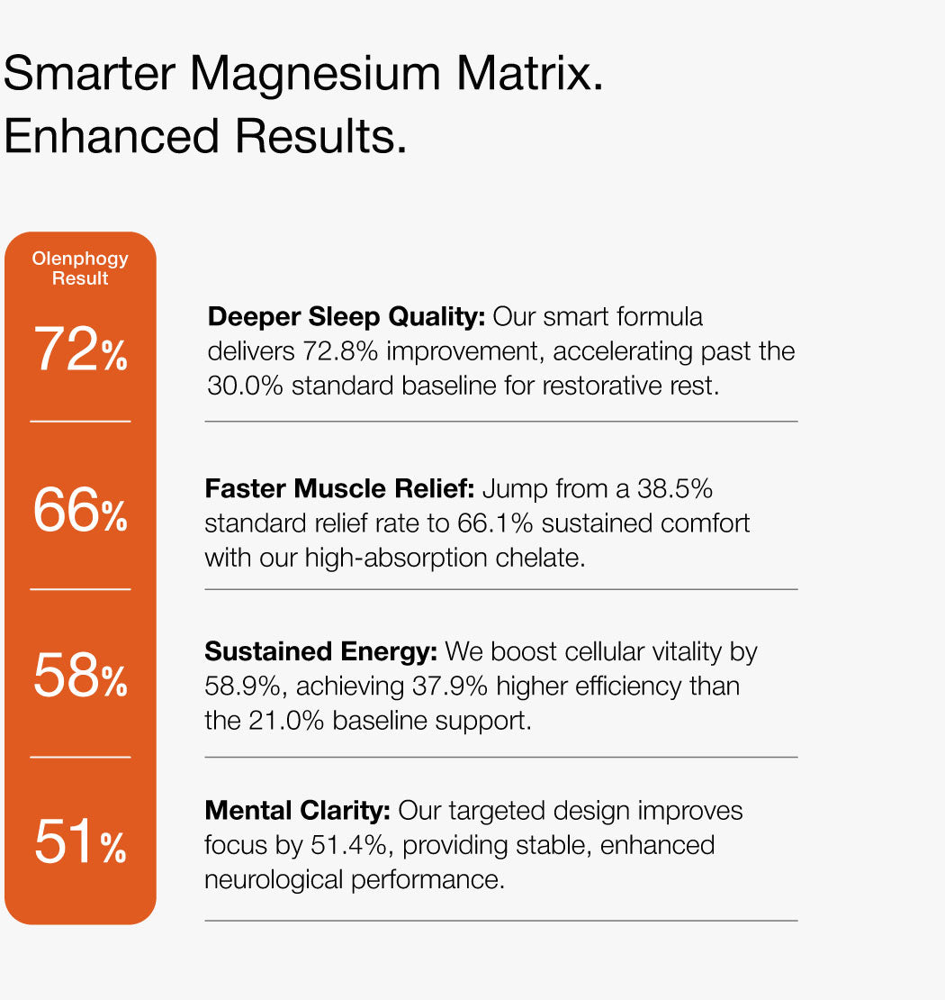
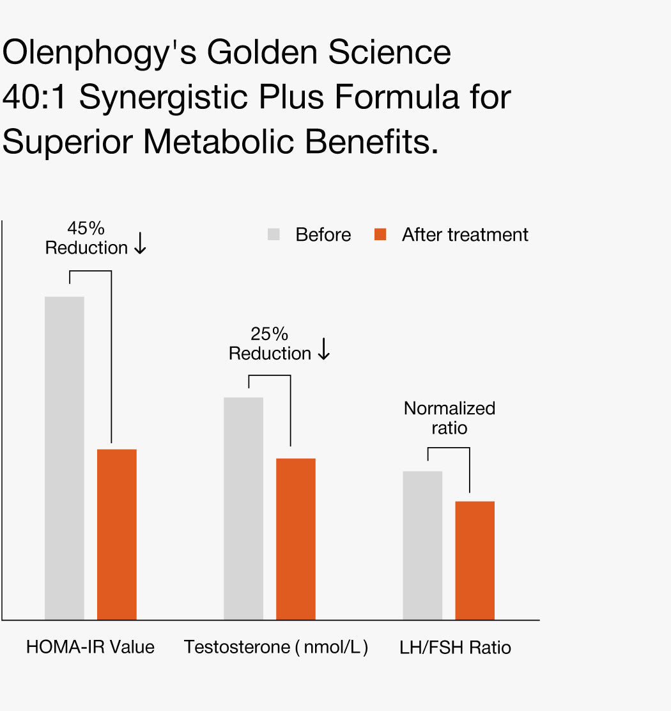
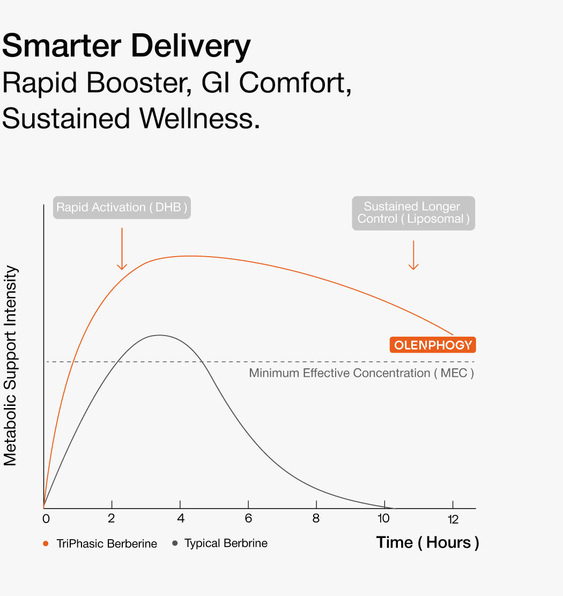

# 共享图册｜移动专用补充

[返回总目录](../README.md)

## IMG-131 · 科学支柱移动方图

- **观察｜文字与层级：** 每毫克与严谨临床数据的品牌承诺，分两行放在暗前景。
- **观察｜构图：** 482方形，实验室两人放大到胸像，左下白色短句；相对桌面版环境更少。
- **分析｜作用与复用：** 749px及以下专用资源；保留人脸与文字，不把实验场景当成品试验证明。
- **资源：** 482 × 482；[原图](https://olenphogy.com/cdn/shop/files/482-482.jpg)；[首个页面](https://olenphogy.com/)。
- **出现位置：** home / responsive-source / 顺位6 / shopify-section-template--25461923086646__1766109747b186c0f2。
- **核读：** 已目视检查；包装极小字不作为完整标签转录，关键剂量以标签专图为准。

## IMG-132 · 纯净支柱移动方图

- **观察｜文字与层级：** 高纯度来源与不加无目的填充的主张。
- **观察｜构图：** 金色软胶囊在上中，暖黄色底和大投影，下部白字三行。
- **分析｜作用与复用：** 手机版将宽图重排为上图下字；当前硬胶囊SKU与软胶囊气氛图仍须区分。
- **资源：** 482 × 482；[原图](https://olenphogy.com/cdn/shop/files/2_eaa27c9a-e23e-429c-b364-6344e1e443bd.jpg)；[首个页面](https://olenphogy.com/)。
- **出现位置：** home / responsive-source / 顺位8 / shopify-section-template--25461923086646__1766109747b186c0f2。
- **核读：** 已目视检查；包装极小字不作为完整标签转录，关键剂量以标签专图为准。

## IMG-133 · 精准支柱移动方图

- **观察｜文字与层级：** 精准配方、吸收和舒适三个概念连接。
- **观察｜构图：** 灰色曲线峰谷占上部，橙点在峰顶，下部黑字三行，白底。
- **分析｜作用与复用：** 小屏留出独立文字区；曲线仍无数据坐标，不当实测图。
- **资源：** 482 × 482；[原图](https://olenphogy.com/cdn/shop/files/3_f0ca1403-4f01-47ed-8b30-7d3f4f075bae.jpg)；[首个页面](https://olenphogy.com/)。
- **出现位置：** home / responsive-source / 顺位10 / shopify-section-template--25461923086646__1766109747b186c0f2。
- **核读：** 已目视检查；包装极小字不作为完整标签转录，关键剂量以标签专图为准。

## IMG-134 · 效能支柱移动方图

- **观察｜文字与层级：** 协同设计与可感知支持。
- **观察｜构图：** 红衣跑者占上部，横向模糊背景，底部白字短段。
- **分析｜作用与复用：** 保留动作全身和阅读区，减少桌面横幅环境留白。
- **资源：** 482 × 482；[原图](https://olenphogy.com/cdn/shop/files/4_80d968ba-0380-4be5-ae39-ecd62401b633.jpg)；[首个页面](https://olenphogy.com/)。
- **出现位置：** home / responsive-source / 顺位12 / shopify-section-template--25461923086646__1766109747b186c0f2。
- **核读：** 已目视检查；包装极小字不作为完整标签转录，关键剂量以标签专图为准。

## IMG-135 · 镁研究移动版

- **观察｜文字与层级：** 保留72/66/58/51及更精确正文数字，灰色基准数字栏和底部来源脚注未随桌面版完整保留。
- **观察｜构图：** 竖向近方图，上方两行标题，左侧仅橙色品牌数字栏，右侧四段解释。
- **分析｜作用与复用：** 这不是等比例缩放；手机省略对照栏降低并排比较能力，正文仍引用基准，引用来源应另保留可读入口。
- **资源：** 1050 × 1110；[原图](https://olenphogy.com/cdn/shop/files/lQDPKIPK1U0JhvHNBFbNBBqwGPPNOduR61gJc-BKVHXiAg_1050_1110.jpg)；[首个页面](https://olenphogy.com/pages/research)。
- **出现位置：** pages--research / responsive-source / 顺位3 / shopify-section-template--25478332973366__blocks_GJFjHH。
- **核读：** 已目视检查；包装极小字不作为完整标签转录，关键剂量以标签专图为准。

## IMG-136 · 肌醇研究移动版

- **观察｜文字与层级：** 45%与25%下降、比值正常化；桌面右侧机制解释及底部参考脚注未在该图保留。
- **观察｜构图：** 上方三行标题，下方三组灰橙前后柱，图例移至图内上部。
- **分析｜作用与复用：** 手机突出结果数字，牺牲解释与来源；复用时不能只保留最强数字而删除必要条件。
- **资源：** 1050 × 1110；[原图](https://olenphogy.com/cdn/shop/files/lQDPJxS51yziJfHNBFbNBBqwJzFMzNSC00cJc-BKVHXiAA_1050_1110.jpg)；[首个页面](https://olenphogy.com/pages/research)。
- **出现位置：** pages--research / responsive-source / 顺位5 / shopify-section-template--25478332973366__blocks_GJFjHH。
- **核读：** 已目视检查；包装极小字不作为完整标签转录，关键剂量以标签专图为准。

## IMG-137 · 小檗碱研究移动版

- **观察｜文字与层级：** 保留快速DHB、脂质体维持与最低有效浓度示意；桌面版底部文献脚注缺失。
- **观察｜构图：** 顶部三行标题，中央缩小的0–12小时灰橙曲线，周围白底，图内字较小。
- **分析｜作用与复用：** 专用移动图仍有细字可读性问题；这是机制示意，不是经过本库验证的成品药代图。
- **资源：** 1050 × 1110；[原图](https://olenphogy.com/cdn/shop/files/1-1.jpg)；[首个页面](https://olenphogy.com/pages/research)。
- **出现位置：** pages--research / responsive-source / 顺位7 / shopify-section-template--25478332973366__blocks_GJFjHH。
- **核读：** 已目视检查；包装极小字不作为完整标签转录，关键剂量以标签专图为准。

[返回共享索引](共享图片索引.md)
