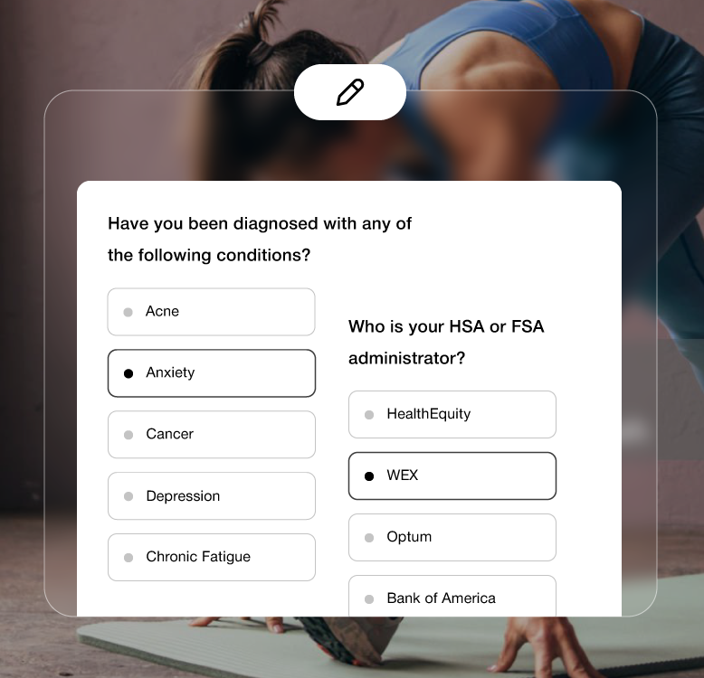
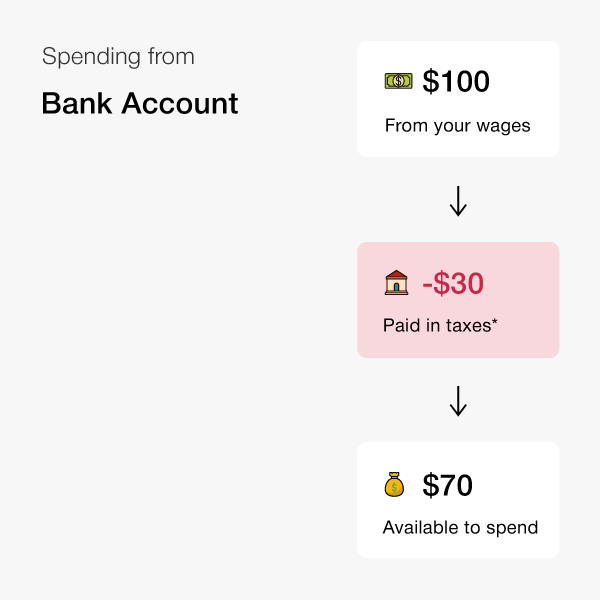
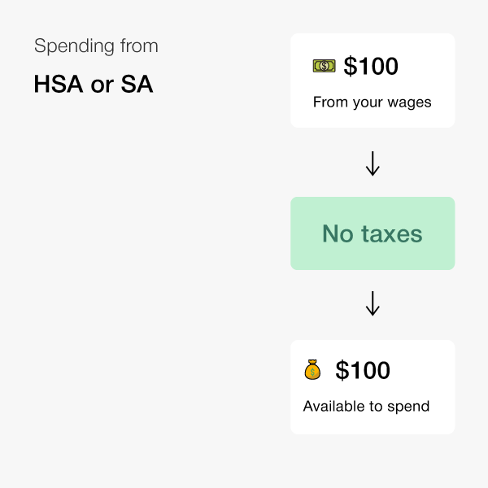
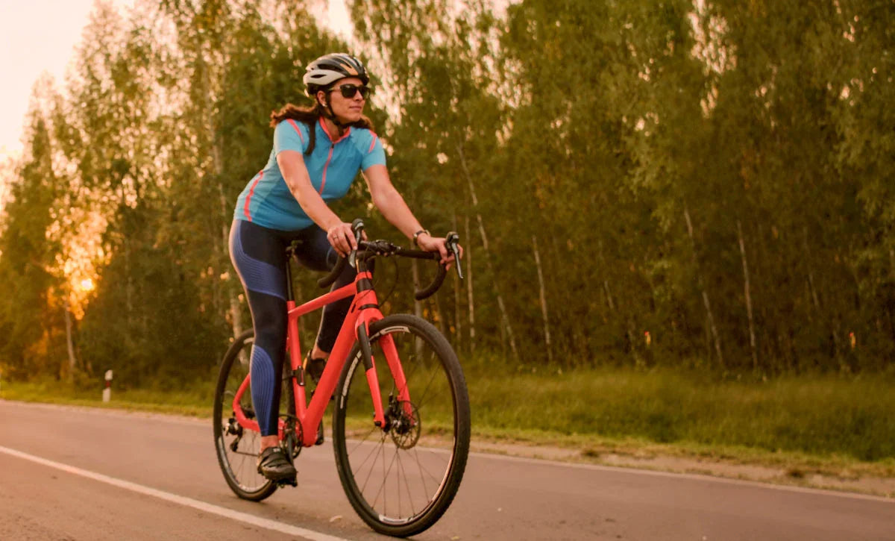
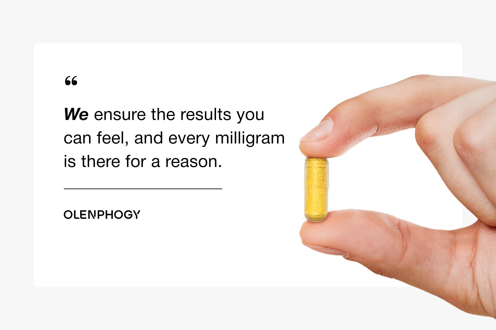

# 共享图册｜购买支持与补充场景

[返回总目录](../README.md)

## IMG-121 · HSA支付步骤图

- **观察｜文字与层级：** 解释从支付选项进入资格流程。
- **观察｜构图：** 模糊人物为背景，中央白色半透明支付选择卡，Truemed选项与信用卡标识。
- **分析｜作用与复用：** 用界面示意降低操作陌生感，图中按钮本身不可点击。
- **资源：** 778 × 750；[原图](https://olenphogy.com/cdn/shop/files/0408truemade-2-778-750_6debb9da-863f-4b0c-94f7-957ff38663df.png)；[首个页面](https://olenphogy.com/pages/pay-with-hsa-fsa)。
- **出现位置：** pages--pay-with-hsa-fsa / body / shopify-section-template--26308502389046__blocks_FJAFxr。
- **核读：** 已目视检查；包装极小字不作为完整标签转录，关键剂量以标签专图为准。

## IMG-122 · HSA资格评估图

- **观察｜文字与层级：** 表示需完成资格评估，不是所有消费者无条件可用。
- **观察｜构图：** 模糊伸展场景，中央健康问卷卡与条件选项，顶部图标。
- **分析｜作用与复用：** 流程文字与利益承诺同时呈现；不采集或推断用户健康信息。
- **资源：** 778 × 750；[原图](https://olenphogy.com/cdn/shop/files/0408truemade-3-778-750_5b323eaf-ca5f-4a38-83fc-8f38fb103c99.png)；[首个页面](https://olenphogy.com/pages/pay-with-hsa-fsa)。
- **出现位置：** pages--pay-with-hsa-fsa / body / shopify-section-template--26308502389046__blocks_FJAFxr。
- **核读：** 已目视检查；包装极小字不作为完整标签转录，关键剂量以标签专图为准。

## IMG-123 · HSA付款图

- **观察｜文字与层级：** 演示支付步骤与字段层级，不转录示例卡号。
- **观察｜构图：** 手部键盘背景虚化，中心白色银行卡表单与卡片图标。
- **分析｜作用与复用：** 用具体界面增强可执行性，避免把示例当真实结账记录。
- **资源：** 778 × 750；[原图](https://olenphogy.com/cdn/shop/files/0408truemade-4-778-750_10888fd4-3b65-4d79-a61c-fe7f666bd635.png)；[首个页面](https://olenphogy.com/pages/pay-with-hsa-fsa)。
- **出现位置：** pages--pay-with-hsa-fsa / body / shopify-section-template--26308502389046__blocks_FJAFxr。
- **核读：** 已目视检查；包装极小字不作为完整标签转录，关键剂量以标签专图为准。

## IMG-124 · 普通税后资金图

- **观察｜文字与层级：** 用简化金额解释税后购买逻辑。
- **观察｜构图：** 白底100工资→红色30税→70可花，灰色箭头串联。
- **分析｜作用与复用：** 这是示例而非所有用户税率，必须保留条件。
- **资源：** 600 × 600；[原图](https://olenphogy.com/cdn/shop/files/0408truemade-5-600-600.png)；[首个页面](https://olenphogy.com/pages/pay-with-hsa-fsa)。
- **出现位置：** pages--pay-with-hsa-fsa / body / shopify-section-template--26308502389046__blocks_66mYmf。
- **核读：** 已目视检查；包装极小字不作为完整标签转录，关键剂量以标签专图为准。

## IMG-125 · HSA税前资金图

- **观察｜文字与层级：** 强调税前账户购买的潜在差异；图中文字出现“HSA or SA”缺F。
- **观察｜构图：** 白底100→绿色免税→100可用，沿用124版式。
- **分析｜作用与复用：** 对照图适合解释条件性省钱；模板不要继承拼写残留。
- **资源：** 600 × 600；[原图](https://olenphogy.com/cdn/shop/files/0408truemade-6-600-600_0f1d2429-c9e6-4785-9ba2-22a31076c1c1.png)；[首个页面](https://olenphogy.com/pages/pay-with-hsa-fsa)。
- **出现位置：** pages--pay-with-hsa-fsa / body / shopify-section-template--26308502389046__blocks_66mYmf。
- **核读：** 已目视检查；包装极小字不作为完整标签转录，关键剂量以标签专图为准。

## IMG-126 · Truemed介绍移动图

- **观察｜文字与层级：** 解释第三方服务与税前健康支出理念。
- **观察｜构图：** 透明底黑色图标在上、标题居中、多行正文，竖向排版。
- **分析｜作用与复用：** 需浅底承载；不是资格保证，适合流程末端的服务介绍。
- **资源：** 1080 × 834；[原图](https://olenphogy.com/cdn/shop/files/0408truemade-7-1080-834.png)；[首个页面](https://olenphogy.com/pages/pay-with-hsa-fsa)。
- **出现位置：** pages--pay-with-hsa-fsa / body / shopify-section-template--26308502389046__image_banner_D8hRfJ。
- **核读：** 已目视检查；包装极小字不作为完整标签转录，关键剂量以标签专图为准。

## IMG-127 · Truemed介绍桌面图

- **观察｜文字与层级：** 同126内容横向版本。
- **观察｜构图：** 透明底横幅，居中图标、标题与紧凑短段，大量左右留白。
- **分析｜作用与复用：** 桌面与手机独立资源，避免把段落缩得过小。
- **资源：** 1920 × 420；[原图](https://olenphogy.com/cdn/shop/files/lQLPJwEvnpNDIUHNAaTNB4CwjEH9EU2KJMMJsGxPGkZeAA_1920_420.png)；[首个页面](https://olenphogy.com/pages/pay-with-hsa-fsa)。
- **出现位置：** pages--pay-with-hsa-fsa / body / shopify-section-template--26308502389046__image_banner_D8hRfJ。
- **核读：** 已目视检查；包装极小字不作为完整标签转录，关键剂量以标签专图为准。

## IMG-128 · 林间骑行女性

- **观察｜文字与层级：** 无独立图片文案。
- **观察｜构图：** 道路与金色树光，女性骑行，暖色环境包围主体。
- **分析｜作用与复用：** 品牌日常活力与奖励内容的氛围图。
- **资源：** 1200 × 725；[原图](https://olenphogy.com/cdn/shop/articles/lQDPKHXNPhdRvOfNAtXNBLCwKZE4WtRq7BEI9cC_qgxLAA_1200_725_25ff901e-54b3-417d-a7e8-ab6582d08737.jpg)；[首个页面](https://olenphogy.com/blogs/blog/magnesium-berberine-performance-energy-recovery)。
- **出现位置：** blogs--blog--magnesium-berberine-performance-energy-recovery / body / shopify-section-template--25461922955574__main。
- **核读：** 已目视检查；包装极小字不作为完整标签转录，关键剂量以标签专图为准。

## IMG-129 · 跑道休息男性

- **观察｜文字与层级：** 无独立图片文案。
- **观察｜构图：** 男性双手撑膝，跑道场景，运动后停顿瞬间。
- **分析｜作用与复用：** 表现恢复需求而非单纯拼搏，适合负担/效率议题。
- **资源：** 1200 × 725；[原图](https://olenphogy.com/cdn/shop/articles/1013-Blog-4_-2-2_9164a27f-ed6a-4293-81f7-d49d3400f05e.jpg)；[首个页面](https://olenphogy.com/blogs/blog/why-supplements-dont-work-guide)。
- **出现位置：** blogs--blog--why-supplements-dont-work-guide / body / shopify-section-template--25461922955574__main。
- **核读：** 已目视检查；包装极小字不作为完整标签转录，关键剂量以标签专图为准。

## IMG-130 · 品牌结果引言卡

- **观察｜文字与层级：** 品牌自述“结果可感知、每毫克有目的”的主张。
- **观察｜构图：** 白灰文字卡与右侧手持黄色胶囊/瓶盖近景交叠。
- **分析｜作用与复用：** 作为理念回扣，不包装成独立用户评价。
- **资源：** 2048 × 1365；[原图](https://olenphogy.com/cdn/shop/articles/0522_82cad54b-01cd-4f26-8f7f-6505ac8df15c.jpg)；[首个页面](https://olenphogy.com/blogs/blog/the-truth-about-supplement-purity-and-color)。
- **出现位置：** blogs--blog--the-truth-about-supplement-purity-and-color / body / shopify-section-template--25461922955574__main。
- **核读：** 已目视检查；包装极小字不作为完整标签转录，关键剂量以标签专图为准。

[返回共享索引](共享图片索引.md)
