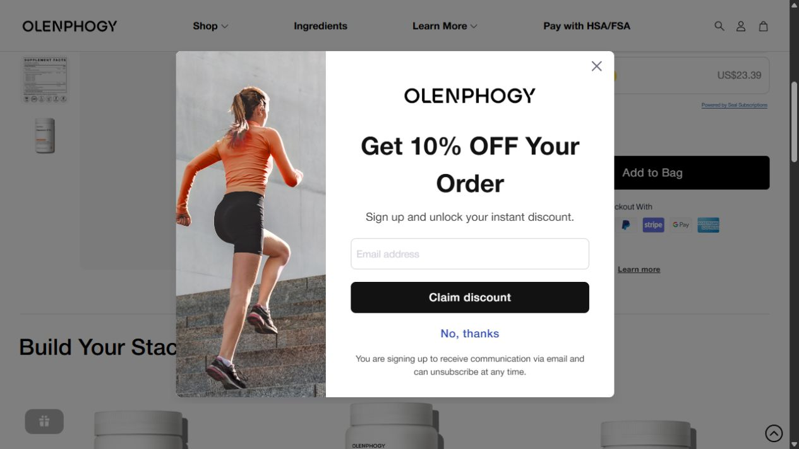

# 优惠弹窗与浮层：完整截图分析

[返回总目录](../README.md)

## POP-001 · 邮件订阅优惠弹窗

[出现页面：镁产品](https://olenphogy.com/products/magnesium-8-pro)。该画面是浏览器实际截图，不属于145个源图片文件；左侧配图的独立原始URL未单独取得，使用完整截图保留图文关系，不冒充原图已下载。

**观察｜构图：** 居中白色圆角对话框，背景商品页罩灰。左侧约三分之一为橙色上衣女性从背侧跑上台阶，身体斜线指向上方；右侧约三分之二为字标、黑色大标题、短说明、邮箱输入框、黑色领取按钮、蓝色拒绝链接和底部邮件/退订说明。右上角另有关闭符号。

**观察｜文案层级：** 先给10%的明确利益，再说注册后可领取折扣，随后要求邮箱并提供领取动作。没有看到明确“仅首单/仅新客”的限定。底部说明注册后会接收邮件且可以退订。

**分析｜转化任务：** 给暂未购买的人一个留下联系渠道的即时理由。商品机制在背后，弹窗只保留单一利益与单一输入字段；运动人物延续品牌主动生活的意象。拒绝和关闭两条退出路径降低强迫感。

**复用公式（原创）：** [真实优惠及条件] → [领取所需动作] → [最少输入字段] → [明确领取按钮] → [简单退出] → [沟通用途/退订说明]。邮箱订阅与商品自动补货订阅是不同动作，不能因为两处都出现10%就认定可叠加。

## POP-002 · 边缘优惠提示与奖励入口

产品和品牌页面截图可见右侧竖向10%优惠提示，以及礼物图标形式的奖励入口。前者让关闭弹窗后仍可回到优惠动作，后者把奖励计划放在持续可见位置。图标属于通用界面元素，不另计品牌创意图。奖励规则已在[购买支持](../01-品牌表达/购买支持与独立页面.md)拆解；本次没有注册、兑换或提交邮箱。

[截图与验收](../00-范围与来源/验收与文件校验.md)。
