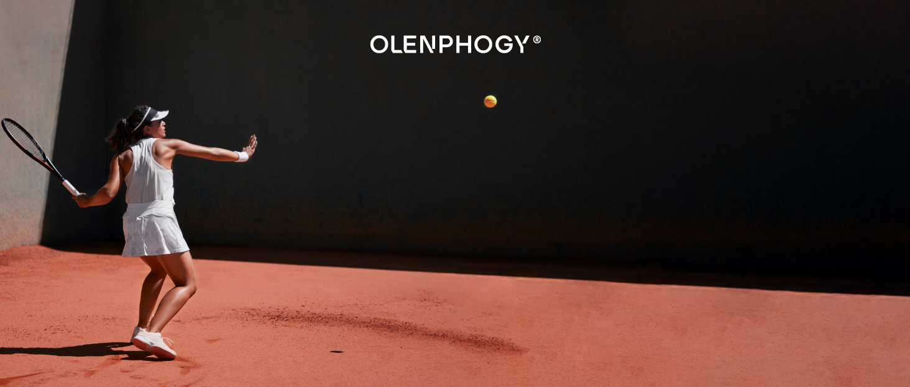
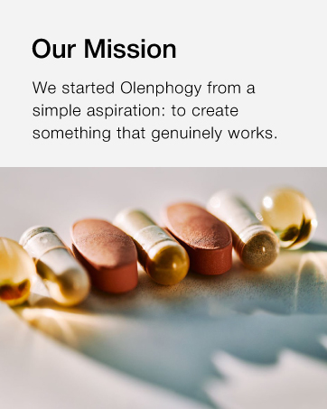
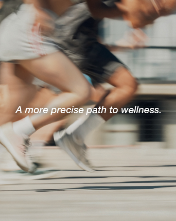
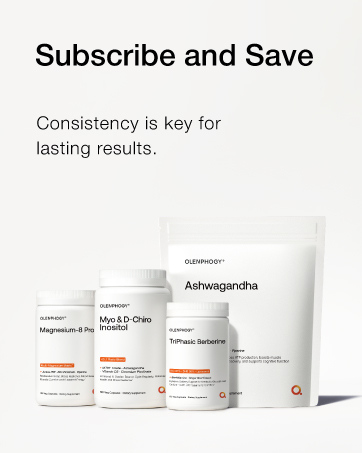
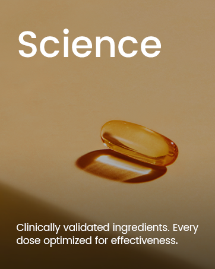
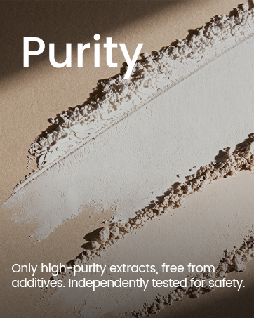
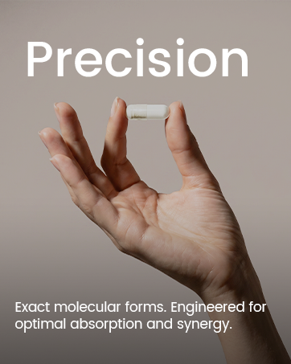
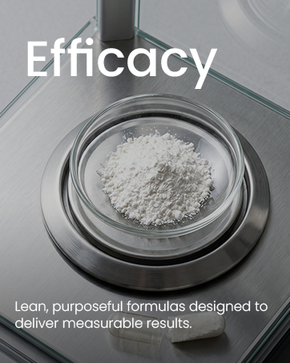

# Brand Story｜背景与7张轮播卡

[返回总目录](../../README.md)

来源：[Amazon.com指定ASIN](https://www.amazon.com/dp/B0G933Z1JW)。位于商品描述之外的品牌故事区域；页面有两个A+容器，须同时检查，不能仅依靠第一个容器的内容。共1张背景横图与7张前景卡，全部本地保存与目视分析。

## 模块顺序与文案任务

|顺位|素材|任务与写法|
|---|---|---|
|背景|138|网球场＋品牌字标建立统一生活氛围，让前景卡可滑动阅读|
|1|139|使命：以朴素创立愿望解释品牌为什么存在，语气短而直接|
|2|140|生活路径：用跑步与斜体短句给理性使命一个情绪落点|
|3|141|订阅：把持续使用理念转换成复购理由，没有写具体优惠数值|
|4|142|科学：成分研究与剂量优化两层，而不是长篇机制|
|5|143|纯净：纯度、排除项、独立检测三步|
|6|144|精准：分子形态→吸收→协同，把工程感压成一句|
|7|145|效能：精简有目的的配方→可测量结果，完成四支柱闭环|

**分析：** 商品A+解释“这款镁为什么这样设计”，品牌故事解释“这个品牌按什么标准做事”。四支柱与官网一致，但图像对应并不固定：Amazon科学用软胶囊，效能用电子秤，官网则用实验室和跑者。值得复用的是语义一致和版式一致，不必让每个支柱永远绑定同一张照片。

**原创框架：** 一句创立动机→一种生活状态→持续使用的合理理由→四条真实可证明的标准。支持订阅的文案不能替代明确的扣款和取消条件；多品群图不能用来推定当前在售目录。

## 逐图分析

## IMG-138 · Brand Story背景横图

- **观察｜文字与层级：** 仅品牌字标，没有独立利益段落。
- **观察｜构图：** 网球红土场，白衣女性在左，深色墙面占右侧大面积，品牌字标在上中。
- **分析｜作用与复用：** 作为轮播后方统一背景，与前景竖卡形成景深；主角小比例意味着阅读焦点让给卡片。
- **资源：** 1464 × 625；[原图](https://m.media-amazon.com/images/S/aplus-media-library-service-media/80cfed47-4f96-4330-a81e-16686d23bdb9.__CR0,0,1464,625_PT0_SX1464_V1___.jpg)；[首个页面](https://www.amazon.com/dp/B0G933Z1JW)。
- **出现位置：** amazon / brand-story / 顺位1 / 第二个aplus容器 / From the brand。
- **核读：** 已目视检查；包装极小字不作为完整标签转录，关键剂量以标签专图为准。

## IMG-139 · 品牌使命卡

- **观察｜文字与层级：** 从创立品牌的朴素愿望切入：做真正起作用的东西。
- **观察｜构图：** 上部白底黑色大标题与短段，下部混合胶囊/药片微距，景深浅、颜色温暖。
- **分析｜作用与复用：** 用短使命代替长公司史；照片有多种剂型，并不代表这些都在当前目录销售。
- **资源：** 362 × 453；[原图](https://m.media-amazon.com/images/S/aplus-media-library-service-media/88fa1915-e0a5-48f4-9292-46b1ae7ee5e8.__CR0,0,362,453_PT0_SX362_V1___.jpg)；[首个页面](https://www.amazon.com/dp/B0G933Z1JW)。
- **出现位置：** amazon / brand-story / 顺位2 / 第二个aplus容器 / From the brand。
- **核读：** 已目视检查；包装极小字不作为完整标签转录，关键剂量以标签专图为准。

## IMG-140 · 精准生活路径卡

- **观察｜文字与层级：** 把精准健康表达成一条生活路径。
- **观察｜构图：** 跑步者腿部近景，人物与背景都有运动模糊，中间白色斜体短句。
- **分析｜作用与复用：** 作为使命与购买选项之间的情绪过场；斜体和速度感降低连续文字卡的疲劳。
- **资源：** 362 × 453；[原图](https://m.media-amazon.com/images/S/aplus-media-library-service-media/45139316-7ca6-4d24-91f3-78a0999e130e.__CR0,0,362,453_PT0_SX362_V1___.jpg)；[首个页面](https://www.amazon.com/dp/B0G933Z1JW)。
- **出现位置：** amazon / brand-story / 顺位3 / 第二个aplus容器 / From the brand。
- **核读：** 已目视检查；包装极小字不作为完整标签转录，关键剂量以标签专图为准。

## IMG-141 · 订阅与产品群卡

- **观察｜文字与层级：** 订阅与节省的标题，下接持续性有助长期结果的理由；没有给具体折扣百分数。
- **观察｜构图：** 白底，上方大黑标题及两行说明，下方三瓶加一袋产品群，阴影轻。
- **分析｜作用与复用：** 从长期理念转到复购；独立Ashwagandha袋装仍未在官网当前目录找到，不据图添加SKU。
- **资源：** 362 × 453；[原图](https://m.media-amazon.com/images/S/aplus-media-library-service-media/40ecab1a-cb3c-479b-8a67-b31a3fceccf7.__CR0,0,362,453_PT0_SX362_V1___.jpg)；[首个页面](https://www.amazon.com/dp/B0G933Z1JW)。
- **出现位置：** amazon / brand-story / 顺位4 / 第二个aplus容器 / From the brand。
- **核读：** 已目视检查；包装极小字不作为完整标签转录，关键剂量以标签专图为准。

## IMG-142 · 科学支柱品牌卡

- **观察｜文字与层级：** 强调成分得到临床研究支持、剂量优化以服务效果。
- **观察｜构图：** 暖金底，单粒软胶囊及大投影在下中，顶部超大白色支柱词，底部两行白字。
- **分析｜作用与复用：** 与官网科学卡的实验室照片不同；同一支柱可换意象，但这里仍不是成品试验证明。
- **资源：** 362 × 453；[原图](https://m.media-amazon.com/images/S/aplus-media-library-service-media/04550ffa-fbcb-4619-930d-b81450c3b7df.__CR0,0,362,453_PT0_SX362_V1___.png)；[首个页面](https://www.amazon.com/dp/B0G933Z1JW)。
- **出现位置：** amazon / brand-story / 顺位5 / 第二个aplus容器 / From the brand。
- **核读：** 已目视检查；包装极小字不作为完整标签转录，关键剂量以标签专图为准。

## IMG-143 · 纯净支柱品牌卡

- **观察｜文字与层级：** 高纯度提取物、无添加、独立安全检测。
- **观察｜构图：** 白粉沿两条斜线铺开，棕灰阴影和纸面质感；上方大白字，底部两行解释。
- **分析｜作用与复用：** 用粉体质感表达纯净，证据仍需要文字和报告；与网站允许功能载体的边界要协调。
- **资源：** 362 × 453；[原图](https://m.media-amazon.com/images/S/aplus-media-library-service-media/bca279c8-9a4d-4c7c-b5b7-d2a65158b967.__CR0,0,362,453_PT0_SX362_V1___.png)；[首个页面](https://www.amazon.com/dp/B0G933Z1JW)。
- **出现位置：** amazon / brand-story / 顺位6 / 第二个aplus容器 / From the brand。
- **核读：** 已目视检查；包装极小字不作为完整标签转录，关键剂量以标签专图为准。

## IMG-144 · 精准支柱品牌卡

- **观察｜文字与层级：** 精确分子形态、吸收和协同的设计。
- **观察｜构图：** 灰米底，右下手指夹白胶囊，顶部大白字，底部两行文字。
- **分析｜作用与复用：** 手指尺度让胶囊具体可感；“精准”由形态解释，不等于照片能证明靶向递送。
- **资源：** 362 × 453；[原图](https://m.media-amazon.com/images/S/aplus-media-library-service-media/6436ef9b-f472-4a83-8d69-6fdb267f3493.__CR0,0,362,453_PT0_SX362_V1___.png)；[首个页面](https://www.amazon.com/dp/B0G933Z1JW)。
- **出现位置：** amazon / brand-story / 顺位7 / 第二个aplus容器 / From the brand。
- **核读：** 已目视检查；包装极小字不作为完整标签转录，关键剂量以标签专图为准。

## IMG-145 · 效能支柱品牌卡

- **观察｜文字与层级：** 精简、有目的的配方与可测量结果。
- **观察｜构图：** 俯拍电子秤上的玻璃皿与白粉，冷灰金属背景，顶端大白字，底端短段。
- **分析｜作用与复用：** 测量器具营造结果可量化感；秤上粉体是检测/计量意象，不是人体效果数据。
- **资源：** 362 × 453；[原图](https://m.media-amazon.com/images/S/aplus-media-library-service-media/cd40967e-7281-437e-b288-f4b0651f61d1.__CR0,0,362,453_PT0_SX362_V1___.png)；[首个页面](https://www.amazon.com/dp/B0G933Z1JW)。
- **出现位置：** amazon / brand-story / 顺位8 / 第二个aplus容器 / From the brand。
- **核读：** 已目视检查；包装极小字不作为完整标签转录，关键剂量以标签专图为准。
