# B0G933Z1JW｜9张图库与6张A+

[返回总目录](../../README.md)

官网与亚马逊存在同母图不同文件，分别保留以便版本追踪。顺序来自实时HTML的主图库数据与A+ DOM；浏览器可见状态另见验收记录。

## IMG-013 · 亚马逊首图

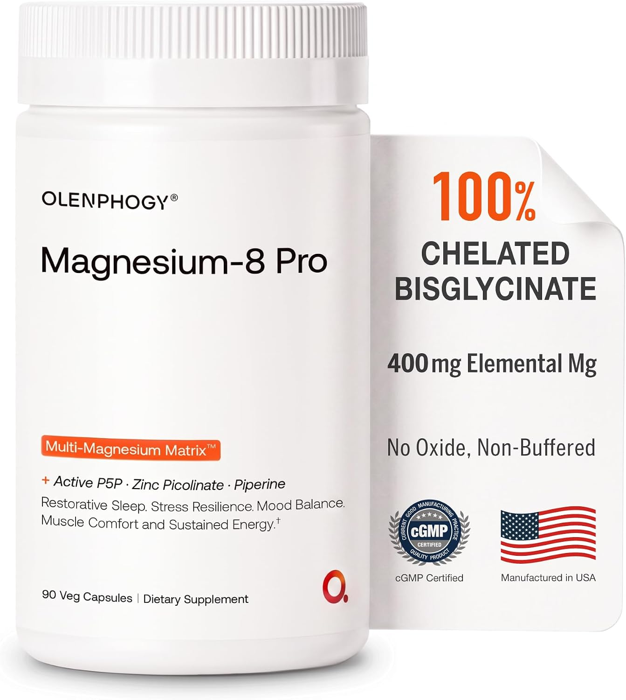

- **观察｜文字与层级：** 强调螯合双甘氨酸镁、400mg元素镁、无氧化物/不缓冲、美国制造等。
- **观察｜构图：** 白底大瓶在左，右侧折页式信息板；橙色100与黑色元素量形成第二焦点。
- **分析｜作用与复用：** 商品与差异化同时可见；100%的修饰范围需与五形态配方一起读，不能解读为全配方只含双甘氨酸镁。
- **资源：** 1343 × 1500；[原图](https://m.media-amazon.com/images/I/71PEJe6aNbL._AC_SL1500_.jpg)；[首个页面](https://www.amazon.com/dp/B0G933Z1JW)。
- **出现位置：** amazon / gallery / 顺位1。
- **核读：** 已目视检查；包装极小字不作为完整标签转录，关键剂量以标签专图为准。

## IMG-014 · 亚马逊五利益场景

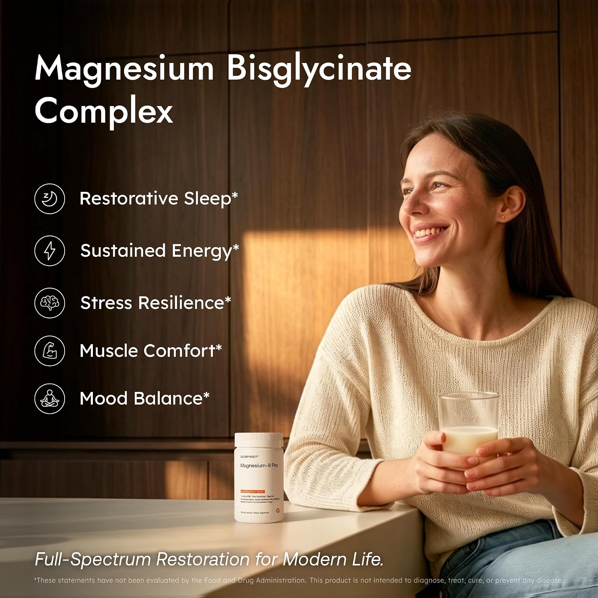

- **观察｜文字与层级：** 五个生活结果先于机制，底部斜体短句收尾。
- **观察｜构图：** 暖木色家居，女性与水杯在右，瓶子在下中；左侧白字与圆形图标分五行。
- **分析｜作用与复用：** 暖色生活照降低技术距离；保证白字与背景的对比，避免图标挤占信息。
- **资源：** 1500 × 1500；[原图](https://m.media-amazon.com/images/I/81jYkuh-SrL._AC_SL1500_.jpg)；[首个页面](https://www.amazon.com/dp/B0G933Z1JW)。
- **出现位置：** amazon / gallery / 顺位2。
- **核读：** 已目视检查；包装极小字不作为完整标签转录，关键剂量以标签专图为准。

## IMG-015 · 五加三配方图

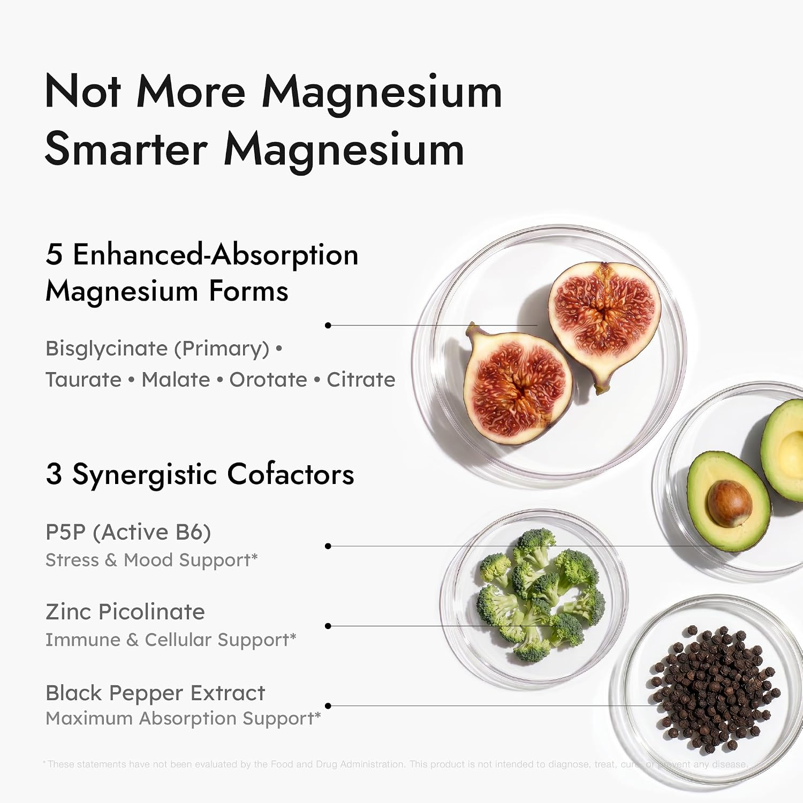

- **观察｜文字与层级：** 五种镁形态和三个辅助成分构成八项；每组是配方角色而非八种镁。
- **观察｜构图：** 白底左侧文本分组，右侧玻璃培养皿与蔬果、胡椒等实物，通过细引线连结。
- **分析｜作用与复用：** 拆解复杂命名；食物为视觉指代，不能据此推定原料来源。
- **资源：** 1500 × 1500；[原图](https://m.media-amazon.com/images/I/81fLKnFMvqL._AC_SL1500_.jpg)；[首个页面](https://www.amazon.com/dp/B0G933Z1JW)。
- **出现位置：** amazon / gallery / 顺位3。
- **核读：** 已目视检查；包装极小字不作为完整标签转录，关键剂量以标签专图为准。

## IMG-016 · 温和服用特写

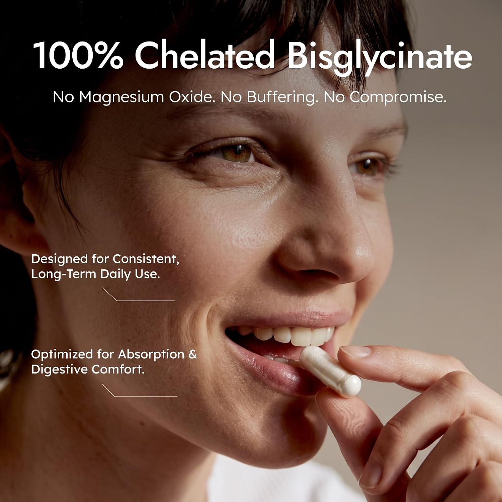

- **观察｜文字与层级：** 突出非缓冲、不含氧化镁，以及日常使用、吸收与肠胃舒适。
- **观察｜构图：** 女性面部和手持胶囊近景，浅暖色光；上方大白字，左侧两组小号说明。
- **分析｜作用与复用：** 身体接近镜头制造可服用感；否定式差异化须有清楚范围。
- **资源：** 1500 × 1500；[原图](https://m.media-amazon.com/images/I/71YJTJQ0KzL._AC_SL1500_.jpg)；[首个页面](https://www.amazon.com/dp/B0G933Z1JW)。
- **出现位置：** amazon / gallery / 顺位4。
- **核读：** 已目视检查；包装极小字不作为完整标签转录，关键剂量以标签专图为准。

## IMG-017 · 辅助成分协同图

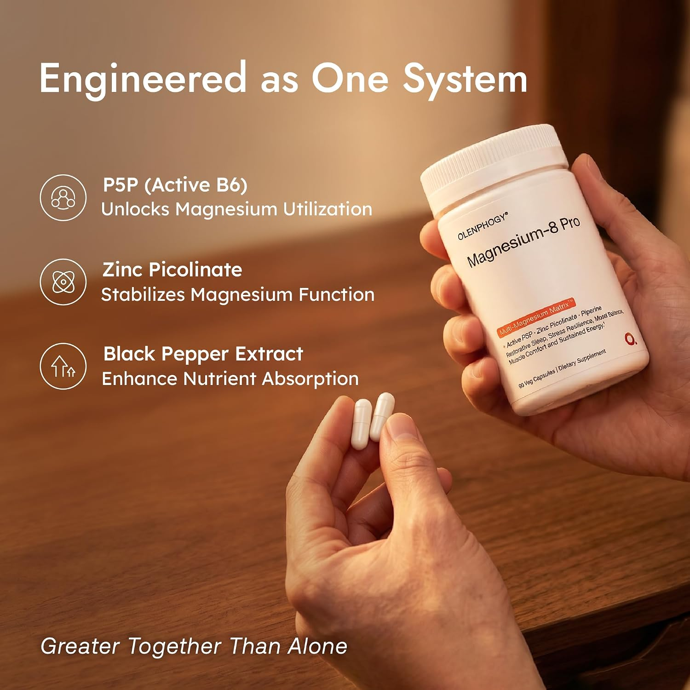

- **观察｜文字与层级：** P5P、锌、胡椒碱分别承担激活/稳定/增强式角色，底部总结协同。
- **观察｜构图：** 右侧手持瓶子，左下另一只手有两粒胶囊，暖木背景；左边图标加三段短文。
- **分析｜作用与复用：** 主成分之外再解释为何加配；画中两粒是场景陈列，不等于标签每份三粒。
- **资源：** 1500 × 1500；[原图](https://m.media-amazon.com/images/I/71B1pWiVBfL._AC_SL1500_.jpg)；[首个页面](https://www.amazon.com/dp/B0G933Z1JW)。
- **出现位置：** amazon / gallery / 顺位5。
- **核读：** 已目视检查；包装极小字不作为完整标签转录，关键剂量以标签专图为准。

## IMG-018 · 日夜双场景亚马逊版

- **观察｜文字与层级：** 日间平静与夜间休息的连续叙事。
- **观察｜构图：** 与002同母版，办公与睡眠左右拼接，右上标题留白；分辨率不同。
- **分析｜作用与复用：** 保留独立素材编号以追踪跨渠道版本，共用构图方法，不重复算作独立创意。
- **资源：** 1500 × 1500；[原图](https://m.media-amazon.com/images/I/81xOuyp6e1L._AC_SL1500_.jpg)；[首个页面](https://www.amazon.com/dp/B0G933Z1JW)。
- **出现位置：** amazon / gallery / 顺位6。
- **核读：** 已目视检查；包装极小字不作为完整标签转录，关键剂量以标签专图为准。

## IMG-019 · 品牌对照表

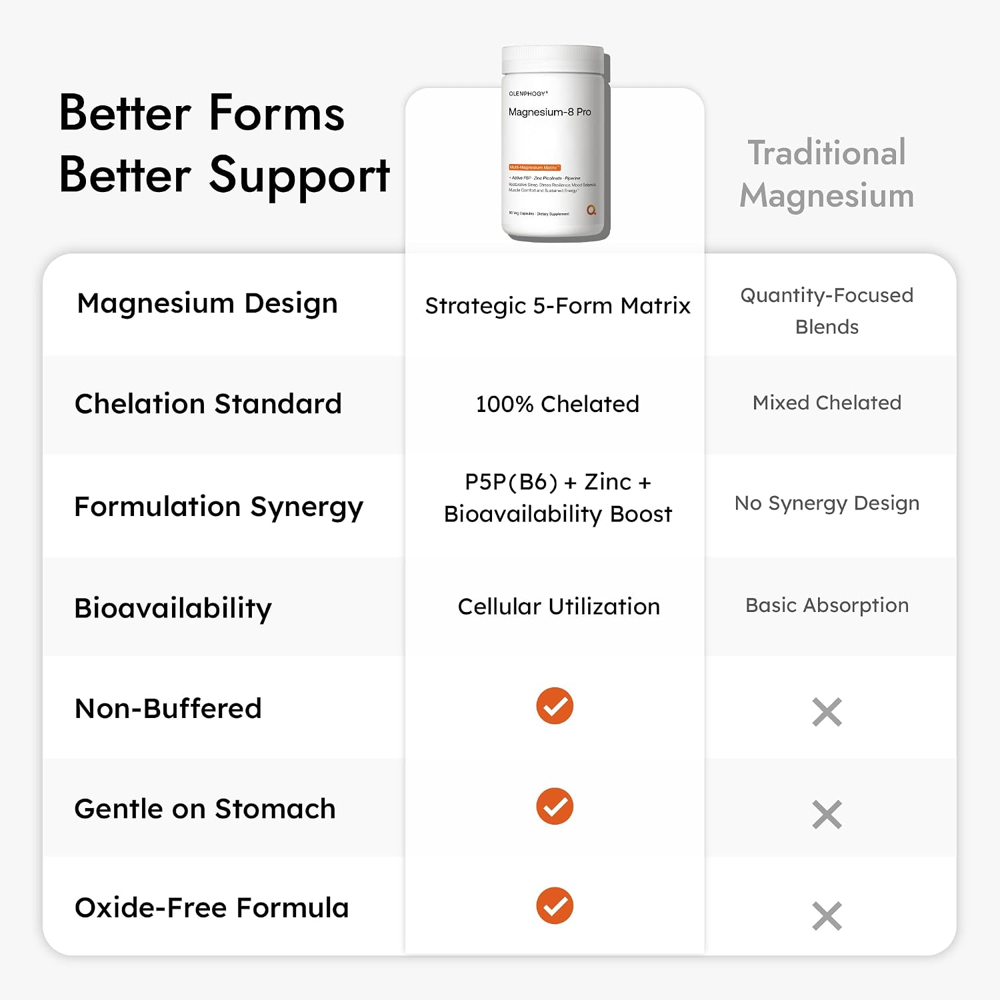

- **观察｜文字与层级：** 从配方设计到螯合、协同、利用度、温和度和无氧化物逐项比较。
- **观察｜构图：** 白灰圆角卡片，顶部瓶子，中部品牌/普通产品两列，七行橙勾与灰叉。
- **分析｜作用与复用：** 将复杂优势压成扫描表；普通产品的比较对象未具体限定，不能当作全行业事实。
- **资源：** 1500 × 1500；[原图](https://m.media-amazon.com/images/I/71dttcINZ1L._AC_SL1500_.jpg)；[首个页面](https://www.amazon.com/dp/B0G933Z1JW)。
- **出现位置：** amazon / gallery / 顺位7。
- **核读：** 已目视检查；包装极小字不作为完整标签转录，关键剂量以标签专图为准。

## IMG-020 · 元素量与矩阵量

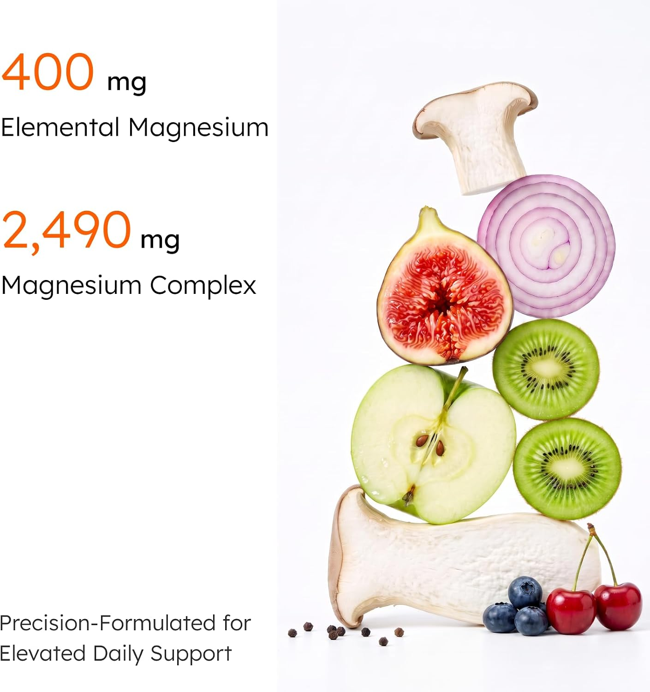

- **观察｜文字与层级：** 把元素镁和原料矩阵两个重量并列。
- **观察｜构图：** 左侧大橙色400mg与2490mg上下排；右侧蔬果堆叠，白底黑色解释。
- **分析｜作用与复用：** 数字必须附对象及每份基准；两数不同本身不是矛盾。
- **资源：** 1409 × 1500；[原图](https://m.media-amazon.com/images/I/71HPYiudRvL._AC_SL1500_.jpg)；[首个页面](https://www.amazon.com/dp/B0G933Z1JW)。
- **出现位置：** amazon / gallery / 顺位8。
- **核读：** 已目视检查；包装极小字不作为完整标签转录，关键剂量以标签专图为准。

## IMG-021 · 亚马逊营养标签

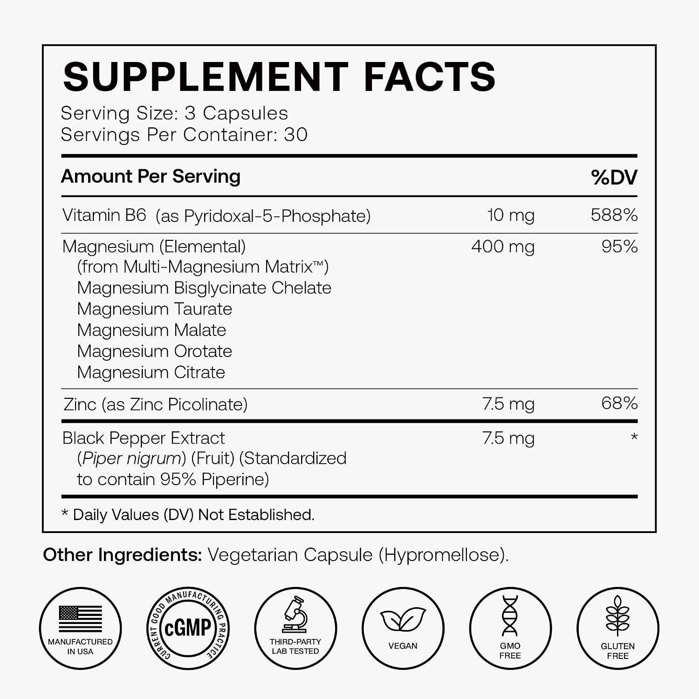

- **观察｜文字与层级：** 与003同一组核心剂量：每3粒400mg元素镁及三辅助项。
- **观察｜构图：** 白底黑字标签为主体，底部认证风格图标，高分辨率适合放大。
- **分析｜作用与复用：** 电商承接查证需求；图标是品牌标示，不代表本库核验了认证文件。
- **资源：** 1500 × 1500；[原图](https://m.media-amazon.com/images/I/7141IAcbzIL._AC_SL1500_.jpg)；[首个页面](https://www.amazon.com/dp/B0G933Z1JW)。
- **出现位置：** amazon / gallery / 顺位9。
- **核读：** 已目视检查；包装极小字不作为完整标签转录，关键剂量以标签专图为准。

## IMG-022 · A+ 情绪开场

- **观察｜文字与层级：** 三拍式休息、平静、焕新，先卖体验不堆成分。
- **观察｜构图：** 超宽横图，熟睡女性在左、浅色枕被铺满；右侧白色斜体短词与下方品牌。
- **分析｜作用与复用：** 用于详情深读入口；浅底白字在小屏存在对比不足风险。
- **资源：** 1464 × 600；[原图](https://m.media-amazon.com/images/S/aplus-media-library-service-media/4599b747-4156-4e24-b3a4-dbe3306aad64.__CR0,0,1464,600_PT0_SX1464_V1___.jpg)；[首个页面](https://www.amazon.com/dp/B0G933Z1JW)。
- **出现位置：** amazon / aplus / ['celwidget', 'aplus-module', 'premium-module-2-fullbackground-image', 'aplus-premium']。
- **核读：** 已目视检查；包装极小字不作为完整标签转录，关键剂量以标签专图为准。

## IMG-023 · A+ 形态解释

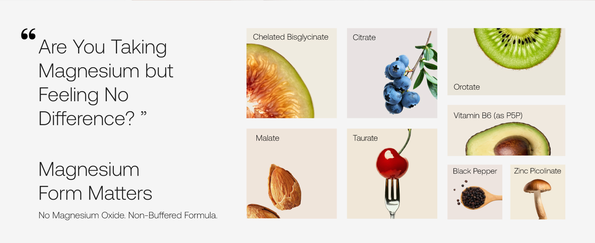

- **观察｜文字与层级：** 先回应补了没感觉，再引出成分形态与5+3系统。
- **观察｜构图：** 左边疑问式大标题与短文，右边八格成分/食物图，左下否定氧化镁。
- **分析｜作用与复用：** 将失败经验重构为选择标准；注意不把示意食物当原料证据。
- **资源：** 1464 × 600；[原图](https://m.media-amazon.com/images/S/aplus-media-library-service-media/0945bab9-39a7-4819-8a76-e15c5d2977c6.__CR0,0,1464,600_PT0_SX1464_V1___.jpg)；[首个页面](https://www.amazon.com/dp/B0G933Z1JW)。
- **出现位置：** amazon / aplus / ['celwidget', 'aplus-module', 'premium-module-2-fullbackground-image', 'aplus-premium']。
- **核读：** 已目视检查；包装极小字不作为完整标签转录，关键剂量以标签专图为准。

## IMG-024 · A+ 协同转折

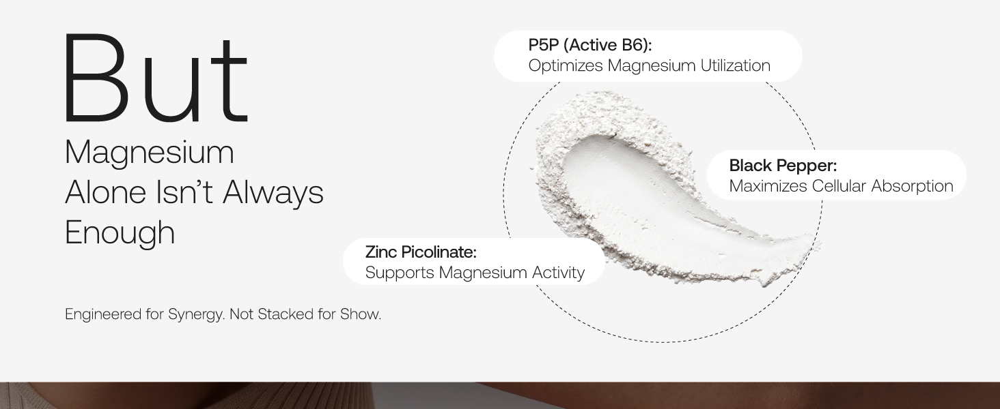

- **观察｜文字与层级：** 上一图解释形态，本图补充为什么仍需辅助营养素。
- **观察｜构图：** 左大字号转折词与说明，右侧粉末勺及圆形虚线，三个标签绕圈；底部接照片带。
- **分析｜作用与复用：** 用转折推进连续阅读，不要每张都从零介绍产品。
- **资源：** 1464 × 600；[原图](https://m.media-amazon.com/images/S/aplus-media-library-service-media/9102d2c9-2504-4b45-bd96-59163dacaada.__CR0,0,1464,600_PT0_SX1464_V1___.jpg)；[首个页面](https://www.amazon.com/dp/B0G933Z1JW)。
- **出现位置：** amazon / aplus / ['celwidget', 'aplus-module', 'premium-module-2-fullbackground-image', 'aplus-premium']。
- **核读：** 已目视检查；包装极小字不作为完整标签转录，关键剂量以标签专图为准。

## IMG-025 · A+ 双甘氨酸比较

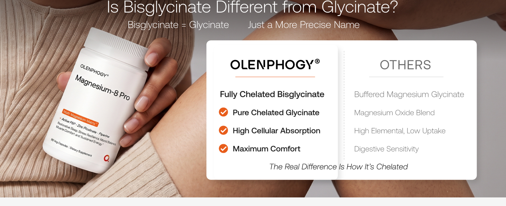

- **观察｜文字与层级：** 区分名称、螯合与纯度相关主张。
- **观察｜构图：** 上方问句，左侧针织袖手持瓶，右侧两列表格，橙色勾与灰色对照。
- **分析｜作用与复用：** 技术辨析接回商品；命名区别不能直接证明所有竞品吸收更低。
- **资源：** 1464 × 600；[原图](https://m.media-amazon.com/images/S/aplus-media-library-service-media/15afe296-f7bb-4b84-98ee-e2d22e31369e.__CR0,0,1464,600_PT0_SX1464_V1___.jpg)；[首个页面](https://www.amazon.com/dp/B0G933Z1JW)。
- **出现位置：** amazon / aplus / ['celwidget', 'aplus-module', 'premium-module-2-fullbackground-image', 'aplus-premium']。
- **核读：** 已目视检查；包装极小字不作为完整标签转录，关键剂量以标签专图为准。

## IMG-026 · A+ 四场景利益

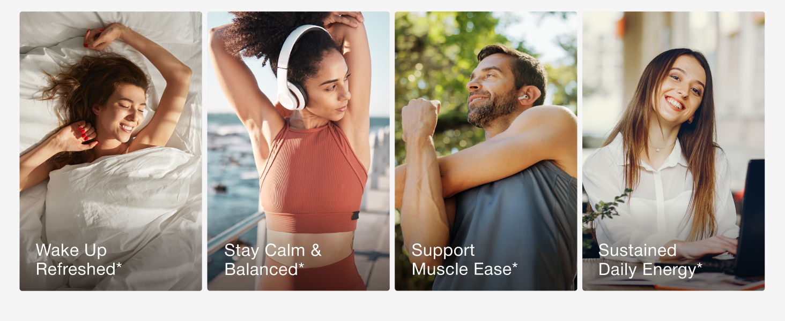

- **观察｜文字与层级：** 把配方利益分配给四种日常时刻。
- **观察｜构图：** 四条等宽竖向照片拼成横图，晨起、伸展、户外男性、办公女性；底部白字。
- **分析｜作用与复用：** 宽屏等分构图，小屏须检查文字缩小后是否仍可读。
- **资源：** 1464 × 600；[原图](https://m.media-amazon.com/images/S/aplus-media-library-service-media/cb23c8d9-8105-4c04-9700-e776038c79a6.__CR0,0,1464,600_PT0_SX1464_V1___.jpg)；[首个页面](https://www.amazon.com/dp/B0G933Z1JW)。
- **出现位置：** amazon / aplus / ['celwidget', 'aplus-module', 'premium-module-2-fullbackground-image', 'aplus-premium']。
- **核读：** 已目视检查；包装极小字不作为完整标签转录，关键剂量以标签专图为准。

## IMG-027 · A+ 保证与信任收尾

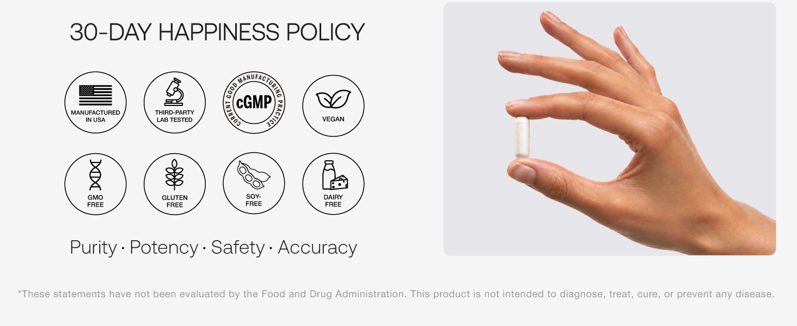

- **观察｜文字与层级：** 从产品机制收束到尝试风险与品质背书，小字声明在底边。
- **观察｜构图：** 灰白底右侧手捏胶囊，左侧30天保证，上下两排八个圆形图标，底部四个品质词。
- **分析｜作用与复用：** 收尾回答敢不敢试；保证期限和起效周期不是同一个概念。
- **资源：** 1464 × 600；[原图](https://m.media-amazon.com/images/S/aplus-media-library-service-media/5c4e735a-4e09-4825-9644-4e427f6e7574.__CR0,0,1464,600_PT0_SX1464_V1___.jpg)；[首个页面](https://www.amazon.com/dp/B0G933Z1JW)。
- **出现位置：** amazon / aplus / ['celwidget', 'aplus-module', 'premium-module-2-fullbackground-image', 'aplus-premium']。
- **核读：** 已目视检查；包装极小字不作为完整标签转录，关键剂量以标签专图为准。
