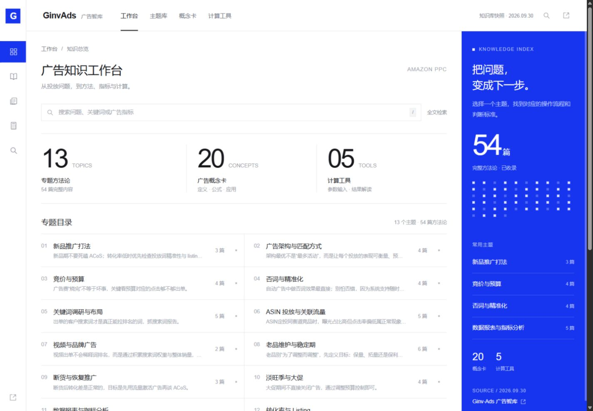

# GinvAds 广告工作台

完整收录 [Ginv-Ads 广告智库](https://sellerhelp.top/projects/Ginv-Ads%E5%B9%BF%E5%91%8A%E6%99%BA%E5%BA%93/) 的 13 个主题、54 篇方法论、20 张概念卡和 5 个计算工具。界面按提供的参考图制作：白色工作区、细线分隔、左侧图标导航和钴蓝色辅助面板。

## 打开工作台

下载仓库 ZIP 并解压，或克隆后进入 `ginv-ads-workbench` 文件夹，保留完整目录。工作台可离线运行；重新采集才需要访问原站。

在 Windows 中双击根目录的 `启动工作台.cmd`。程序会启动本地服务并打开浏览器。运行期间保留命令窗口；关闭它会停止服务。如果服务已经启动，会直接打开已有工作台。

也可以在当前项目文件夹的 PowerShell 中运行：

```powershell
npm start
```

看到 `GinvAds 工作台已启动：http://127.0.0.1:4173` 后，在浏览器打开该地址。这里的“本地服务”是在你自己电脑上提供网页的小程序，需要保持运行。工作台运行只需要 Node.js，不需要 `npm install`，不需要 Python，也不需要再次输入原站访问码。不要直接双击 `index.html`，浏览器会阻止它读取旁边的知识数据。

如果 `4173` 端口被其它程序占用，先关闭已有工作台，或在 PowerShell 中指定其它端口：

```powershell
$env:PORT = '4174'
npm start
```

此时打开 `http://127.0.0.1:4174/`。一键启动脚本固定使用 4173。

## 如何使用



- **工作台**：查看完整专题目录和五个计算工具入口。
- **主题库**：打开完整主题，阅读核心流程、快速判断、主题提示和每篇文章；也可以切换单篇阅读。保留原文的要点、SOP、自查清单和标签。
- **概念卡**：查看定义、公式、含义、应用及提示；可筛选含公式的卡片。
- **全文搜索**：搜索专题流程、54 篇文章正文、概念卡和工具说明。多个词按“同时包含”匹配，可按内容类型筛选；搜索后进入文章，再用浏览器返回，搜索条件会保留。按 `/` 快捷键进入搜索。
- **计算工具**：修改参数后点击“计算结果”，在右侧查看数值与解释；输入改变后旧结果会清除。“恢复默认值”还原源站参数。结果可复制；在窄屏时结果面板位于表单下方。
- **打印**：主题阅读页可打印当前完整主题或单篇正文。

## 完整性与计算口径

内容快照日期为 **2026-09-30（Asia/Shanghai）**。文章正文与原页逐项核对，13 个主题的 54 篇文章和 20 张概念卡均可在实际页面完整打开。原站关联的 24 项静态资源另有本地归档与 SHA256 校验。共享推广侧栏的其它项目和外部推广网站不属于 Ginv 主体正文，发现的入口和状态保留在覆盖报告中。

工作台保存原站内容及原函数，五个工具沿用其数学公式，并明确处理空值、无效数字、非正分母和不合法转化率。显示精度和解释有以下改进：

1. “反推保本 CPC”实际求目标 ACoS 下允许的平均 CPC；只有目标 ACoS 等于毛利率时才代表保本。
2. “保底日预算”是按平均转化率估算约一单的预算，不保证必定出单；显示两位小数，并另列原站的整数美元显示。
3. 高点击工具按原函数的 **1.5 倍**计算并取整，原说明虽提到 1.5–2 倍，函数只实现 1.5 倍。
4. EV 等于 CPC 时显示“盈亏平衡”，并处理浮点计算误差。零或负毛利可以计算，并说明没有正向广告费空间；这是对原站输入处理的改进。

详见 `docs/tool-audit.md`、`docs/browser-audit.json` 和 `archive/README.md`。工具页面的“原站工具说明”保留原始介绍与参数。

## 文件结构

```text
workbench/dist/            工作台网页、样式、交互和计算引擎
workbench/dist/data/       工作台使用的完整知识数据
public/data/              采集得到的原始结构化内容
archive/source/           已验证的原站页面、脚本和样式
archive/assets/           24项真实资源归档
archive/coverage.json     覆盖范围、资源哈希和内容核对报告
archive/audit/            原始工具及工作台工具的独立数值验证
scripts/                  启动、采集、同步和验证脚本
tests/                    工作台计算工具验证
docs/                     公式审计、实际浏览器核对和界面截图
```

## 检查工作台

在项目根目录 PowerShell 中运行：

```powershell
npm run check
npm test
node archive/audit/workbench-calculator-cases.mjs
```

成功结果为内容检查通过、17 个计算测试通过，以及 105 项独立计算案例全部通过。内容检查同时核验数据数量、唯一 ID、所有文章关联、资源文件哈希和网页实际使用数据的一致性。

## 重新采集和更新

日常使用工作台不需要网络来源站，只有重新采集时需要 Python 和两个采集库：

```powershell
python -m pip install -r requirements-capture.txt
python scripts/capture-source.py
```

出现 `Access code (hidden):` 时输入原站访问码，内容不会回显，也不会保存到文件。采集结束后应显示 `coverageStatus: complete`。然后运行：

```powershell
npm run sync
npm run check
```

刷新本地工作台即可读取新数据。如另有线上托管，需重新发布才会更新。请不要将访问码写进源码或归档；现有项目没有保存访问码、认证 Cookie 或浏览器账户状态。

如仅需从现有已验证快照重新解析数据，可使用采集说明中的 `--extract-existing` / `--audit-existing` 模式。覆盖状态未完成时，同步脚本会拒绝更新工作台，避免把缺失数据交给使用者。

## 来源与项目版本

知识正文、概念卡和原始工具来自上述 Ginv-Ads 广告智库，保留原文和来源链接；新增界面、全文搜索、计算校验与本地启动脚本属于本工作台的实现。随附归档用于追溯内容和公式，不为第三方原始内容另行授予许可。

这是可独立运行的 GitHub 版本，包含完整网页与采集归档，不依赖原项目的私人托管配置。`workbench/` 是普通源码目录；如需自行托管，可发布其中的 `dist/` 静态文件。
